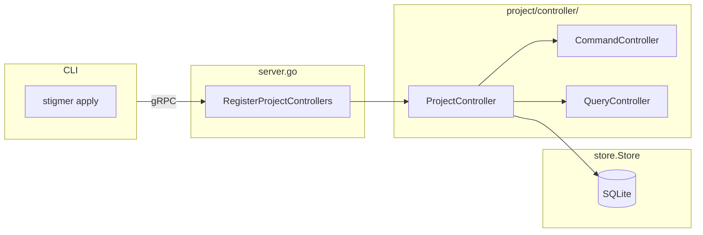

# A1: Project Controller Foundation

## Overview

This task establishes the Project entity backend infrastructure in the Go OSS server. Project is the aggregate root for SDK-based deployments, containing embedded resources (agents, workflows, mcp_servers, skills) that will be reconciled in later phases (E1/E2).

## Architecture Context




## Files to Create

### 1. [backend/services/stigmer-server/pkg/domain/project/controller/project_controller.go](backend/services/stigmer-server/pkg/domain/project/controller/project_controller.go)

**Purpose**: Controller struct and constructor following the established pattern from `mcpserver_controller.go`.

**Structure**:

```go
package project

import (
    projectv1 "github.com/stigmer/stigmer/apis/stubs/go/ai/stigmer/agentic/project/v1"
    "github.com/stigmer/stigmer/backend/libs/go/store"
)

// ProjectController implements ProjectCommandController and ProjectQueryController
type ProjectController struct {
    projectv1.UnimplementedProjectCommandControllerServer
    projectv1.UnimplementedProjectQueryControllerServer
    store store.Store
    
    // Downstream controller references for reconciliation (Phase E)
    // These will be injected after in-process gRPC server starts
    agentClient          interface{} // Will be *agent.Client
    workflowClient       interface{} // Will be *workflow.Client
    mcpServerClient      interface{} // Will be *mcpserver.Client
    skillClient          interface{} // Will be *skill.Client
}

func NewProjectController(store store.Store) *ProjectController {
    return &ProjectController{store: store}
}

// Setter methods for downstream clients (for reconciliation in later phases)
func (c *ProjectController) SetAgentClient(client interface{}) { c.agentClient = client }
// ... other setters
```

**Key Decisions**:

- Embed both `UnimplementedProjectCommandControllerServer` and `UnimplementedProjectQueryControllerServer` by value (not pointer) per gRPC forward compatibility requirements
- Start with `store.Store` only; downstream clients will be `interface{}` placeholders initially
- Follow the exact pattern from `mcpserver_controller.go` for consistency

### 2. [backend/services/stigmer-server/pkg/domain/project/controller/BUILD.bazel](backend/services/stigmer-server/pkg/domain/project/controller/BUILD.bazel)

**Purpose**: Bazel build configuration following existing controller patterns.

**Structure**:

```python
load("@rules_go//go:def.bzl", "go_library", "go_test")

go_library(
    name = "controller",
    srcs = ["project_controller.go"],
    importpath = "github.com/stigmer/stigmer/backend/services/stigmer-server/pkg/domain/project/controller",
    visibility = ["//visibility:public"],
    deps = [
        "//apis/stubs/go/ai/stigmer/agentic/project/v1:project",
        "//backend/libs/go/store",
    ],
)

go_test(
    name = "controller_test",
    srcs = ["project_controller_test.go"],
    embed = [":controller"],
    deps = [
        "//apis/stubs/go/ai/stigmer/agentic/project/v1:project",
        "//apis/stubs/go/ai/stigmer/commons/apiresource",
        "//apis/stubs/go/ai/stigmer/commons/apiresource/apiresourcekind",
        "//backend/libs/go/grpc/interceptors/apiresource",
        "//backend/libs/go/store/sqlite",
    ],
)
```

### 3. [backend/services/stigmer-server/pkg/domain/project/controller/project_controller_test.go](backend/services/stigmer-server/pkg/domain/project/controller/project_controller_test.go)

**Purpose**: Foundation tests following patterns from `mcpserver_controller_test.go`.

**Test Cases** (~10 tests):

- `TestNewProjectController_CreatesWithStore` - Constructor returns valid controller
- `TestProjectController_ImplementsCommandServer` - Type assertion for gRPC interface
- `TestProjectController_ImplementsQueryServer` - Type assertion for gRPC interface
- `TestProjectController_EmbeddedServersNotNil` - Verify embedded servers work
- `contextWithProjectKind()` - Helper function for tests
- `setupTestController()` - Helper to create controller with temp SQLite
- `createTestProject()` - Helper to create valid Project proto

### 4. [backend/services/stigmer-server/pkg/domain/project/controller/README.md](backend/services/stigmer-server/pkg/domain/project/controller/README.md)

**Purpose**: Documentation following the pattern of other controller READMEs.

**Contents**:

- Package overview and purpose
- Project entity role as aggregate root
- Implemented operations (with status: planned/implemented)
- Reconciliation architecture preview
- Example usage

## Modifications to Existing Files

### [backend/services/stigmer-server/pkg/server/server.go](backend/services/stigmer-server/pkg/server/server.go)

**Changes**:

1. Add import for `projectv1` and `projectcontroller`
2. Create and register ProjectController (near McpServer registration, lines 264-268)
3. Log registration

**Insertion Point** (after McpServer, ~line 268):

```go
// Import additions
projectv1 "github.com/stigmer/stigmer/apis/stubs/go/ai/stigmer/agentic/project/v1"
projectcontroller "github.com/stigmer/stigmer/backend/services/stigmer-server/pkg/domain/project/controller"

// Registration additions (after McpServer controller)
// Create and register Project controller
projectController := projectcontroller.NewProjectController(store)
projectv1.RegisterProjectCommandControllerServer(grpcServer, projectController)
projectv1.RegisterProjectQueryControllerServer(grpcServer, projectController)

log.Info().Msg("Registered Project controllers")
```

## Quality Requirements

Following the plan's stated requirements:

- All functions under 50 lines
- All files under 300 lines
- Comprehensive package documentation
- Zero linter errors
- Pass `go vet`, `gofmt`, Bazel build
- Table-driven tests with descriptive names

## Verification Steps

1. `bazel build //backend/services/stigmer-server/pkg/domain/project/controller:controller`
2. `bazel test //backend/services/stigmer-server/pkg/domain/project/controller:controller_test`
3. `bazel build //backend/services/stigmer-server/pkg/server:server`
4. Verify `gofmt` and `go vet` pass

## Dependencies

**Proto Stubs** (already generated):

- `//apis/stubs/go/ai/stigmer/agentic/project/v1:project`

**Backend Libraries**:

- `//backend/libs/go/store` - Storage interface
- `//backend/libs/go/store/sqlite` - Test implementation

## Follow-on Tasks

This foundation enables subsequent tasks:

- **A2**: Reconciliation value objects (ResourceKey, DesiredState, ActualState)
- **D1**: Create/Update handlers using pipeline framework
- **D2**: Get/GetByReference handlers
- **E1/E2**: Reconciliation service integration

## Proto Interface Summary

**ProjectCommandController** (from `command_grpc.pb.go`):

- `Apply(ctx, *Project) (*Project, error)` - Create or update
- `Create(ctx, *Project) (*Project, error)` - Create new
- `Update(ctx, *Project) (*Project, error)` - Update existing
- `Delete(ctx, *ProjectId) (*Project, error)` - Delete

**ProjectQueryController** (from `query_grpc.pb.go`):

- `Get(ctx, *ProjectId) (*Project, error)` - Get by ID
- `GetByReference(ctx, *ApiResourceReference) (*Project, error)` - Get by slug

