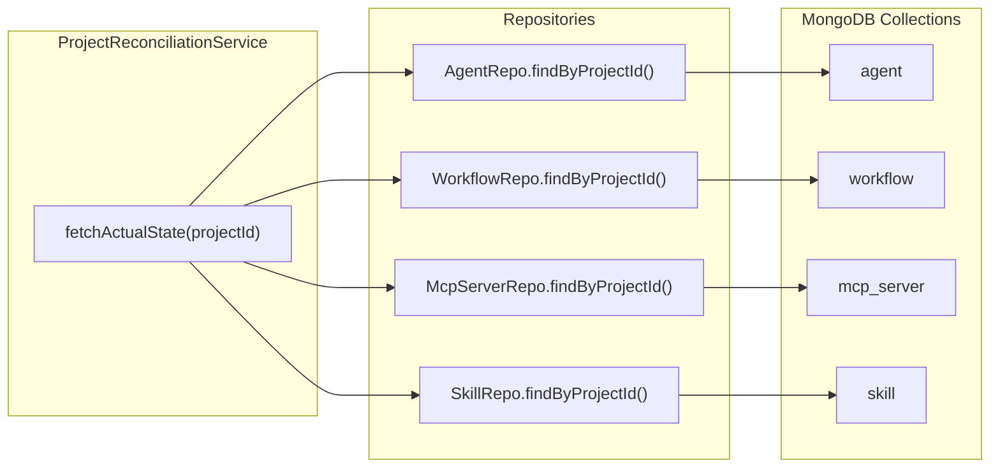

# T05.17: Actual State Fetching Implementation

## Overview

This task implements the "Actual State Fetching" component of the reconciliation engine. It enables the backend to query all resources (agents, workflows, MCP servers, skills) that belong to a specific project, identified by the `stigmer.ai/sdk.project` annotation in each resource's metadata.

## Architecture




## Key Design Decisions

- **Annotation-Based Ownership**: Resources belong to a project via `metadata.annotations["stigmer.ai/sdk.project"]` = projectId
- **Batch Queries**: Each repository makes one batch query per type (no N+1 problem)
- **Slug-Keyed Maps**: Results converted to slug-keyed maps for O(1) lookup during diff
- **Defensive Programming**: Empty projectId returns empty list, null-safe throughout

## Implementation Details

### 1. Repository Changes (4 files)

Add `findByProjectId(String projectId)` to each repository using the same pattern:

**Query Pattern**:

```java
// MongoDB query for annotation-based ownership
Query query = Query.query(
    Criteria.where("metadata.annotations.stigmer\\.ai/sdk\\.project").is(projectId)
);
```

**Note**: The backslashes escape the dots in the annotation key path for MongoDB's dot notation.

**Files to modify**:

- [AgentRepo.java](backend/services/stigmer-service/src/main/java/ai/stigmer/domain/agentic/agent/repo/AgentRepo.java)
- [WorkflowRepo.java](backend/services/stigmer-service/src/main/java/ai/stigmer/domain/agentic/workflow/repo/WorkflowRepo.java)
- [McpServerRepo.java](backend/services/stigmer-service/src/main/java/ai/stigmer/domain/agentic/mcpserver/repo/McpServerRepo.java)
- [SkillRepo.java](backend/services/stigmer-service/src/main/java/ai/stigmer/domain/agentic/skill/repo/SkillRepo.java)

**Method to add** (~20 lines per repo):

```java
/**
 * Find resources owned by a project.
 * 
 * Ownership is determined by the annotation:
 * {@code stigmer.ai/sdk.project} = projectId
 *
 * @param projectId The project ID to query for
 * @return List of resources owned by the project
 */
public List<Resource> findByProjectId(String projectId) {
    if (projectId == null || projectId.isEmpty()) {
        log.debug("Empty projectId provided, returning empty result");
        return List.of();
    }
    
    log.debug("Finding {} by projectId: {}", resolvedKind, projectId);
    Query query = Query.query(
        Criteria.where("metadata.annotations.stigmer\\.ai/sdk\\.project").is(projectId)
    );
    List<Document> docs = mongoTemplate.find(query, Document.class, collectionName);
    
    return docs.stream()
        .map(this::docToProto)
        .filter(Optional::isPresent)
        .map(Optional::get)
        .collect(Collectors.toList());
}
```

### 2. Service Implementation

**File**: [ProjectReconciliationService.java](backend/services/stigmer-service/src/main/java/ai/stigmer/domain/agentic/project/reconcile/ProjectReconciliationService.java)

Replace the stub `fetchActualState()` method (lines 261-273) with the full implementation:

```java
ActualState fetchActualState(String projectId) {
    log.debug("Fetching actual state for project: {}", projectId);
    
    // Query each repository for resources owned by this project
    List<Agent> agents = agentRepo.findByProjectId(projectId);
    List<Workflow> workflows = workflowRepo.findByProjectId(projectId);
    List<McpServer> mcpServers = mcpServerRepo.findByProjectId(projectId);
    List<Skill> skills = skillRepo.findByProjectId(projectId);
    
    // Convert to slug-keyed maps for O(1) lookup during diff
    Map<String, Agent> agentMap = agents.stream()
        .filter(a -> a.getMetadata() != null && !a.getMetadata().getName().isEmpty())
        .collect(Collectors.toMap(
            a -> a.getMetadata().getName(),
            Function.identity(),
            (existing, duplicate) -> existing  // Keep first on duplicate
        ));
    
    Map<String, Workflow> workflowMap = workflows.stream()
        .filter(w -> w.getMetadata() != null && !w.getMetadata().getName().isEmpty())
        .collect(Collectors.toMap(
            w -> w.getMetadata().getName(),
            Function.identity(),
            (existing, duplicate) -> existing
        ));
    
    Map<String, McpServer> mcpServerMap = mcpServers.stream()
        .filter(m -> m.getMetadata() != null && !m.getMetadata().getName().isEmpty())
        .collect(Collectors.toMap(
            m -> m.getMetadata().getName(),
            Function.identity(),
            (existing, duplicate) -> existing
        ));
    
    Map<String, Skill> skillMap = skills.stream()
        .filter(s -> s.getMetadata() != null && !s.getMetadata().getName().isEmpty())
        .collect(Collectors.toMap(
            s -> s.getMetadata().getName(),
            Function.identity(),
            (existing, duplicate) -> existing
        ));
    
    log.debug("Fetched actual state: {} agents, {} workflows, {} mcp_servers, {} skills",
        agentMap.size(), workflowMap.size(), mcpServerMap.size(), skillMap.size());
    
    return ActualState.of(agentMap, workflowMap, mcpServerMap, skillMap);
}
```

### 3. Constant Definition

Add a constant for the annotation key in `ProjectReconciliationService`:

```java
/**
 * Annotation key for project ownership.
 * Resources owned by a project have this annotation set to the project's ID.
 */
public static final String PROJECT_OWNERSHIP_ANNOTATION = "stigmer.ai/sdk.project";
```

### 4. Test Implementation

**New test file**: `ProjectReconciliationServiceActualStateTest.java` (~300 lines)

Test coverage:

- Repository method tests (findByProjectId for each repo)
- Service method tests (fetchActualState with various scenarios)
- Integration scenarios (empty project, single type, all types, duplicates)

**Test nested classes**:

1. **AgentRepoFindByProjectIdTests** - Query construction, empty/null handling, results
2. **WorkflowRepoFindByProjectIdTests** - Same pattern
3. **McpServerRepoFindByProjectIdTests** - Same pattern
4. **SkillRepoFindByProjectIdTests** - Same pattern
5. **FetchActualStateTests** - Service orchestration, map conversion, logging

## Files Summary


| File                                | Action | Lines | Description                    |
| ----------------------------------- | ------ | ----- | ------------------------------ |
| `AgentRepo.java`                    | Modify | +20   | Add `findByProjectId()`        |
| `WorkflowRepo.java`                 | Modify | +20   | Add `findByProjectId()`        |
| `McpServerRepo.java`                | Modify | +20   | Add `findByProjectId()`        |
| `SkillRepo.java`                    | Modify | +20   | Add `findByProjectId()`        |
| `ProjectReconciliationService.java` | Modify | +45   | Implement `fetchActualState()` |
| Tests (new)                         | Create | ~300  | Comprehensive test coverage    |


**Total**: ~125 implementation lines + ~300 test lines

## Success Criteria

- All four repositories have working `findByProjectId()` methods
- `fetchActualState()` returns properly-keyed `ActualState` from database
- Empty projectId returns empty `ActualState` (defensive programming)
- Resources without names are filtered out (data quality)
- Duplicate slugs handled gracefully (keep first)
- Zero linter errors
- All existing tests continue to pass
- New tests provide comprehensive coverage

## Risk Mitigation

- **MongoDB Query Syntax**: The annotation key `stigmer.ai/sdk.project` contains dots and slashes. MongoDB dot notation handles this correctly with escaped dots in the path.
- **Index Consideration**: For production performance, an index on `metadata.annotations.stigmer.ai/sdk.project` should be added (separate ops task, not blocking for T05.17).

