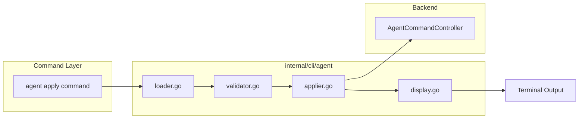

# Sub-task 3: Agent Applier and Display

## Overview

Create `applier.go` for gRPC apply operations and `display.go` for output formatting, mirroring the proven MCP Server pattern exactly while adapting to Agent-specific fields.

## Architecture




## File 1: applier.go (~100 lines)

**Location**: [client-apps/cli/internal/cli/agent/applier.go](client-apps/cli/internal/cli/agent/applier.go)

**Purpose**: Single responsibility - orchestrate gRPC apply calls to the backend.

### Types

```go
// ApplyOptions contains options for applying an Agent configuration
type ApplyOptions struct {
    Agent  *agentv1.Agent       // Agent proto to apply
    OrgID  string               // Organization ID for the resource
    Conn   *grpc.ClientConn     // gRPC connection to the backend
    Quiet  bool                 // Suppress detailed output
    DryRun bool                 // Validate without applying
}

// ApplyResult contains the result of applying an Agent configuration
type ApplyResult struct {
    Agent   *agentv1.Agent     // Applied Agent (from server response)
    Created bool               // true if created, false if updated
}
```

### Implementation Strategy

Mirror [mcpserver/applier.go](client-apps/cli/internal/cli/mcpserver/applier.go):

1. **Input validation**: Check Agent and Conn are non-nil
2. **Metadata initialization**: Ensure metadata exists, set org if not already set
3. **Dry-run handling**: If dry-run, display preview and return early
4. **Create vs Update detection**: Check if `metadata.id` exists
5. **gRPC call**: Use `AgentCommandControllerClient.Apply()`
6. **Return result**: Include created flag for display logic

### Key Imports

```go
import (
    agentv1 "github.com/stigmer/stigmer/apis/stubs/go/ai/stigmer/agentic/agent/v1"
    "github.com/stigmer/stigmer/apis/stubs/go/ai/stigmer/commons/apiresource"
    "github.com/stigmer/stigmer/client-apps/cli/internal/cli/cliprint"
)
```

## File 2: display.go (~80 lines)

**Location**: [client-apps/cli/internal/cli/agent/display.go](client-apps/cli/internal/cli/agent/display.go)

**Purpose**: Single responsibility - format and display Agent information to the terminal.

### Functions

**DisplayApplyResult** - Show success message and next steps after apply

- Created vs Updated message
- Resource details: ID, Name, Slug
- Next steps: get, delete, run commands

**DisplayAgentPreview** - Show Agent summary for dry-run mode

- Name, Description
- Instructions (truncated to ~100 chars with ellipsis)
- MCP Server count
- Skill count
- Sub-agent count

**DisplayAgentSummary** - Internal helper for consistent formatting

### Display Content (Agent-specific)

Unlike MCP Server which displays server type (stdio/http), Agent displays:

- **Name**: `metadata.name`
- **Description**: `spec.description`
- **Instructions**: First ~100 chars of `spec.instructions`
- **MCP Servers**: Count of `spec.mcp_server_usages`
- **Skills**: Count of `spec.skill_refs`
- **Sub-agents**: Count of `spec.sub_agents` (if any)

### Output Format

```
MCP Server pattern (for reference):
  Name:        GitHub MCP Server
  Description: GitHub tools for repository operations
  Type:        stdio
  Command:     npx

Agent pattern (to implement):
  Name:         Engineering Assistant
  Description:  Helps with code review
  Instructions: You are an engineering assistant that helps...
  MCP Servers:  3
  Skills:       2
  Sub-agents:   1
```

## BUILD.bazel Updates

Add new files to the existing `BUILD.bazel`:

```python
go_library(
    name = "agent",
    srcs = [
        "applier.go",    # NEW
        "display.go",    # NEW
        "execute.go",
        "loader.go",
        "validation.go",
        "validator.go",
    ],
    deps = [
        "//apis/stubs/go/ai/stigmer/agentic/agent/v1:agent",
        "//apis/stubs/go/ai/stigmer/commons/apiresource",
        "//client-apps/cli/internal/cli/cliprint",  # NEW
        "@build_buf_go_protovalidate//:protovalidate",
        "@com_github_pkg_errors//:errors",
        "@in_gopkg_yaml_v3//:yaml_v3",
        "@org_golang_google_grpc//:grpc",  # NEW
        "@org_golang_google_protobuf//encoding/protojson",
    ],
)
```

## Quality Standards

Per [coding-guidelines.mdc](client-apps/cli/.cursor/rules/coding-guidelines.mdc):

- **applier.go**: ~100 lines (under 150 ideal limit)
- **display.go**: ~80 lines (under 150 ideal limit)
- **Every function**: Under 50 lines
- **Every error**: Wrapped with specific context
- **Single responsibility**: applier.go = gRPC, display.go = formatting

## Testing Considerations

Tests for Sub-task 3 would require mocking gRPC connections, which is typically done at the integration test level. The display functions can be tested by calling them with constructed proto messages. However, per the plan, we're not including tests in this sub-task (tests are typically at the command layer for apply operations).

## Execution Checklist

1. Create `display.go` with display functions (no external dependencies beyond cliprint)
2. Create `applier.go` with Apply function and types
3. Update `BUILD.bazel` with new files and dependencies
4. Verify with `bazel build //client-apps/cli/internal/cli/agent:agent`
5. Run linter check on new files

