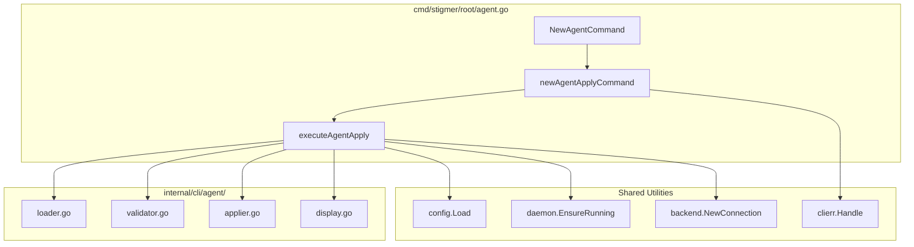

# Sub-task 4: Agent Apply Command

## Overview

Wire up `stigmer agent apply <file>` command that orchestrates:

- **Load** configuration (agent.Load)
- **Validate** cross-field logic (agent.Validate)
- **Apply** to backend (agent.Apply)
- **Display** result (agent.DisplayApplyResult)

This mirrors the proven MCP Server pattern from `[mcpserver.go](client-apps/cli/cmd/stigmer/root/mcpserver.go)`.

## Architecture




## File Changes

### 1. Create `cmd/stigmer/root/agent.go` (~150 lines)

**Purpose**: Thin command layer that orchestrates the agent business logic.

**Structure**:

```go
// NewAgentCommand() - command group with aliases ["agt"]
// newAgentApplyCommand() - apply subcommand
// agentApplyOptions - typed options struct
// executeAgentApply() - orchestration function
// resolveAgentOrganization() - org resolution (mirrors mcpserver pattern)
```

**Apply Command Flags**:

- `--org` - Organization override
- `--dry-run` - Validate without applying

**Execute Flow** (8 steps):

1. Load configuration via `agent.Load()`
2. Validate cross-field logic via `agent.Validate()`
3. Dry-run exit path with preview
4. Load backend config
5. Resolve organization
6. Ensure daemon (local mode)
7. Connect to backend
8. Apply and display result

### 2. Modify `cmd/stigmer/root.go`

Add command registration:

```go
rootCmd.AddCommand(root.NewAgentCommand())
```

### 3. Modify `cmd/stigmer/root/BUILD.bazel`

Add `agent.go` to `srcs`:

```bazel
srcs = [
    "agent.go",  # NEW
    "apply.go",
    ...
]
```

## Implementation Details

### Command Group Definition

```go
func NewAgentCommand() *cobra.Command {
    cmd := &cobra.Command{
        Use:     "agent",
        Aliases: []string{"agt"},
        Short:   "Manage AI agents",
        Long:    `...`,  // Detailed description
        Example: `...`,  // Usage examples
    }
    cmd.AddCommand(newAgentApplyCommand())
    return cmd
}
```

### Apply Subcommand

```go
func newAgentApplyCommand() *cobra.Command {
    var orgOverride string
    var dryRun bool
    
    cmd := &cobra.Command{
        Use:   "apply [file]",
        Short: "Apply an agent configuration",
        Args:  cobra.MaximumNArgs(1),
        Run: func(cmd *cobra.Command, args []string) {
            var filePath string
            if len(args) > 0 {
                filePath = args[0]
            }
            result, err := executeAgentApply(agentApplyOptions{
                FilePath:    filePath,
                OrgOverride: orgOverride,
                DryRun:      dryRun,
            })
            clierr.Handle(err)
            if !dryRun && result != nil {
                agent.DisplayApplyResult(result)
            }
        },
    }
    cmd.Flags().StringVar(&orgOverride, "org", "", "organization ID")
    cmd.Flags().BoolVar(&dryRun, "dry-run", false, "validate without applying")
    return cmd
}
```

### Execute Function (Orchestration)

Mirrors `[executeMcpServerApply](client-apps/cli/cmd/stigmer/root/mcpserver.go:147-219)`:

```go
func executeAgentApply(opts agentApplyOptions) (*agent.ApplyResult, error) {
    // Step 1: Load configuration
    loadResult, err := agent.Load(&agent.LoadOptions{FilePath: opts.FilePath})
    
    // Step 2: Validate cross-field logic  
    if err := agent.Validate(loadResult.Agent); err != nil {
        return nil, err
    }
    
    // Step 3: Dry-run path
    if opts.DryRun {
        agent.DisplayAgentPreview(loadResult.Agent)
        return nil, nil
    }
    
    // Steps 4-8: Backend connection and apply
    // (Same pattern as MCP Server)
}
```

## Key Integration Points

**Components from Sub-tasks 1-3**:

- `agent.Load()` - Sub-task 1
- `agent.Validate()` - Sub-task 2
- `agent.Apply()` - Sub-task 3
- `agent.DisplayApplyResult()` - Sub-task 3
- `agent.DisplayAgentPreview()` - Sub-task 3

**Shared Utilities**:

- `config.Load()` - Backend configuration
- `daemon.EnsureRunning()` - Local daemon management
- `backend.NewConnection()` - gRPC connection
- `clierr.Handle()` - Centralized error handling
- `cliprint.Print*()` - User feedback

## Coding Guidelines Compliance

Per [coding-guidelines.mdc](client-apps/cli/.cursor/rules/coding-guidelines.mdc):

- **File size**: ~150 lines (well under 250 limit)
- **Function size**: Each function under 50 lines
- **Thin handlers**: Command layer only orchestrates, business logic in internal/
- **Error wrapping**: All errors wrapped with context
- **Single responsibility**: `agent.go` handles agent command group only

## Testing Strategy

Manual testing via:

```bash
# Build
bazel build //client-apps/cli/cmd/stigmer:stigmer

# Test apply with dry-run
./bazel-bin/client-apps/cli/cmd/stigmer/stigmer_/stigmer agent apply --dry-run test-agent.yaml

# Test auto-detect
cd /path/with/agent.yaml && stigmer agent apply

# Test with org override
stigmer agent apply --org my-org agent.yaml
```

## Deliverables

1. `cmd/stigmer/root/agent.go` - Command group with apply subcommand (~150 lines)
2. Updated `cmd/stigmer/root.go` - Registration line
3. Updated `cmd/stigmer/root/BUILD.bazel` - Source file added
4. Bazel build passing
5. Manual testing of apply flow

