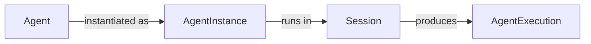

# Agent Documentation Restructure Plan

## What Is Changing and Why

The current single file `apis/ai/stigmer/agentic/agent/docs/agent-resource-guide.md` has 3 critical factual errors, 4 major missing fields, and is too monolithic for its stated purpose of being the foundation for Skills and Agents. The fix is to split it into focused documents and correct every inaccuracy against the protos.

---

## Factual Errors Being Fixed

- `**scope: platform` in `spec.proto` inline YAML** — the field is `org`, value is `local`. Two wrong things in one comment.
- `**kind` integer vs string ambiguity** — seedpack YAMLs (`agent-creator.yaml`, `skill-creator.yaml`) confirm `kind: skill` and `kind: mcp_server` (lowercase strings) are correct. Proto comments show `kind: 43` which is wrong.
- `**spec.description` marked Required but has no `buf.validate` constraint** — will be corrected to reflect actual enforcement (or clarified as strongly recommended).
- `**org: local` explanation** — the value is correct (`local` is confirmed in live YAMLs) but the explanation is wrong. `metadata.proto` says "defaults to `default` org in local mode" — this contradiction needs resolving and documenting clearly.

---

## New File Structure

```
apis/ai/stigmer/agentic/agent/docs/
├── README.md                     (new) index + full lifecycle
├── agent-resource-guide.md       (rewrite) core YAML schema reference only
├── resource-references.md        (new) ApiResourceReference format
├── mcp-server-integration.md     (new) MCP servers + tool approvals
├── skill-integration.md          (new) Skills + injection mechanism
├── sub-agents.md                 (new) Sub-agents + permission model
├── examples.md                   (new) all YAML examples
└── validation-checklist.md       (new) checklist + all pitfalls
```

---

## File-by-File Plan

### 1. Fix `apis/ai/stigmer/agentic/agent/v1/spec.proto`

Fix stale inline YAML comments:

- Change `scope: platform` → `org: local` in all 3 places
- Change `kind: 43` → `kind: skill` and `kind: 44` → `kind: mcp_server`

### 2. New: `README.md`

- Overview paragraph explaining the Agent resource
- Full lifecycle diagram:




- Extended Docker analogy: Agent = image, AgentInstance = container config, Session = container runtime, AgentExecution = container run
- Table of contents linking all docs in this folder

### 3. Rewrite: `agent-resource-guide.md`

Scope narrows to: metadata + spec fields reference only. Adds:

- `metadata.visibility` — `PRIVATE` (default) / `PUBLIC`. Explain marketplace publishing.
- `metadata.org` — show in all YAML examples (local mode vs cloud mode)
- `metadata.annotations` — acknowledge existence, link to labels
- `AgentStatus` fields — `default_instance_id` + audit fields
- Fix `spec.description` Required column to reflect actual enforcement
- Remove all content that moves to dedicated files (MCP, skills, sub-agents, examples, checklist)

### 4. New: `resource-references.md`

Single source of truth for `ApiResourceReference`:

- Full field table (`org`, `kind`, `slug`, `version`)
- Explicitly document that `kind` is a **lowercase string** enum name in YAML (`skill`, `mcp_server`) — not an integer
- Document `org: local` — what it means (the bootstrapped system org in local mode), when to use it vs an org slug
- Full `version` semantics: empty = latest, `stable` / `v1.0` = tag, 64-char hex = immutable hash

### 5. New: `mcp-server-integration.md`

Moves and expands MCP content from `agent-resource-guide.md`. Adds:

- `ToolApprovalOverride.message` inheritance behavior (currently undocumented):
  - When `requires_approval=true` and `message` is empty: uses McpServer default → falls back to `"Execute tool: {tool_name}"`
- **Silent failure for invalid tool names** in `tool_approval_overrides` (currently undocumented)
- Full policy chain (already correct in original, keep it)
- Runtime resolution flow (keep)

### 6. New: `skill-integration.md`

Moves and expands Skills content. Adds:

- Explicit explanation of the skill trigger mechanism — what "triggers based on description matching" actually means at runtime
- `version` field full semantics (currently just a brief note)

### 7. New: `sub-agents.md`

Moves Sub-Agent content. Content is already accurate — just needs its own focused document.

### 8. New: `examples.md`

All 5 YAML examples from the original guide, updated:

- Add `metadata.org: local` to all examples (shows correct form)
- Add a cloud-mode example with `metadata.org: acme-corp` and `metadata.visibility: PUBLIC`

### 9. New: `validation-checklist.md`

Original checklist + pitfalls, plus 3 new pitfall entries:

- **Silent approval override failure** — typo in `tool_name` means no approval is applied with no error
- **Cloud mode missing `metadata.org`** — agent fails to be assigned to an org
- `**kind` as integer** — `kind: 43` is wrong; use `kind: skill`

---

## Key Files Changed

- `[apis/ai/stigmer/agentic/agent/v1/spec.proto](apis/ai/stigmer/agentic/agent/v1/spec.proto)` — proto comment fixes
- `[apis/ai/stigmer/agentic/agent/docs/agent-resource-guide.md](apis/ai/stigmer/agentic/agent/docs/agent-resource-guide.md)` — rewritten as core schema reference
- 7 new markdown files in the same `docs/` folder

