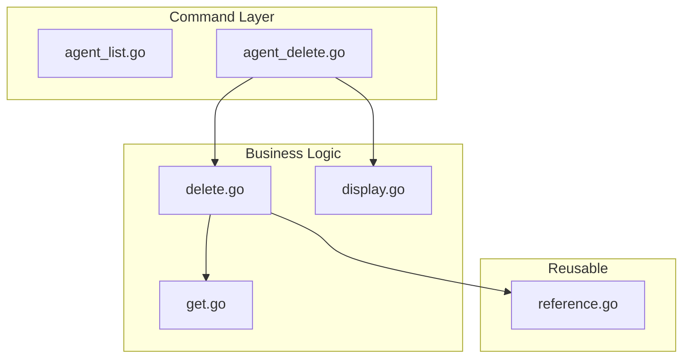

# Phase 1 Sub-task 6: Agent List + Delete Commands

## Context

Sub-tasks 1-5 are complete. We have:

- Agent loader, validator, applier, display
- Apply, validate, and get commands
- Enum-based reference parsing (no hardcoded prefixes)

## API Availability

**Delete API**: Available via `AgentCommandController.Delete(ctx, *AgentId) (*Agent, error)`

- Uses `AgentId` type with `Value` field (different from MCP Server's `ApiResourceDeleteInput`)

**List API**: NOT available - `AgentQueryController` only has `Get` and `GetByReference`

- List command will be a helpful placeholder (same pattern as MCP Server)

## Architecture




---

## Implementation Plan

### 1. Create Delete Business Logic

**File**: [internal/cli/agent/delete.go](client-apps/cli/internal/cli/agent/delete.go) (~80 lines)

Purpose: gRPC delete orchestration, separated from command layer.

```go
// DeleteFromBackend deletes an agent by ID.
// Returns the deleted agent or error with context.
func DeleteFromBackend(conn grpc.ClientConnInterface, agentID string) (*agentv1.Agent, error)
```

Key points:

- Uses `AgentCommandController.Delete()` with `AgentId{Value: agentID}`
- Returns deleted agent for display
- Wraps errors with specific context

---

### 2. Extend Display for Delete

**File**: [internal/cli/agent/display.go](client-apps/cli/internal/cli/agent/display.go) (add ~25 lines)

Add:

```go
// DisplayDeleteResult displays the result of a delete operation.
func DisplayDeleteResult(agent *agentv1.Agent)
```

Output format:

- Success message with agent name
- Confirmation the resource is deleted

---

### 3. Create Delete Command

**File**: [cmd/stigmer/root/agent_delete.go](client-apps/cli/cmd/stigmer/root/agent_delete.go) (~115 lines)

**Command**: `stigmer agent delete <name-or-id>`

Flags:

- `--force, -f`: Skip confirmation prompt
- `--org`: Organization override

**Orchestration flow** (mirrors MCP Server pattern):

1. Load backend configuration
2. Resolve organization
3. Ensure daemon (local mode)
4. Connect to backend
5. Parse reference (uses existing `reference.Parse()`)
6. Fetch agent to confirm existence (uses existing `GetFromBackend()`)
7. Show confirmation prompt (unless `--force`)
8. Delete via gRPC
9. Display success

**Confirmation prompt** (using survey library):

```go
survey.Confirm{
    Message: fmt.Sprintf("Delete agent '%s'? This cannot be undone.", name),
}
```

---

### 4. Create List Command (Placeholder)

**File**: [cmd/stigmer/root/agent_list.go](client-apps/cli/cmd/stigmer/root/agent_list.go) (~55 lines)

**Command**: `stigmer agent list`

Implementation:

- Display helpful message that List is not yet available
- Suggest using `stigmer agent get <name>` instead
- Mirror MCP Server's placeholder pattern exactly

---

### 5. Register Commands

**File**: [cmd/stigmer/root/agent.go](client-apps/cli/cmd/stigmer/root/agent.go)

Add registrations:

```go
cmd.AddCommand(newAgentListCommand())
cmd.AddCommand(newAgentDeleteCommand())
```

---

### 6. Update BUILD Files

**cmd/stigmer/root/BUILD.bazel**:

- Add `agent_list.go` to srcs
- Add `agent_delete.go` to srcs
- Add `@com_github_alecaivazis_survey_v2//:survey` to deps (if not already present)

**internal/cli/agent/BUILD.bazel**:

- Add `delete.go` to srcs

---

## File Summary


| File                               | Action | Lines    |
| ---------------------------------- | ------ | -------- |
| `internal/cli/agent/delete.go`     | CREATE | ~80      |
| `internal/cli/agent/display.go`    | MODIFY | +25      |
| `internal/cli/agent/BUILD.bazel`   | MODIFY | +1 src   |
| `cmd/stigmer/root/agent_list.go`   | CREATE | ~55      |
| `cmd/stigmer/root/agent_delete.go` | CREATE | ~115     |
| `cmd/stigmer/root/agent.go`        | MODIFY | +2 lines |
| `cmd/stigmer/root/BUILD.bazel`     | MODIFY | +2 srcs  |


---

## Coding Guidelines Compliance

- All files under 250 lines
- All functions under 50 lines
- Errors wrapped with specific context
- Command handlers are thin orchestration
- Business logic in `internal/cli/agent/`
- Reuses existing `reference.Parse()` and `GetFromBackend()`

---

## Key Differences from MCP Server

1. **Delete API**: Agent uses `AgentId{Value: string}`, MCP Server uses `ApiResourceDeleteInput{ResourceId: string}`
2. **Confirmation**: Agent will have proper interactive confirmation (improvement over MCP Server's incomplete implementation)
3. **Error messages**: Agent-specific error context ("agent" not "MCP server")

---

## Testing Approach

- Delete logic testable via mock gRPC connection
- Confirmation prompt uses survey library (same as approval package)
- Manual testing with local daemon:
  - `stigmer agent apply agent.yaml` (create)
  - `stigmer agent get my-agent` (verify)
  - `stigmer agent delete my-agent` (with confirmation)
  - `stigmer agent delete my-agent --force` (skip confirmation)
  - `stigmer agent list` (placeholder message)

