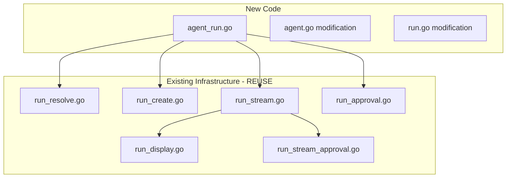

# Sub-task 7: Agent Run Command

## Strategic Architecture

The `stigmer agent run` command must be implemented as a **thin orchestration layer** that reuses the existing, battle-tested run infrastructure. The root `run` command contains ~800 lines of well-structured execution logic across 8 files - duplicating this would be engineering malpractice.




## Key Design Decisions

**1. Reuse over duplication**: All execution logic exists in `run_*.go` files. The new command is purely orchestration.

**2. Agent-only execution**: Unlike root `run` which tries workflow → agent, `stigmer agent run` is deterministic - agents only.

**3. No auto-discovery**: Explicit reference required. Clean, predictable behavior for production use.

**4. Flag parity**: Same flags as root `run` for seamless migration.

**5. Soft deprecation**: Root `run` shows warning but continues working - no breaking changes.

---

## Implementation

### File 1: Create `agent_run.go` (~130 lines)

Location: [cmd/stigmer/root/agent_run.go](client-apps/cli/cmd/stigmer/root/agent_run.go)

**Structure**:

```go
// newAgentRunCommand creates the agent run subcommand
func newAgentRunCommand() *cobra.Command {
    // Flags: --message, --env, --env-file, --secret, --secret-file, --follow, --org
}

// executeAgentRun orchestrates agent execution
func executeAgentRun(opts agentRunOptions) error {
    // 1. Load and merge environment variables
    // 2. Connect to backend (reuse: connectToBackend)
    // 3. Resolve agent (reuse: resolveAgent)
    // 4. Create execution (reuse: createAgentExecution)
    // 5. Display started message
    // 6. Stream logs if --follow (reuse: streamAgentExecutionLogs)
}
```

**Flags** (matching root run for seamless migration):

- `--message, -m` - Initial prompt for the agent
- `--env` - Runtime environment variables (KEY=VALUE, repeatable)
- `--env-file` - Load environment from file (repeatable)
- `--secret` - Secret environment variables (encrypted)
- `--secret-file` - Load secrets from file (encrypted)
- `--follow` - Stream execution logs (default: true)
- `--org` - Organization override

**Dependencies** (all existing):

- `connectToBackend()` from `run_resolve.go`
- `resolveAgent()` from `run_resolve.go`
- `createAgentExecution()` from `run_create.go`
- `streamAgentExecutionLogs()` from `run_stream.go`
- `envfile.LoadAndMergeWithSecrets()` from `internal/cli/envfile`

---

### File 2: Modify `agent.go`

Location: [cmd/stigmer/root/agent.go](client-apps/cli/cmd/stigmer/root/agent.go)

**Change**: Add run command registration

```go
func NewAgentCommand() *cobra.Command {
    // ... existing code ...
    
    cmd.AddCommand(newAgentApplyCommand())
    cmd.AddCommand(newAgentValidateCommand())
    cmd.AddCommand(newAgentGetCommand())
    cmd.AddCommand(newAgentListCommand())
    cmd.AddCommand(newAgentSearchCommand())
    cmd.AddCommand(newAgentDeleteCommand())
    cmd.AddCommand(newAgentRunCommand())  // NEW
    
    return cmd
}
```

**Also update**:

- Command examples to include `stigmer agent run` usage
- Long description to mention execution capability

---

### File 3: Modify `run.go` - Deprecation Warning

Location: [cmd/stigmer/root/run.go](client-apps/cli/cmd/stigmer/root/run.go)

**Change**: Add deprecation warning at the start of Run function

```go
Run: func(cmd *cobra.Command, args []string) {
    // Show deprecation warning (once per invocation)
    cliprint.PrintWarning("Deprecated: 'stigmer run' will be removed in a future version")
    cliprint.PrintInfo("  Use: stigmer agent run <name>   (for agents)")
    cliprint.PrintInfo("  Use: stigmer workflow run <name> (for workflows)")
    fmt.Println()
    
    // ... existing logic continues unchanged ...
}
```

---

### File 4: Update `BUILD.bazel`

Location: [cmd/stigmer/root/BUILD.bazel](client-apps/cli/cmd/stigmer/root/BUILD.bazel)

**Change**: Add `agent_run.go` to sources

---

## Execution Flow

```mermaid
sequenceDiagram
    participant User
    participant AgentRun as agent_run.go
    participant EnvFile as envfile package
    participant Resolve as run_resolve.go
    participant Create as run_create.go
    participant Stream as run_stream.go
    participant Backend as gRPC Backend

    User->>AgentRun: stigmer agent run my-agent -m "hello"
    AgentRun->>EnvFile: LoadAndMergeWithSecrets()
    EnvFile-->>AgentRun: runtimeEnv
    AgentRun->>Resolve: connectToBackend(orgOverride)
    Resolve-->>AgentRun: conn, orgID
    AgentRun->>Resolve: resolveAgent(ref, orgID, conn)
    Resolve->>Backend: AgentQueryController.Get/GetByReference
    Backend-->>Resolve: Agent
    Resolve-->>AgentRun: agent
    AgentRun->>Create: createAgentExecution(agentID, orgID, msg, env, conn)
    Create->>Backend: AgentExecutionCommandController.Create
    Backend-->>Create: AgentExecution
    Create-->>AgentRun: execution
    AgentRun->>User: "Execution started: {id}"
    AgentRun->>Stream: streamAgentExecutionLogs(execID, conn)
    Stream->>Backend: AgentExecutionQueryController.Subscribe
    loop Until terminal phase
        Backend-->>Stream: execution update
        Stream->>User: Display phase/message/approval
    end
    Stream->>User: "Execution complete"
```


---

## Testing Strategy

**Manual Testing** (no new test files - reuses existing infrastructure):

1. **Basic execution**: `stigmer agent run my-agent`
2. **With message**: `stigmer agent run my-agent --message "Hello"`
3. **With env vars**: `stigmer agent run my-agent --env API_KEY=xxx`
4. **Without streaming**: `stigmer agent run my-agent --no-follow`
5. **By agent ID**: `stigmer agent run agt_01abc123`
6. **With org override**: `stigmer agent run my-agent --org other-org`
7. **Deprecation warning**: `stigmer run my-agent` (should show warning)

---

## Coding Guidelines Compliance

- File size: ~130 lines (well under 250 limit)
- Functions: Under 50 lines each
- Errors: Wrapped with specific context
- Command handler: Thin orchestration only
- No business logic duplication
- Descriptive naming: `executeAgentRun`, `agentRunOptions`

---

## Files Summary


| File           | Action | Lines | Purpose                                     |
| -------------- | ------ | ----- | ------------------------------------------- |
| `agent_run.go` | CREATE | ~130  | Run subcommand with flags and orchestration |
| `agent.go`     | MODIFY | +3    | Add run command registration + examples     |
| `run.go`       | MODIFY | +5    | Add deprecation warning                     |
| `BUILD.bazel`  | MODIFY | +1    | Add agent_run.go to sources                 |


**Total new code**: ~140 lines
**Code reused**: ~800 lines of existing run infrastructure