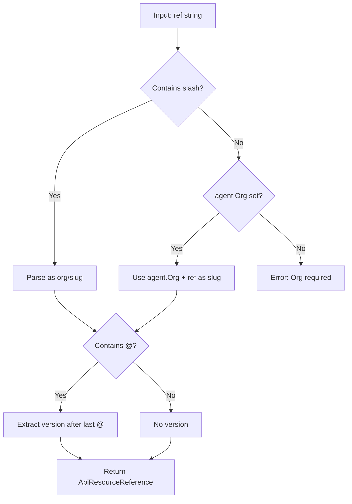

# Phase 2 Sub-Task 3: Add Smart Parsing to Agent Package

## Overview

Add new methods to `sdk/go/agent/` that implement the org/slug reference model with smart parsing. These methods will serve as the primary API for adding skills and MCP servers to agents, replacing the old scope-based approach.

## Design Philosophy

This implementation follows three core principles for a world-class SDK:

1. **Intuitive API**: `agent.AddSkill("web-search")` is natural - no factory functions needed
2. **Explicit over implicit**: `"org/slug"` is always explicit; `"slug"` uses agent context
3. **Fail fast, fail clear**: Invalid references cause immediate, descriptive errors

## Smart Parsing Logic




**Examples:**

- `"web-search"` → `{Org: agent.Org, Slug: "web-search"}`
- `"stigmer/web-search"` → `{Org: "stigmer", Slug: "web-search"}`
- `"web-search@v1.0"` → `{Org: agent.Org, Slug: "web-search", Version: "v1.0"}`
- `"stigmer/web-search@v1.0"` → `{Org: "stigmer", Slug: "web-search", Version: "v1.0"}`

## Implementation Structure

### File 1: `sdk/go/agent/skill_options.go` (~40 lines)

Functional options for skill configuration:

```go
// SkillOption configures skill reference creation in AddSkill methods.
type SkillOption func(*skillOptions)

type skillOptions struct {
    version string
}

// AtVersion sets the skill version (tag, hash, or "latest").
func AtVersion(v string) SkillOption
```

### File 2: `sdk/go/agent/parsing.go` (~100 lines)

Internal parsing helpers leveraging the skill/mcpserver packages:

```go
// parseSkillRef parses a skill reference with smart org resolution.
// If ref contains "/", parses as "org/slug[@version]".
// If ref has no "/", uses defaultOrg + ref as slug.
func parseSkillRef(ref, defaultOrg string, opts ...SkillOption) (*apiresource.ApiResourceReference, error)

// parseMcpServerRef parses an MCP server reference with smart org resolution.
// Same logic as parseSkillRef but without version support.
func parseMcpServerRef(ref, defaultOrg string) (*apiresource.ApiResourceReference, error)
```

Key implementation details:

- Reuse parsing logic from [sdk/go/skill/skill.go](sdk/go/skill/skill.go) and [sdk/go/mcpserver/mcpserver.go](sdk/go/mcpserver/mcpserver.go)
- Handle edge cases: multiple slashes, @ in version, empty parts
- Return structured errors with context (input string, reason)

### File 3: Additions to `sdk/go/agent/agent.go`

New public methods (maintaining thread safety with existing `mu` mutex):

**Skill Methods:**

```go
// AddSkill adds a skill reference using smart org/slug parsing.
//
// If ref contains "/", it's parsed as "org/slug" or "org/slug@version".
// If ref has no "/", the agent's Org is used with ref as the slug.
//
// Panics if the format is invalid or if Org is required but not set.
// For dynamic input, use TryAddSkill instead.
//
// Examples:
//
//   agent.AddSkill("web-search")                    // Uses agent.Org
//   agent.AddSkill("stigmer/web-search")            // Explicit org
//   agent.AddSkill("stigmer/web-search@v1.0")       // With version
//   agent.AddSkill("web-search", AtVersion("v1.0")) // Option pattern
func (a *Agent) AddSkill(ref string, opts ...SkillOption) *Agent

// AddSkills adds multiple skill references using smart parsing.
// Panics on first invalid reference.
func (a *Agent) AddSkills(refs ...string) *Agent

// TryAddSkill is like AddSkill but returns an error instead of panicking.
// Use this for dynamic/user-provided references.
func (a *Agent) TryAddSkill(ref string, opts ...SkillOption) (*Agent, error)

// TryAddSkills is like AddSkills but returns an error instead of panicking.
func (a *Agent) TryAddSkills(refs ...string) (*Agent, error)
```

**MCP Server Method (Updated):**

The existing `UseMCPServer` method in [agent.go](sdk/go/agent/agent.go) (lines 307-314) currently assumes platform scope. We have two options:

**Option A (Recommended):** Add new method, deprecate old

```go
// UseMCP adds an MCP server using smart org/slug parsing.
//
// If ref contains "/", it's parsed as "org/slug".
// If ref has no "/", the agent's Org is used with ref as the slug.
//
// Panics if the format is invalid or if Org is required but not set.
//
// Examples:
//
//   agent.UseMCP("github")                // Uses agent.Org
//   agent.UseMCP("stigmer/github")        // Explicit org
//   agent.UseMCP("github", "create_pr")   // With specific tools
func (a *Agent) UseMCP(ref string, enabledTools ...string) *Agent

// TryUseMCP is like UseMCP but returns an error instead of panicking.
func (a *Agent) TryUseMCP(ref string, enabledTools ...string) (*Agent, error)
```

**Option B:** Update existing `UseMCPServer` to use smart parsing (breaking change)

I recommend Option A to avoid breaking existing code.

### File 4: `sdk/go/agent/smart_parsing_test.go` (~350 lines)

Comprehensive test coverage:

**Test Categories:**

1. **AddSkill parsing tests**
  - Slug-only with agent.Org set
  - Explicit org/slug
  - With version in string
  - With version option
  - Version option overrides string version
  - Hyphenated names
  - Multiple slashes (org/slug/extra → slug = "slug/extra")
2. **AddSkill error tests**
  - Slug-only without agent.Org → panic with clear message
  - Empty string → panic
  - Empty org in explicit ref → panic
  - Empty slug → panic
3. **TryAddSkill tests**
  - Same scenarios as AddSkill but verify error returns (not panics)
  - Verify error types can be checked with `errors.Is`
4. **AddSkills batch tests**
  - Multiple valid refs
  - First invalid ref stops processing
  - Empty list is no-op
5. **UseMCP tests**
  - Same parsing scenarios as AddSkill (without version)
  - With enabled tools
  - Chaining multiple servers
6. **Thread safety tests**
  - Concurrent AddSkill calls
  - Concurrent mixed calls (AddSkill + UseMCP)
7. **Integration tests**
  - Full agent creation with new methods
  - Verify proto conversion works correctly

## Error Messages

Error messages must be actionable:

```
agent: cannot add skill "web-search": agent.Org is not set (use "org/slug" format or set agent.Org first)

agent: cannot add skill "/slug": organization is empty in reference

agent: cannot add skill "": reference string is empty
```

## Compatibility Notes

**Preserved (no changes):**

- `AddSkillRef(*ApiResourceReference)` - existing method
- `AddSkillRefs(...*ApiResourceReference)` - existing method
- `AddMcpServerUsage(ref, tools...)` - existing method
- `UseMCPServer(slug, tools...)` - old method (will be deprecated later)

**New (this task):**

- `AddSkill(ref, opts...)` - smart parsing
- `AddSkills(refs...)` - batch smart parsing
- `TryAddSkill(ref, opts...)` - safe smart parsing
- `TryAddSkills(refs...)` - safe batch smart parsing
- `UseMCP(ref, tools...)` - smart parsing
- `TryUseMCP(ref, tools...)` - safe smart parsing

## Verification Checklist

After implementation:

- `go build ./sdk/go/...` compiles without errors
- `go test -v ./sdk/go/agent/...` all tests pass (including new ones)
- `go vet ./sdk/go/agent/...` no issues
- Godoc renders correctly for all new functions
- Error messages are clear and actionable
- Thread safety verified with race detector: `go test -race ./sdk/go/agent/...`

## References

- [sdk/go/skill/skill.go](sdk/go/skill/skill.go) - Parse logic pattern
- [sdk/go/mcpserver/mcpserver.go](sdk/go/mcpserver/mcpserver.go) - Parse logic pattern
- [sdk/go/skill/errors.go](sdk/go/skill/errors.go) - Error type pattern
- [sdk/go/agent/agent.go](sdk/go/agent/agent.go) - Current implementation

