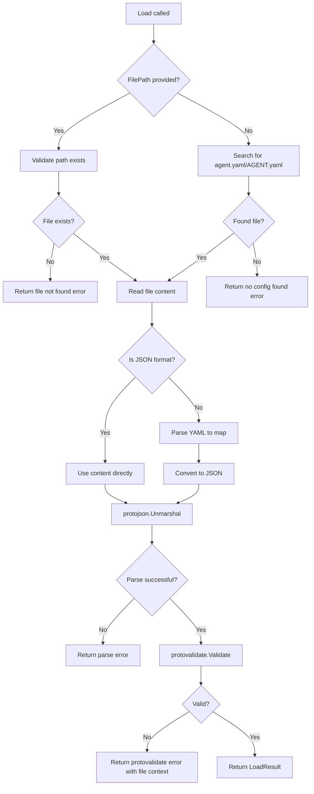

# Sub-task 1: Agent YAML Loader

This is the foundation for the entire Agent YAML-First architecture. Every subsequent command depends on this loader being correct, extensible, and thoroughly tested.

## Critical Architecture Decision: Protovalidate as Single Source of Truth

**The proto files already define all validation rules via `buf.validate`:**

From `api.proto`:

```protobuf
message Agent {
  string api_version = 1 [(buf.validate.field).string.const = 'agentic.stigmer.ai/v1'];
  string kind = 2 [(buf.validate.field).string.const = 'Agent'];
  ApiResourceMetadata metadata = 3 [(buf.validate.field).required = true];
  AgentSpec spec = 4;
}
```

From `spec.proto`:

```protobuf
message AgentSpec {
  string instructions = 3 [(buf.validate.field).string.min_len = 10];
  repeated McpServerUsage mcp_server_usages = 4 [/* CEL: kind == 44 */];
  repeated ApiResourceReference skill_refs = 5 [/* CEL: kind == 43 */];
}
```

**We do NOT duplicate these validations in Go code.** The loader:

1. Handles file operations (can't be in proto)
2. Parses YAML/JSON (can't be in proto)
3. Unmarshals to proto via `protojson`
4. Calls `protovalidate.Validate()` - single source of truth

This is the pattern already used in `sdk/go/agent/proto.go`.

**Note:** The existing MCP Server loader has manual validation - that is technical debt we are intentionally NOT replicating.

## Files to Create/Modify

### 1. [internal/cli/agent/loader.go](client-apps/cli/internal/cli/agent/loader.go) (NEW)

```go
package agent

import (
    "buf.build/go/protovalidate"
    agentv1 "github.com/stigmer/stigmer/apis/stubs/go/ai/stigmer/agentic/agent/v1"
)

const (
    DefaultFileName   = "agent.yaml"
    AlternateFileName = "AGENT.yaml"
)

// Package-level protovalidate validator (initialized once)
var validator protovalidate.Validator

func init() {
    var err error
    validator, err = protovalidate.New()
    if err != nil {
        panic(fmt.Sprintf("failed to initialize protovalidate: %v", err))
    }
}

type LoadOptions struct {
    FilePath string
}

type LoadResult struct {
    Agent      *agentv1.Agent
    SourcePath string
}

// Core functions (lean - no duplicate validation):
// - Load(opts *LoadOptions) (*LoadResult, error)
// - resolveFilePath(explicitPath string) (string, error)
// - parseContent(content []byte, filePath string) (*agentv1.Agent, error)
// - yamlMapToJSON(m map[string]interface{}) ([]byte, error)
// - convertYAMLValue(v interface{}) interface{}
```

**Key implementation details**:

- **File Resolution**: Explicit path OR auto-detect `agent.yaml`/`AGENT.yaml` in cwd
- **Format Detection**: Extension-based (`.json` vs `.yaml`/`.yml`)
- **YAML Parsing**: `yaml.v3` to intermediate map, then JSON conversion for protojson
- **Proto Unmarshaling**: `protojson.UnmarshalOptions{DiscardUnknown: false}` for strict parsing
- **Validation**: `protovalidate.Validate()` - NOT manual Go code

**NO manual validation functions.** All schema validation comes from proto rules.

**Error messages** (actionable, user-friendly):

```
file not found: /path/to/file.yaml

no Agent configuration found

Looking for: agent.yaml or AGENT.yaml in current directory

Create a configuration file or specify a path: stigmer agent apply <file>
```

Protovalidate errors are wrapped with file context:

```
agent validation failed in /path/to/agent.yaml: validation error:
 - api_version: value must equal "agentic.stigmer.ai/v1" [string.const]
```

### 2. [internal/cli/agent/loader_test.go](client-apps/cli/internal/cli/agent/loader_test.go) (NEW)

**Comprehensive test coverage** using table-driven tests:

```go
// =============================================================================
// File Resolution Tests
// =============================================================================

func TestLoad_ExplicitPath(t *testing.T)       // loads from explicit file path
func TestLoad_AutoDetect(t *testing.T)         // finds agent.yaml in cwd
func TestLoad_AutoDetectAlternate(t *testing.T)// finds AGENT.yaml in cwd
func TestLoad_FileNotFound(t *testing.T)       // explicit path doesn't exist
func TestLoad_NoConfigFound(t *testing.T)      // no auto-detect match

// =============================================================================
// Parsing Tests
// =============================================================================

func TestLoad_ValidYAML(t *testing.T)          // parses valid YAML
func TestLoad_ValidJSON(t *testing.T)          // parses valid JSON (.json extension)
func TestLoad_InvalidYAMLSyntax(t *testing.T)  // rejects malformed YAML
func TestLoad_UnknownFieldsRejected(t *testing.T) // strict parsing catches typos

// =============================================================================
// Protovalidate Tests (proto rules are source of truth)
// =============================================================================

func TestLoad_ProtovalidateErrors(t *testing.T) // protovalidate catches violations
// Tests that protovalidate properly rejects:
// - Wrong apiVersion (proto const constraint)
// - Wrong kind (proto const constraint)
// - Missing metadata (proto required constraint)
// - Instructions too short (proto min_len constraint)

// =============================================================================
// Success Cases
// =============================================================================

func TestLoad_MinimalValidAgent(t *testing.T)  // minimal agent passes
func TestLoad_FullAgent(t *testing.T)          // agent with all fields passes

// =============================================================================
// Test Helpers
// =============================================================================

func createTestFile(t *testing.T, dir, filename, content string) string
func minimalValidAgentYAML() string
func fullAgentYAML() string
```

**Test patterns**:

- `t.TempDir()` for automatic cleanup
- `testify/assert` and `testify/require`
- Descriptive test names
- Table-driven with `t.Run()` subtests
- Tests verify protovalidate is called (not manual validation)

### 3. [internal/cli/agent/BUILD.bazel](client-apps/cli/internal/cli/agent/BUILD.bazel) (MODIFY)

Add new source file and dependencies:

```bazel
load("@rules_go//go:def.bzl", "go_library", "go_test")

go_library(
    name = "agent",
    srcs = [
        "execute.go",
        "loader.go",       # NEW
        "validation.go",
    ],
    importpath = "github.com/stigmer/stigmer/client-apps/cli/internal/cli/agent",
    visibility = ["//client-apps/cli:__subpackages__"],
    deps = [
        "//apis/stubs/go/ai/stigmer/agentic/agent/v1:agent",  # NEW - Agent proto
        "//client-apps/cli/internal/cli/synthesis",
        "@build_buf_go_protovalidate//:protovalidate",        # NEW - Single source of truth
        "@com_github_pkg_errors//:errors",
        "@in_gopkg_yaml_v3//:yaml_v3",                        # NEW - YAML parsing
        "@org_golang_google_protobuf//encoding/protojson",    # NEW - Proto unmarshaling
    ],
)

go_test(
    name = "agent_test",
    srcs = ["loader_test.go"],
    embed = [":agent"],
    deps = [
        "@com_github_stretchr_testify//assert",
        "@com_github_stretchr_testify//require",
    ],
)
```

**Note**: The protovalidate dependency `@build_buf_go_protovalidate//:protovalidate` is already used in:

- `backend/libs/go/grpc/request/pipeline/steps/BUILD.bazel`
- `backend/services/workflow-runner/pkg/validation/BUILD.bazel`

## Example Agent YAML

For reference in tests and documentation:

```yaml
apiVersion: agentic.stigmer.ai/v1
kind: Agent
metadata:
  name: code-reviewer
  slug: code-reviewer
  description: Reviews code for quality and security
spec:
  description: An AI agent that reviews code changes
  instructions: |
    You are a senior code reviewer. Focus on:
    - Code quality and maintainability
    - Security vulnerabilities
    - Performance implications
  mcp_server_usages:
    - mcp_server_ref:
        scope: platform
        slug: github
      enabled_tools:
        - search_code
        - get_file
  skill_refs:
    - scope: platform
      kind: 43
      slug: code-review-best-practices
```

## Quality Checklist (Per CLI Engineering Standards)

Before declaring complete:

- `loader.go` under 150 lines (ideal), max 200
- Every function under 50 lines
- Every error wrapped with specific context
- No business logic beyond schema validation
- Imports organized with blank line separators
- Function names describe what they do
- Tests comprehensive with edge cases
- Bazel build passes (`bazel build //client-apps/cli/internal/cli/agent:agent`)
- Tests pass (`bazel test //client-apps/cli/internal/cli/agent:agent_test`)

## Proto Types Reference

Key imports for implementation:

```go
import (
    agentv1 "github.com/stigmer/stigmer/apis/stubs/go/ai/stigmer/agentic/agent/v1"
    "github.com/stigmer/stigmer/apis/stubs/go/ai/stigmer/commons/apiresource"
)
```

Key types:

- `agentv1.Agent` - Main resource type
- `agentv1.AgentSpec` - Configuration spec
- `apiresource.ApiResourceMetadata` - Standard metadata

## Data Flow




**Key insight**: Step Q calls `protovalidate.Validate()` which enforces ALL proto-defined rules:

- `api_version` const constraint
- `kind` const constraint  
- `metadata` required
- `instructions` min_len=10
- `skill_refs` kind=43 CEL expression
- `mcp_server_usages` kind=44 CEL expression

## Error Taxonomy

All errors follow the CLI Error Handling standard:


| Scenario                       | Error Message Pattern                                                      | Source            |
| ------------------------------ | -------------------------------------------------------------------------- | ----------------- |
| File not found                 | `file not found: %s`                                                       | Loader            |
| No auto-detect                 | `no Agent configuration found\n\nLooking for: agent.yaml or AGENT.yaml...` | Loader            |
| YAML parse fail                | `failed to parse YAML from %s: %v`                                         | Loader            |
| JSON convert fail              | `failed to convert YAML to JSON from %s: %v`                               | Loader            |
| Proto unmarshal fail           | `failed to parse Agent configuration from %s: %v`                          | Loader            |
| Invalid apiVersion             | `api_version: value must equal "agentic.stigmer.ai/v1"`                    | Protovalidate     |
| Invalid kind                   | `kind: value must equal "Agent"`                                           | Protovalidate     |
| Missing metadata               | `metadata: value is required`                                              | Protovalidate     |
| Instructions too short         | `spec.instructions: value length must be at least 10 characters`           | Protovalidate     |
| Invalid skill_refs kind        | `spec.skill_refs: skill_refs must reference resources with kind=skill`     | Protovalidate CEL |
| Invalid mcp_server_usages kind | `spec.mcp_server_usages: must reference resources with kind=mcp_server`    | Protovalidate CEL |


**Protovalidate errors are wrapped with file context:**

```
agent validation failed in agent.yaml: validation error:
 - spec.instructions: value length must be at least 10 characters [string.min_len]
```

## Implementation Notes

**Why protovalidate is the single source of truth**:

- Proto files define ALL schema rules via `buf.validate`
- No duplication between proto and Go code
- Backend uses the same validation rules
- Changes to validation rules only need proto updates

**What loader handles (can't be in proto)**:

- File resolution (explicit path or auto-detect)
- YAML/JSON parsing
- `protojson.Unmarshal` to convert to proto
- Wrapping protovalidate errors with file context

**What loader does NOT do** (already in protovalidate):

- apiVersion/kind validation (proto const)
- Required field checks (proto required)
- Min length checks (proto min_len)
- Reference kind validation (proto CEL expressions)

**What validator.go in Sub-task 2 will handle**:

- Cross-resource validation (does referenced skill/MCP server exist?)
- Business logic beyond schema (semantic checks)

**Why strict protojson parsing** (`DiscardUnknown: false`):

- Catch typos in YAML (e.g., `descripion` vs `description`)
- Early error detection before protovalidate runs
- Consistent behavior with protovalidate strictness

