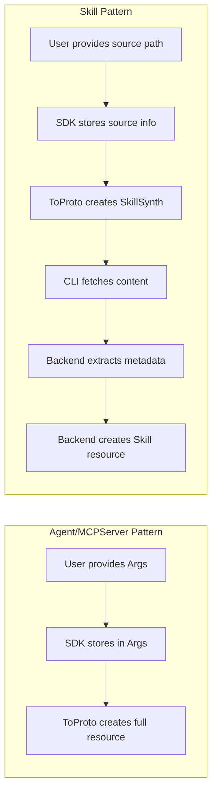

# Apply Unified Pattern to Skill Resource

## Critical Discovery: Skill is Architecturally Different

After thorough analysis, **Skill is fundamentally different** from Agent/MCPServer/Environment:


| Aspect          | Agent/MCPServer/Environment | Skill                                 |
| --------------- | --------------------------- | ------------------------------------- |
| Nature          | Configuration resources     | Content artifact (like Docker images) |
| User provides   | Args with configuration     | Source location (path or git URL)     |
| Args usage      | Single source of truth      | Backend-populated from artifact       |
| ToProto returns | Full resource proto         | SkillSynth (handover message)         |
| Identity        | Name from user              | Name extracted from SKILL.md          |





## Current State Analysis

**Strengths of current implementation:**

- `FromDir()` and `FromGit()` correctly handle the content artifact pattern
- `ToProto()` correctly produces `SkillSynth` for CLI handover
- Context registration works properly
- `commons/ref/skill.go` already provides skill reference factories

**Gaps requiring attention:**

1. No `errors.go` file (inconsistent with Agent/MCPServer pattern)
2. No tests exist for the skill package
3. `doc.go` references non-existent `skill.New()` and `skill.Parse()` functions
4. No protovalidate validation on the synthesis output
5. Missing identity fields (Name/Slug) that could help during synthesis

## Implementation Plan

### 1. Create `skill/errors.go`

Following the established pattern from [mcpserver/errors.go](sdk/go/mcpserver/errors.go), create a proper errors file with:

```go
// skill/errors.go
package skill

import (
    "errors"
    "github.com/stigmer/stigmer/sdk/go/internal/validation"
)

var (
    ErrPathRequired = errors.New("skill: path is required for FromDir")
    ErrUrlRequired  = errors.New("skill: url is required for FromGit")
    ErrSourceNil    = errors.New("skill: source is nil, cannot convert to proto")
)

// Type aliases for validation/conversion errors
type ValidationError = validation.ValidationError
type ConversionError = validation.ConversionError
type ResourceError = validation.ResourceError
type SynthesisError = validation.SynthesisError

// Synthesis sentinel errors re-exported
var (
    ErrSynthesisAlreadyDone = validation.ErrSynthesisAlreadyDone
    ErrSynthesisFailed      = validation.ErrSynthesisFailed
    ErrManifestWrite        = validation.ErrManifestWrite
)

// Helper constructors for Skill-specific errors
func NewResourceError(name, operation, message string) *ResourceError
func NewResourceErrorWithCause(name, operation, message string, err error) *ResourceError
```

### 2. Update `skill/synth.go`

Refactor the current implementation to:

- Use sentinel errors from `errors.go` instead of inline `errors.New()`
- Add optional Name field for synthesis tracking (derived from path or tag)
- Keep the existing `FromDir()` and `FromGit()` pattern (these are correct)

Key changes in [sdk/go/skill/synth.go](sdk/go/skill/synth.go):

```go
// Add identity fields for synthesis tracking
type Skill struct {
    // Existing source fields...
    sourceType sourceType
    localPath  string
    gitURL     string
    // ...
    
    // NEW: Optional identity for synthesis tracking
    // If not provided, derived from source path during synthesis
    name string  // Optional explicit name
    slug string  // Auto-generated from name or path
}

// Add WithName option for explicit naming
func WithName(name string) SynthOption
```

### 3. Fix `skill/doc.go`

The current doc.go incorrectly references:

- `skill.New("stigmer", "web-search")` - This doesn't exist
- `skill.Parse("stigmer/web-search@stable")` - This doesn't exist

These functions are in `commons/ref/`. Update doc.go to reflect the actual API:

```go
// Package skill provides the Skill entity for defining skills in the SDK.
//
// # Defining Skills (this package)
// Use FromDir() or FromGit() to create skills for synthesis:
//
//     skill.FromDir(ctx, "./skills/calculator", skill.WithTag("stable"))
//     skill.FromGit(ctx, "github.com/org/skills", skill.WithRef("v1.0"))
//
// # Referencing Existing Skills (commons/ref package)
// Use ref.Skill() to reference existing skills in agent configurations:
//
//     import "github.com/stigmer/stigmer/sdk/go/commons/ref"
//     agent.AddSkillRef(ref.Skill("stigmer", "web-search"))
```

### 4. Create Comprehensive Tests

Create [sdk/go/skill/synth_test.go](sdk/go/skill/synth_test.go) with tests for:

```go
// Test cases covering:
func TestFromDir_ValidPath(t *testing.T)
func TestFromDir_EmptyPath_Error(t *testing.T)
func TestFromDir_WithTag(t *testing.T)
func TestFromDir_ContextRegistration(t *testing.T)
func TestFromDir_NilContext_NoError(t *testing.T)

func TestFromGit_ValidURL(t *testing.T)
func TestFromGit_EmptyURL_Error(t *testing.T)
func TestFromGit_WithRef(t *testing.T)
func TestFromGit_WithSubdir(t *testing.T)
func TestFromGit_AllOptions(t *testing.T)

func TestToProto_LocalSource(t *testing.T)
func TestToProto_GitSource(t *testing.T)
func TestToProto_WithTag(t *testing.T)

func TestSkill_IsLocal(t *testing.T)
func TestSkill_IsGit(t *testing.T)
func TestSkill_String(t *testing.T)
```

### 5. Validation Improvements

Add protovalidate to `ToProto()` for consistency with Agent/MCPServer:

```go
func (s *Skill) ToProto() (*skillv1.SkillSynth, error) {
    synth := &skillv1.SkillSynth{...}
    
    // Validate the proto message
    if err := validator.Validate(synth); err != nil {
        return nil, fmt.Errorf("skill synth validation failed: %w", err)
    }
    
    return synth, nil
}
```

## File Changes Summary


| File                         | Action | Description                                        |
| ---------------------------- | ------ | -------------------------------------------------- |
| `sdk/go/skill/errors.go`     | Create | Sentinel errors, type aliases, helper constructors |
| `sdk/go/skill/synth.go`      | Modify | Use errors from errors.go, add optional name field |
| `sdk/go/skill/doc.go`        | Modify | Fix incorrect API references                       |
| `sdk/go/skill/synth_test.go` | Create | Comprehensive test coverage                        |


## Why Not Force Name/Slug/Args Pattern

The plan **intentionally** does not force the Agent-style pattern because:

1. **SkillArgs is backend-populated** - The `SkillArgs.SkillMd`, `SkillArgs.Name`, `SkillArgs.Description` are all extracted by the backend from the skill artifact content, not provided by the SDK user.
2. **Skills don't have user-provided configuration** - Unlike Agent which has `Instructions`, skills get their behavior from the SKILL.md file content.
3. **ToProto produces a handover message, not the resource** - The SDK's job is to tell the CLI where to find the skill, not to define the skill itself.

Forcing the pattern would create:

- Confusion about what SkillArgs means
- Technical debt from misaligned architecture
- Maintenance burden when the pattern doesn't fit

## Quality Gates

After implementation:

```bash
cd sdk/go
go build ./skill/...
go test ./skill/... -v
go vet ./skill/...
```

All tests must pass, no linter errors.