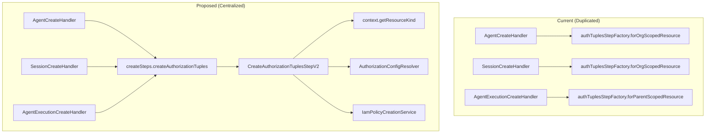

# Centralize Authorization Tuple Creation in CreateOperationSteps

## Problem Statement

Currently, every create handler has duplicated boilerplate code for authorization tuple creation:

```java
// Every handler has this pattern:
private final CreateAuthorizationTuplesStep authTuplesStepFactory;

private RequestPipelineStepV2<CreateContextV2<T>> createAuthTuples() {
    return authTuplesStepFactory.forOrgScopedResource(
        ApiResourceKind.agent,              // Redundant - already in context
        agent -> agent.getMetadata().getId(),  // Always the same pattern
        agent -> agent.getMetadata().getOrg()  // Always the same pattern
    );
}
```

This pattern is repeated across 13+ handlers with minor variations.

## Existing Infrastructure

The codebase already has excellent infrastructure for configuration-driven authorization:

1. **Proto-defined config** in `[authorization_config.proto](apis/ai/stigmer/commons/apiresource/apiresourcekind/authorization_config.proto)` - defines scope types, owner types, parent relations
2. **Per-resource config** in `[api_resource_kind.proto](apis/ai/stigmer/commons/apiresource/apiresourcekind/api_resource_kind.proto)` - each `ApiResourceKind` has embedded `AuthorizationConfig`
3. **AuthorizationConfigResolver** in `[AuthorizationConfigResolver.java](backend/libs/java/api/api-shape/src/main/java/ai/stigmer/apishape/authorization/AuthorizationConfigResolver.java)` - resolves config from proto metadata
4. **IamPolicyCreationService** in `[IamPolicyCreationService.java](backend/libs/java/api/api-authorization/src/main/java/ai/stigmer/apiauthorization/service/IamPolicyCreationService.java)` - creates tuples based on config
5. **CreateContextV2.getResourceKind()** - already provides `ApiResourceKind` from method metadata

## Solution Architecture




## Implementation Approach

### Phase 1: Create New Centralized Step

Create a new fully configuration-driven step that:

1. **Auto-discovers resource kind** from `context.getResourceKind()`
2. **Auto-resolves authorization config** via `AuthorizationConfigResolver.resolve(kind)`
3. **Uses reflection-free field extraction** via standardized metadata accessors
4. **Handles parent resolution** via a new `ParentIdResolver` interface for special cases

### Phase 2: Add to CreateOperationSteps

Extend `[CreateOperationSteps.java](backend/libs/java/grpc/grpc-request/src/main/java/ai/stigmer/grpcrequest/pipeline/step/create/CreateOperationSteps.java)`:

```java
@Component
@RequiredArgsConstructor
@Getter
public class CreateOperationSteps<T extends Message> {
    public final CreateOperationAuthorizeStep<T> authorize;
    public final CreateOperationBuildNewStateStepV2<T> buildNewState;
    public final CreateOperationCheckDuplicateStepV2<T> checkDuplicate;
    public final CreateOperationPersistStepV2<T> persist;
    public final CreateOperationValidateInputStepV2<T> validateInput;
    
    // NEW: Configuration-driven authorization tuple creation
    public final CreateAuthorizationTuplesStepV2<T> createAuthorizationTuples;
}
```

### Phase 3: Handle Parent ID Resolution

The challenge is that parent IDs are in different spec fields:

- `agent_execution.spec.session_id`
- `agent_instance.spec.agent_id`
- `workflow_instance.spec.workflow_id`

**Option A: Reflection-based** - Use proto reflection to find fields matching parent kind

**Option B: Registry-based** - Create a `ParentIdExtractorRegistry` that maps `ApiResourceKind` to extractors

**Recommended: Option B** - More explicit, type-safe, easier to debug

```java
@Component
public class ParentIdExtractorRegistry {
    private final Map<ApiResourceKind, ParentIdExtractor<?>> extractors = Map.of(
        ApiResourceKind.agent_execution, (AgentExecution e) -> e.getSpec().getSessionId(),
        ApiResourceKind.agent_instance, (AgentInstance i) -> i.getSpec().getAgentId(),
        ApiResourceKind.workflow_instance, (WorkflowInstance w) -> w.getSpec().getWorkflowId()
    );
}
```

### Phase 4: Migrate Handlers

Update each handler to use the centralized step:

**Before:**

```java
private final CreateAuthorizationTuplesStep authTuplesStepFactory;

private RequestPipelineStepV2<CreateContextV2<Agent>> createAuthTuples() {
    return authTuplesStepFactory.forOrgScopedResource(
        ApiResourceKind.agent,
        agent -> agent.getMetadata().getId(),
        agent -> agent.getMetadata().getOrg()
    );
}

// In pipeline:
.addStep(createAuthTuples())
```

**After:**

```java
// No factory injection needed
// No private method needed

// In pipeline:
.addStep(createSteps.createAuthorizationTuples)
```

## Files to Create/Modify

### New Files

1. `backend/libs/java/grpc/grpc-request/src/main/java/ai/stigmer/grpcrequest/pipeline/step/create/CreateAuthorizationTuplesStepV2.java`
  - New step that auto-resolves kind and config
2. `backend/libs/java/grpc/grpc-request/src/main/java/ai/stigmer/grpcrequest/pipeline/step/create/ParentIdExtractorRegistry.java`
  - Registry for parent ID extraction functions

### Files to Modify

1. `[CreateOperationSteps.java](backend/libs/java/grpc/grpc-request/src/main/java/ai/stigmer/grpcrequest/pipeline/step/create/CreateOperationSteps.java)`
  - Add `createAuthorizationTuples` field
2. All 13 create handlers (migrate to use centralized step):
  - `AgentCreateHandler.java`
  - `AgentExecutionCreateHandler.java`
  - `AgentInstanceCreateHandler.java`
  - `SessionCreateHandler.java`
  - `EnvironmentCreateHandler.java`
  - `McpServerCreateHandler.java`
  - `SkillCreateHandler.java` (if exists)
  - `WorkflowCreateHandler.java`
  - `WorkflowInstanceCreateHandler.java`
  - `WorkflowExecutionCreateHandler.java`
  - `OrganizationCreateHandler.java`
  - `ApiKeyCreateHandler.java`
  - `ExecutionContextCreateHandler.java` (no auth - verify)

## Backward Compatibility

The existing `CreateAuthorizationTuplesStep` factory should be kept for:

- Custom authorization patterns not covered by proto config
- Gradual migration (handlers can migrate one at a time)
- Testing individual components

## Success Metrics

1. **Reduced boilerplate**: Remove ~50 lines per handler (factory + method + field)
2. **Single source of truth**: Authorization config fully driven by proto
3. **Consistency**: All handlers use the same pattern
4. **Maintainability**: New resources only need proto config, no handler changes

## Testing Strategy

1. Unit tests for `CreateAuthorizationTuplesStepV2` with each scope type
2. Unit tests for `ParentIdExtractorRegistry`
3. Integration tests verifying FGA tuples are created correctly
4. Regression tests for all existing handlers

