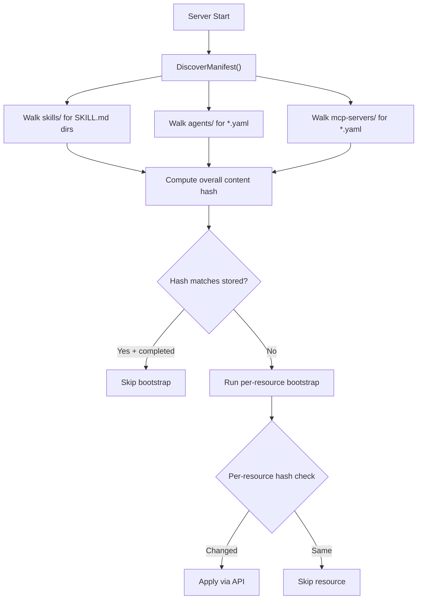

# Auto-discover Seedpack Resources (Eliminate manifest.json)

## Problem

The `agent-creator` skill exists at `skills/agent-creator/` and is embedded in the binary, but is never bootstrapped because it's missing from `manifest.json`. Additionally, even adding it wouldn't help without also bumping the version string -- a fragile manual step.

The manifest duplicates information already derivable from the filesystem:

- Skill names = directory names under `skills/`
- Skill content digests = computable from file contents
- Skill provenance = already in each skill's `provenance.json`
- Agent names/paths = discoverable from `agents/*.yaml`
- MCP server names/paths = discoverable from `mcp-servers/*.yaml`

## Design

**Convention-over-configuration**: Resources are discovered by filesystem structure, not declared in a manifest. The discovery conventions are:

```
skills/{name}/SKILL.md        -> SkillEntry{Name: name, Path: "skills/{name}"}
agents/{name}.yaml            -> AgentEntry{Name: name (from metadata.name), Path: "agents/{name}.yaml"}
mcp-servers/{name}.yaml       -> McpServerEntry{Name: name (from metadata.name), Path: "mcp-servers/{name}.yaml"}
```

**Content-hash change detection**: Instead of comparing a manually-bumped version string, compute a deterministic hash from all embedded resource contents. Any file change (add, modify, delete) automatically triggers re-bootstrap.




## Separation of Concerns: Runtime vs Build-time

`manifest.json` currently serves two masters:

1. **Runtime bootstrap** (what to apply on server start) -- replaced by auto-discovery
2. **Build-time vendoring** (`tools/01_vendor_skill.sh` reads it for external skill source URLs/commits) -- still needs a declarative config

Move the vendor config to `tools/vendor-sources.json` with only the build-time fields:

```json
{
  "skills": [
    {
      "name": "skill-creator",
      "source": {
        "type": "git",
        "url": "https://github.com/anthropics/skills",
        "commit_sha": "1ed29a03dc..."
      }
    }
  ]
}
```

Then delete `manifest.json` from the seedpack root.

## File Changes

### 1. [seedpack/seedpack.go](backend/services/stigmer-server/pkg/seedpack/seedpack.go) -- Core changes

- **Replace `LoadManifest()`** with `DiscoverManifest()` that walks the embedded FS:
  - Walk `skills/` for subdirectories containing `SKILL.md` -> build `[]SkillEntry`
  - Walk `agents/` for `*.yaml` files -> build `[]AgentEntry` (name from `metadata.name` in parsed YAML)
  - Walk `mcp-servers/` for `*.yaml` files -> build `[]McpServerEntry` (name from `metadata.name` in parsed YAML)
- **Add `computeSkillDigest(skillPath)`**: Hash all files in a skill directory (sorted by path) to produce a deterministic content digest
- **Add `computeSeedpackHash(manifest)`**: Hash all individual resource digests to produce an overall content hash
- **Simplify `Manifest` struct**: Remove `SchemaVersion`, `CreatedAt`, `Description` (not needed without a file). Add `ContentHash` field. Remove `Source` from `SkillEntry` (provenance lives in `provenance.json`)
- **Update `GetSkillByName` / `GetAgentByName` / `GetMcpServerByName`**: Call `DiscoverManifest()` instead of `LoadManifest()`

### 2. [seedpack/embed.go](backend/services/stigmer-server/pkg/seedpack/embed.go) -- Remove manifest embed

- Remove `//go:embed manifest.json` directive
- Update package doc comment

### 3. [seedpack/BUILD.bazel](backend/services/stigmer-server/pkg/seedpack/BUILD.bazel) -- Remove manifest from embedsrcs

- Remove `"manifest.json"` from the `embedsrcs` list

### 4. [bootstrap/bootstrap.go](backend/services/stigmer-server/pkg/bootstrap/bootstrap.go) -- Minimal changes

- Change `seedpack.LoadManifest()` -> `seedpack.DiscoverManifest()`
- The version comparison (line 134) now compares `manifest.ContentHash` instead of `manifest.Version`
- Log format updates to show content hash instead of version string

### 5. Delete [manifest.json](backend/services/stigmer-server/pkg/seedpack/manifest.json)

### 6. Create `tools/vendor-sources.json` -- Build-time vendor config

- Extract only the `skills[].source` entries from the old manifest
- Update `tools/01_vendor_skill.sh` to read from `tools/vendor-sources.json` instead of `../manifest.json`

### 7. [seedpack/seedpack_test.go](backend/services/stigmer-server/pkg/seedpack/seedpack_test.go) -- Update tests

- Replace `TestLoadManifest` with `TestDiscoverManifest` that validates auto-discovery finds all expected resources (both `skill-creator` AND `agent-creator`)
- Update entry-specific tests to use `DiscoverManifest()`
- Add test that verifies adding a file to the embedded FS changes the content hash
- Keep all existing skill/agent/MCP server loading tests (they don't depend on the manifest)

## Key Design Decisions

- **No caching**: The embedded FS is read-only and in-memory. Discovery is fast enough to run on every `DiscoverManifest()` call without a `sync.Once`. Keeps the code simple and stateless.
- **Deterministic hash computation**: Sort file paths before hashing to ensure the same content always produces the same hash, regardless of FS walk order.
- **Agent/MCP server names from YAML `metadata.name`**: More reliable than deriving from filename (the YAML is the source of truth for the resource identity).
- **Skill names from directory name**: Consistent with the existing convention and how skills are referenced elsewhere.
- **Per-resource idempotency unchanged**: The existing `calculateAgentHash()` and `calculateMcpServerHash()` functions continue to work as-is. For skills, we compute the content digest at discovery time instead of reading it from the manifest.

