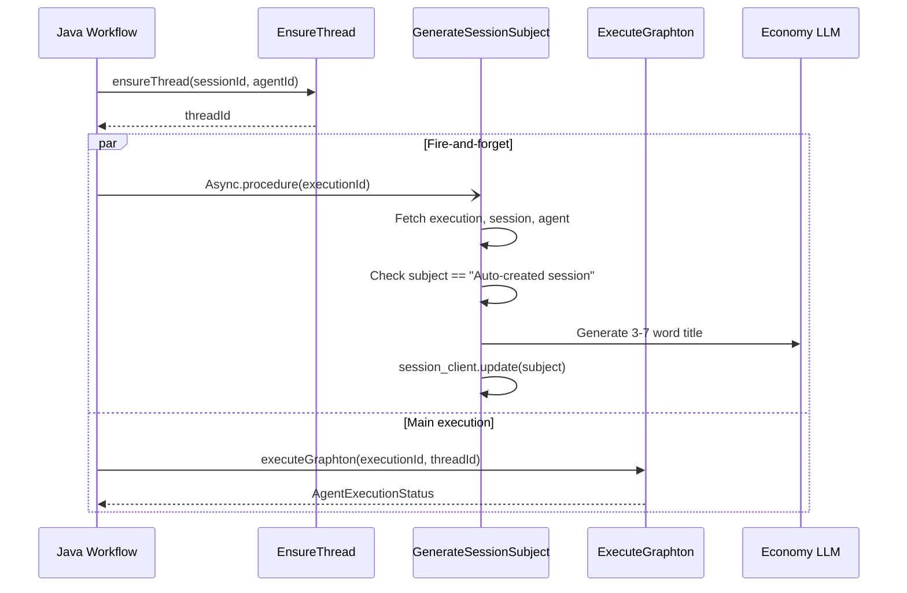

# Auto-Generate Session Subjects

## Context and Prior Art

A reference implementation exists in the Planton codebase at `[planton/backend/services/agent-fleet-worker/worker/activities/generate_session_subject.py](planton/backend/services/agent-fleet-worker/worker/activities/generate_session_subject.py)`. It works but has quality issues that we will NOT carry over:

- Hardcodes `ChatAnthropic` -- not provider-agnostic
- Uses `get_token_manager()` -- different auth pattern from Stigmer's `get_api_key()`
- Uses `with_structured_output()` -- not universally supported across providers (especially Ollama)
- Matches a Planton-specific sentinel pattern (`Session YYYY-MM-DD_HH-MM-SS`)

We will build a cleaner implementation that fits Stigmer's architecture and conventions.

## Architecture




The subject generation runs as a separate Temporal activity, scheduled via `Async.procedure()` (fire-and-forget). It does not block the main execution. If it fails, the user simply keeps seeing "Auto-created session" -- no degradation.

## Key Design Decisions

### 1. Provider-Agnostic Model Selection

Use Stigmer's existing `ModelRegistry.get_summarization_model()` to select an economy-tier model:

- Anthropic -> `claude-haiku-4`
- OpenAI -> `gpt-4o-mini`
- Ollama -> same local model (zero cost)

Then use `parse_model_string()` to instantiate the LangChain model. This ensures the activity works regardless of provider configuration.

### 2. Raw Text Prompt (No Structured Output)

`with_structured_output()` relies on tool-calling or JSON mode, which is not universally supported (notably smaller Ollama models). For a 3-7 word title, a simple text prompt with `.strip()` + truncation is sufficient, more reliable, and works with every provider.

### 3. Sentinel Detection

Check `session.spec.subject == "Auto-created session"` to decide whether to generate a subject. This preserves user-set subjects and avoids re-generating on subsequent executions.

### 4. Slim Payload

Following the established pattern from `ExecuteGraphton`, pass only `execution_id` to the activity. The activity hydrates everything it needs via gRPC calls. This keeps Temporal payloads small.

### 5. Resilience

- Errors are caught and logged, never re-raised (fire-and-forget)
- No retries configured on the activity stub (subject generation is best-effort)
- `setMaximumAttempts(1)` on the Java side

## Changes Required

### Repo: `stigmer` (Python)

**New file: `backend/services/agent-runner/worker/activities/generate_session_subject.py`**

The Temporal activity implementation. Core logic:

```python
@activity.defn(name="GenerateSessionSubject")
async def generate_session_subject(execution_id: str) -> None:
    # 1. Hydrate execution -> extract session_id, agent_id, user_message
    # 2. Fetch session -> check subject == "Auto-created session" (skip if not)
    # 3. Fetch agent metadata -> get name + description for prompt context
    # 4. Select economy model via ModelRegistry.get_summarization_model()
    # 5. Instantiate via parse_model_string() with provider-specific kwargs
    # 6. Generate title via simple prompt -> strip/truncate
    # 7. Update session.spec.subject via session_client.update()
```

Key patterns to follow from the codebase:

- Auth: `api_key = get_api_key()` (`[worker/token_manager.py](backend/services/agent-runner/worker/token_manager.py)`)
- Config: `worker_config = Config.load_from_env()` (`[worker/config.py](backend/services/agent-runner/worker/config.py)`)
- Session update pattern: get -> modify spec -> update (from `[worker/sandbox_manager.py](backend/services/agent-runner/worker/sandbox_manager.py)`)
- Model instantiation: `parse_model_string()` from `[graphton/core/models.py](backend/libs/python/graphton/src/graphton/core/models.py)`

**Modify: `backend/services/agent-runner/worker/worker.py`**

Register the new activity alongside existing ones (line ~144):

```python
from worker.activities.generate_session_subject import generate_session_subject
# ... in register_activities():
activities=[execute_graphton, ensure_thread, cleanup_sandbox, generate_session_subject]
```

### Repo: `stigmer-cloud` (Java)

**New file: `GenerateSessionSubjectActivity.java`**

Activity interface in the same package as `ExecuteGraphtonActivity.java`:

```java
@ActivityInterface
public interface GenerateSessionSubjectActivity {
    @ActivityMethod(name = "GenerateSessionSubject")
    void generateSessionSubject(String executionId);
}
```

**Modify: `InvokeAgentExecutionWorkflowImpl.java`**

Add activity stub (after line ~191, following the existing pattern):

```java
private final GenerateSessionSubjectActivity generateSessionSubjectActivity =
    Workflow.newActivityStub(
        GenerateSessionSubjectActivity.class,
        ActivityOptions.newBuilder()
            .setTaskQueue(getActivityTaskQueue())
            .setStartToCloseTimeout(Duration.ofSeconds(60))
            .setScheduleToStartTimeout(Duration.ofMinutes(1))
            .setRetryOptions(RetryOptions.newBuilder()
                .setMaximumAttempts(1)  // Best-effort, no retries
                .build())
            .build()
    );
```

Add fire-and-forget call in `executeGraphtonFlow()` (after Step 1, before Step 2 -- around line 365):

```java
// Step 1.5: Generate session subject (fire-and-forget)
Async.procedure(() -> {
    try {
        generateSessionSubjectActivity.generateSessionSubject(executionId);
    } catch (Exception e) {
        logger.warn("Session subject generation failed (non-critical): {}", e.getMessage());
    }
});
```

## Surprise: Cross-Repo Dependency

This implementation spans **two repositories** (`stigmer` and `stigmer-cloud`). The Python activity must be deployed before the Java workflow references it, or the `Async.procedure()` call will log a warning and fail silently (which is acceptable for fire-and-forget, but not ideal).

Deployment order: Python activity first, Java workflow second.

## What This Does NOT Change

- The Go-side hardcoded `"Auto-created session"` in `create.go:356` stays as-is (it serves as the sentinel value for detection)
- No proto changes required (uses existing `session.spec.subject` field)
- No changes to `execute_graphton.py` (clean separation)

