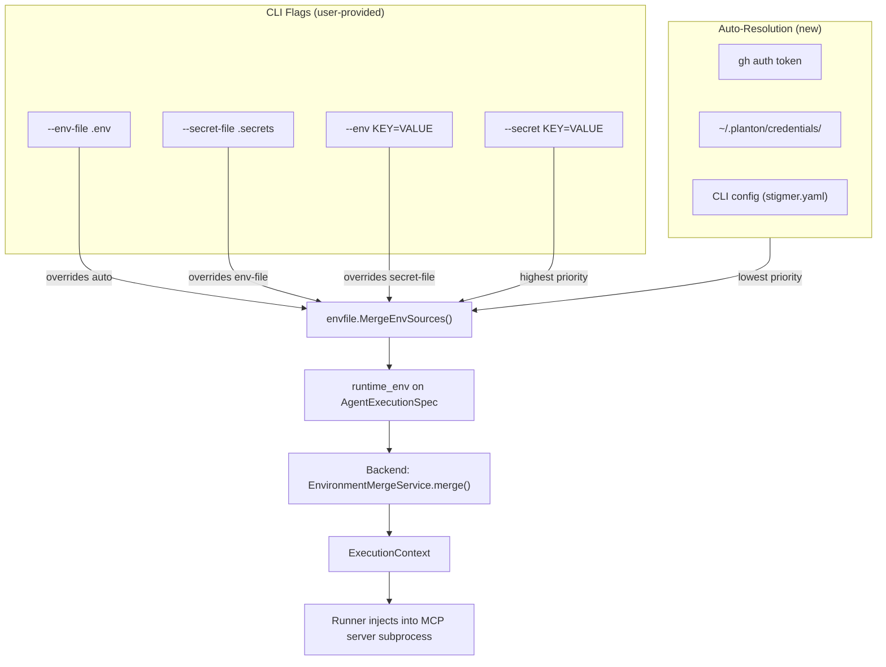

# Auto-Resolve MCP Credentials During `stigmer run`

## Domain Analysis (Architect Role)

### The Critique

The existing credential resolution (`ResolveEnvForDiscovery`) was designed for a LOCAL operation: spawning an MCP server subprocess on the user's machine to discover its capabilities. The token never leaves the machine. Extending this to `stigmer run` changes the security model: tokens are now transmitted to the backend, stored in ExecutionContext, and forwarded to the runner. This is a fundamentally different trust boundary.

Additionally, `runtime_env` is the HIGHEST priority merge tier in the backend:

```
Agent env_spec defaults (lowest) < Environment refs < runtime_env (highest)
```

Auto-injecting credentials into `runtime_env` means they override org-configured Environment resources. If an admin binds an Environment with `GITHUB_TOKEN=ghp_org_service_account`, a developer's personal `gh auth token` would silently override it.

### Why This Is Acceptable for Now

- **Practical correctness**: In local development (the primary use case), the developer WANTS their personal credentials. In CI/CD, `gh auth token` is unavailable, so Environment refs naturally win. The conflict scenario is rare.
- **Explicit precedent**: The user can already do `stigmer run agent foo --env GITHUB_TOKEN=$(gh auth token)`. Auto-resolution removes the manual step but doesn't grant new capabilities.
- **Trust boundary already crossed**: The user trusts the backend (they ran `stigmer login`). `--env` and `--secret` already send arbitrary credentials over the wire.
- **Experiment phase**: This is the right trade-off for velocity. If priority inversion becomes a real problem, the correct long-term fix is a new `ambient_env` field on `AgentExecutionSpec` with its own merge tier (`defaults < ambient_env < Environment refs < runtime_env`). That's a proto + backend change — out of scope here but documented.

### The Fix

A single new function `ResolveWellKnownEnv(cfg)` in the existing `env_resolver.go`, returning `envfile.EnvMap` with proper `is_secret` flags. Called in `executeRun()` and merged as the lowest priority source below user-provided env.

---

## Architecture




## Implementation

### 1. Add `ResolveWellKnownEnv` to env_resolver.go

**File**: `[client-apps/cli/internal/cli/mcpserver/env_resolver.go](client-apps/cli/internal/cli/mcpserver/env_resolver.go)`

Add a new exported function that resolves all well-known credentials unconditionally (not tied to a specific MCP server's `env_spec`). It reuses the existing `resolveKnownVar()` internal function.

```go
func ResolveWellKnownEnv(cfg *config.Config) envfile.EnvMap {
    result := make(envfile.EnvMap)
    for _, name := range wellKnownVars {
        if os.Getenv(name) != "" {
            continue // shell env takes priority
        }
        if val, ok := resolveKnownVar(name, cfg); ok {
            result[name] = &executioncontextv1.ExecutionValue{
                Value:    val,
                IsSecret: isSecretVar(name),
            }
        }
    }
    return result
}
```

Key design decisions:

- `wellKnownVars` is a package-level slice: `["GITHUB_TOKEN", "PLANTON_API_KEY", "STIGMER_SERVER_ADDRESS", "STIGMER_API_KEY"]`
- `isSecretVar()` maps each var to its secret status: `GITHUB_TOKEN` and `PLANTON_API_KEY` and `STIGMER_API_KEY` are secrets; `STIGMER_SERVER_ADDRESS` is not
- Skips vars already present in `os.Environ()` (same pattern as `ResolveEnvForDiscovery`)
- Returns empty map (not nil) when nothing is resolved

New imports needed in `env_resolver.go`:

- `executioncontextv1 "github.com/stigmer/stigmer/apis/stubs/go/ai/stigmer/agentic/executioncontext/v1"`
- `"github.com/stigmer/stigmer/client-apps/cli/internal/cli/envfile"`

### 2. Wire into `executeRun()` in run.go

**File**: `[client-apps/cli/cmd/stigmer/root/run.go](client-apps/cli/cmd/stigmer/root/run.go)`

In `executeRun()`, after loading user-provided env (Step 5) and after connecting to backend (Step 6), add a new step that:

1. Loads CLI config via `config.Load()`
2. Calls `mcpserver.ResolveWellKnownEnv(cfg)`
3. Merges auto-resolved vars as the LOWEST priority, then user env on top
4. Logs which vars were auto-resolved (using `climsg.Info` if verbose, always log to zerolog)

The merge uses the existing `envfile.MergeEnvSources(autoEnv, runtimeEnv)` — later sources override earlier, so `runtimeEnv` (user-provided) wins over `autoEnv`.

This happens BEFORE routing to `runAgent` or `runWorkflow`, so both paths benefit.

### 3. Update BUILD.bazel

**File**: `[client-apps/cli/internal/cli/mcpserver/BUILD.bazel](client-apps/cli/internal/cli/mcpserver/BUILD.bazel)`

Add two new dependencies to the `go_library` target:

- `//apis/stubs/go/ai/stigmer/agentic/executioncontext/v1` (for `ExecutionValue`)
- `//client-apps/cli/internal/cli/envfile` (for `EnvMap` type alias)

### 4. Add tests

**File**: `[client-apps/cli/internal/cli/mcpserver/env_resolver_test.go](client-apps/cli/internal/cli/mcpserver/env_resolver_test.go)`

Follow the existing test pattern (using `testify/assert`, `t.Setenv`, `t.TempDir`):

- **Test: resolves GITHUB_TOKEN when gh is available** — verify it appears in the returned map with `is_secret: true`
- **Test: resolves PLANTON_API_KEY from credential file** — set up temp credential file, verify resolution with `is_secret: true`
- **Test: resolves STIGMER_SERVER_ADDRESS and STIGMER_API_KEY from config** — verify correct values and secret flags
- **Test: skips vars already in os.Environ** — use `t.Setenv("GITHUB_TOKEN", "existing")`, verify it's NOT in the returned map
- **Test: returns empty map when nothing resolvable** — no gh, no planton, verify empty map (not nil)
- **Test: isSecretVar correctness** — verify the secret/non-secret classification

Add `executioncontext/v1` to test deps in BUILD.bazel.

## Scope Boundaries (What We Are NOT Doing)

- **No `--no-auto-env` opt-out flag** — YAGNI for v1. The user can override any auto-resolved value with `--env`. If demand arises, this is a 1-line flag addition.
- **No `ambient_env` proto field** — The correct long-term architecture for proper merge priority. Deferred until the priority inversion actually causes problems.
- **No session follow-up path changes** — `run_session.go`'s `buildFollowUpFn` creates follow-up executions within an existing session. These inherit the session's context. Credential resolution for follow-ups is a separate concern.
- **No changes to `connectToBackend` signature** — We load config separately via `config.Load()` (a cheap YAML read) to avoid touching 4 call sites.

## Risk Assessment

- **Priority inversion** (auto-resolved overrides Environment refs): Acceptable for now. Documented above. Mitigated by the fact that in CI/CD `gh auth token` is unavailable.
- **Credential leakage**: Mitigated by marking credentials as `is_secret: true` (encrypted at rest, redacted in logs, deleted when execution completes).
- **Performance**: `gh auth token` has a 5-second timeout. In the worst case (gh installed but not authenticated), this adds up to 5 seconds to `stigmer run`. This is the same trade-off as discovery and is acceptable.
- **Import cycle**: `mcpserver` → `envfile` is a new dependency edge. No cycle risk since `envfile` does not import `mcpserver`.

