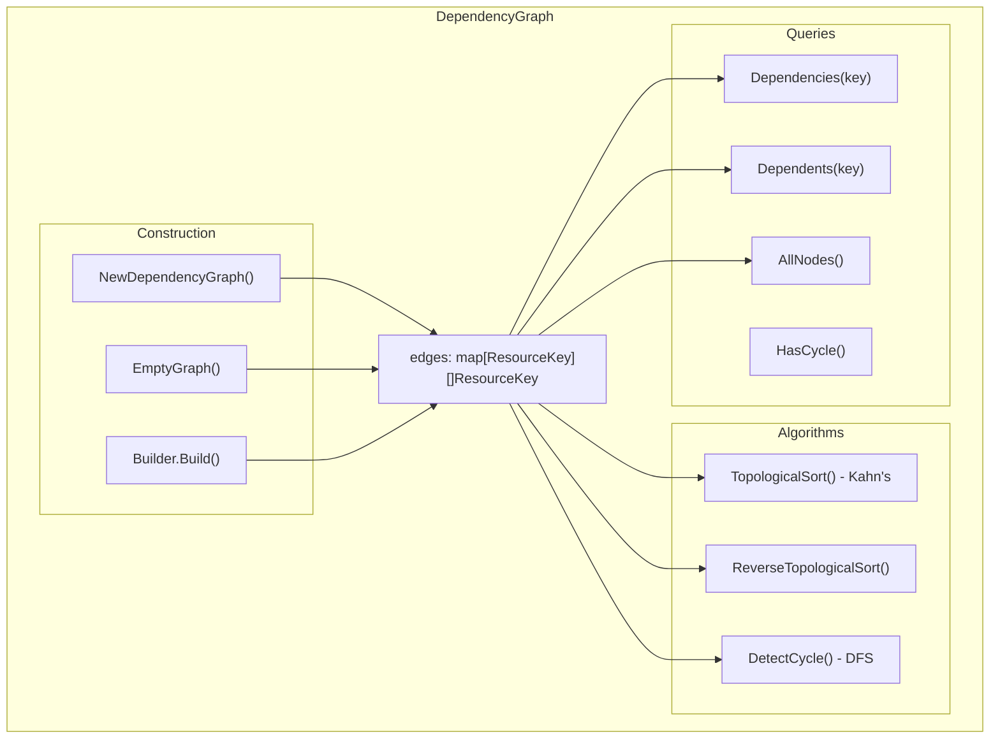

# B1: Dependency Graph Value Object

## Overview

Implement an immutable dependency graph value object that enables safe execution ordering during reconciliation. The graph uses `ResourceKey` nodes (not raw strings) for type safety and supports topological sorting for creation order and reverse sorting for deletion order.

This is a **critical infrastructure component** - incorrect topological sort can cause resource creation failures due to missing dependencies.

## Architecture




## File Structure

```
backend/services/stigmer-server/pkg/domain/project/reconcile/
├── dependency_graph.go          # Main implementation (~200 lines)
├── dependency_graph_test.go     # Comprehensive tests (~500 lines, 35+ tests)
└── BUILD.bazel                  # Update with new files
```

## Implementation Details

### 1. Core Data Structure

```go
// DependencyGraph is an immutable value object representing resource dependencies.
// edges maps "dependent" -> "dependencies" (things it depends on).
type DependencyGraph struct {
    edges     map[ResourceKey][]ResourceKey  // dependent -> dependencies
    nodeSet   map[ResourceKey]struct{}       // all nodes (precomputed)
    dependents map[ResourceKey][]ResourceKey // reverse index: dependency -> dependents
}
```

**Key Design Decisions:**

- Use `ResourceKey` (not strings) for compile-time type safety
- Precompute `nodeSet` and `dependents` at construction for O(1) queries
- Store edges as slices (not sets) since order doesn't matter and slices are more Go-idiomatic

### 2. Constructor and Factory Functions

Location: [dependency_graph.go](backend/services/stigmer-server/pkg/domain/project/reconcile/dependency_graph.go)

- `NewDependencyGraph(edges map[ResourceKey][]ResourceKey) *DependencyGraph` - Main constructor with deep defensive copy
- `EmptyGraph() *DependencyGraph` - Singleton for empty graph (reusable)
- `DependencyGraphBuilder` - Builder pattern for incremental construction

### 3. Topological Sort (Kahn's Algorithm)

```go
func (g *DependencyGraph) TopologicalSort() ([]ResourceKey, error)
func (g *DependencyGraph) TopologicalSortSubset(nodes []ResourceKey) ([]ResourceKey, error)
```

**Algorithm:**

1. Compute in-degree for all nodes (count of dependencies)
2. Initialize queue with nodes having in-degree 0 (no dependencies)
3. While queue not empty:
  - Dequeue node, add to result
  - For each dependent, decrement in-degree
  - If in-degree becomes 0, enqueue
4. If result.size != nodes.size, cycle exists - return error

### 4. Reverse Topological Sort

```go
func (g *DependencyGraph) ReverseTopologicalSort() ([]ResourceKey, error)
```

Simply reverses the result of `TopologicalSort()`. Used for deletion order (delete dependents before dependencies).

### 5. Cycle Detection (DFS)

```go
func (g *DependencyGraph) DetectCycle() ([]ResourceKey, bool)
func (g *DependencyGraph) HasCycle() bool
```

**Algorithm:**

1. Track visited nodes and recursion stack
2. DFS from each unvisited node
3. If we encounter a node in the recursion stack, cycle found
4. Return the cycle path for debugging

### 6. Query Methods

```go
func (g *DependencyGraph) Dependencies(key ResourceKey) []ResourceKey   // What does this depend on?
func (g *DependencyGraph) Dependents(key ResourceKey) []ResourceKey     // What depends on this?
func (g *DependencyGraph) AllNodes() []ResourceKey                      // All nodes in graph
func (g *DependencyGraph) NodeCount() int                               // Number of nodes
func (g *DependencyGraph) EdgeCount() int                               // Number of edges
func (g *DependencyGraph) IsEmpty() bool                                // No edges
func (g *DependencyGraph) HasNode(key ResourceKey) bool                 // Node exists
func (g *DependencyGraph) String() string                               // For logging
```

### 7. Builder Pattern

```go
type DependencyGraphBuilder struct {
    edges map[ResourceKey][]ResourceKey
}

func NewDependencyGraphBuilder() *DependencyGraphBuilder
func (b *DependencyGraphBuilder) AddDependency(dependent, dependency ResourceKey) *DependencyGraphBuilder
func (b *DependencyGraphBuilder) AddDependencies(dependent ResourceKey, deps []ResourceKey) *DependencyGraphBuilder
func (b *DependencyGraphBuilder) Build() *DependencyGraph
```

## Test Strategy

### Test Categories (35+ tests)

**Construction (6 tests):**

- Create empty graph
- Handle nil edges map
- Defensive copy of edges (external mutation doesn't affect graph)
- Defensive copy of inner slices
- Handle empty inner slices
- Builder produces correct graph

**Topological Sort (10 tests):**

- Empty graph returns empty list
- Single node returns that node
- Linear chain (A->B->C) sorted correctly
- Diamond pattern (A->B,C; B,C->D) sorted correctly
- Multiple independent chains sorted correctly
- Nodes with no dependencies come first
- Subset sort works correctly
- Returns error on cycle
- Handles disconnected components
- Real-world Stigmer resource pattern

**Reverse Topological Sort (4 tests):**

- Returns exact reverse of topological sort
- Correct order for deletion (dependents before dependencies)
- Handles empty graph
- Returns error on cycle

**Cycle Detection (8 tests):**

- No cycle in acyclic graph
- Detect simple cycle (A->B->C->A)
- Detect self-reference (A->A)
- Detect cycle in complex graph
- Return cycle path
- HasCycle() returns correct boolean
- Multiple cycles - detect at least one
- Cycle in subset of graph

**Query Methods (7 tests):**

- Dependencies returns correct deps
- Dependencies returns empty for unknown node
- Dependents returns correct dependents
- AllNodes returns all nodes (keys and values)
- NodeCount and EdgeCount correct
- HasNode works correctly
- String() is informative

## Quality Requirements

Following established patterns from [resource_key.go](backend/services/stigmer-server/pkg/domain/project/reconcile/resource_key.go):

- All fields unexported (lowercase)
- No setters - immutable
- Defensive copying in constructor and getters
- Singleton empty instance
- Comprehensive godoc with examples
- `fmt.Stringer` implementation
- Functions under 50 lines
- File under 300 lines (split if needed)
- Table-driven tests
- `>80%` test coverage

## BUILD.bazel Updates

Add to [BUILD.bazel](backend/services/stigmer-server/pkg/domain/project/reconcile/BUILD.bazel):

```bazel
go_library(
    srcs = [
        # ... existing files ...
        "dependency_graph.go",
    ],
)

go_test(
    srcs = [
        # ... existing files ...
        "dependency_graph_test.go",
    ],
)
```

## Verification

```bash
# Build
bazel build //backend/services/stigmer-server/pkg/domain/project/reconcile:reconcile

# Test
bazel test //backend/services/stigmer-server/pkg/domain/project/reconcile:reconcile_test

# Format check
gofmt -d backend/services/stigmer-server/pkg/domain/project/reconcile/dependency_graph.go
```

## Key Differences from Java Implementation

The Go implementation improves upon the Java version:

1. **Type Safety**: Uses `ResourceKey` instead of raw `String` - compile-time verification that only valid resource keys are used
2. **Precomputed Reverse Index**: The `dependents` map enables O(1) lookup of "what depends on this resource" (Java computes this on-demand)
3. **Idiomatic Go**: Uses slices instead of sets (Go doesn't have built-in sets), follows Go naming conventions
4. **Established Patterns**: Follows the defensive copying and immutability patterns already in the reconcile package

