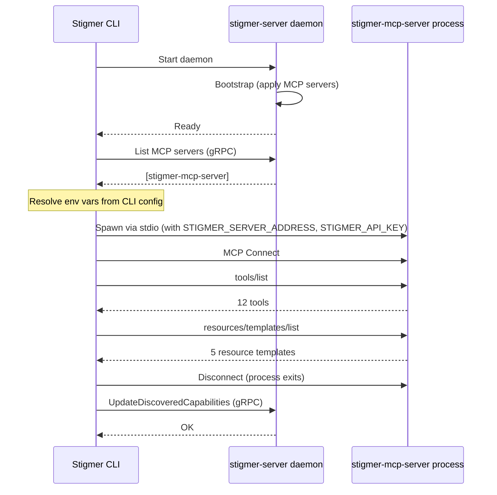

# Phase 5: Bootstrap Discovery Integration

## Architecture

Discovery is CLI-side only. The server stays untouched. After the daemon starts and bootstrap completes, the CLI resolves credentials, spawns each MCP server, discovers its tools/resources, and pushes the results back via gRPC.




## Part 1: Extract shared library — `backend/libs/go/mcpdiscovery/`

Move the reusable MCP discovery core out of the CLI into a shared library. The CLI's existing discover command is refactored to use it.

### New package: `backend/libs/go/mcpdiscovery/`

Three files, each with a single responsibility:

`**transport.go**` — Transport factory

- `CreateTransport(spec, envOverrides) (mcp.Transport, error)` — builds stdio or HTTP transport
- Unlike the current CLI version (`cmd.Env = os.Environ()`), accepts explicit env overrides that are merged with `os.Environ()`
- Moved from `[client-apps/cli/internal/cli/mcpserver/discover_transport.go](client-apps/cli/internal/cli/mcpserver/discover_transport.go)`

`**convert.go**` — Type conversion

- `ConvertTools([]*mcp.Tool) []*mcpserverv1.DiscoveredTool`
- `ConvertResourceTemplates([]*mcp.ResourceTemplate) []*mcpserverv1.DiscoveredResourceTemplate`
- Moved from `[client-apps/cli/internal/cli/mcpserver/discover_convert.go](client-apps/cli/internal/cli/mcpserver/discover_convert.go)`

`**discover.go**` — Core discovery logic

- `Discover(ctx, spec, envOverrides) (*mcpserverv1.DiscoveredCapabilities, error)`
- Creates transport, connects MCP client, lists tools + resource templates, converts, returns
- Extracted from `discoverCapabilities()` in `[client-apps/cli/internal/cli/mcpserver/discover.go](client-apps/cli/internal/cli/mcpserver/discover.go)`

### Dependency update

- Add `github.com/modelcontextprotocol/go-sdk` to `[backend/libs/go/go.mod](backend/libs/go/go.mod)`
- This does NOT affect the server module — Go only pulls transitive dependencies for packages actually imported

### CLI refactoring

- `[client-apps/cli/internal/cli/mcpserver/discover.go](client-apps/cli/internal/cli/mcpserver/discover.go)` — `discoverCapabilities()` calls `mcpdiscovery.Discover()` instead of inline logic
- Delete `[discover_transport.go](client-apps/cli/internal/cli/mcpserver/discover_transport.go)` and `[discover_convert.go](client-apps/cli/internal/cli/mcpserver/discover_convert.go)` (moved to shared lib)
- `[discover_display.go](client-apps/cli/internal/cli/mcpserver/discover_display.go)` — stays in CLI (display is CLI-specific)

## Part 2: Credential resolution — env resolver

### New file: `client-apps/cli/internal/cli/mcpserver/env_resolver.go`

Resolves environment variables needed by an MCP server for discovery. Reads the server's `env_spec` and fills in values from well-known local sources when they aren't already set in the process environment.

**Resolution pattern per env var:**

1. Check `os.Getenv(name)` — if set, use it (user's shell takes priority)
2. If not set, resolve from CLI config or well-known credential stores
3. If still not resolved and not required, skip (the MCP server may work without it)

**Initial resolvers (stigmer-mcp-server only):**

- `STIGMER_SERVER_ADDRESS` — from CLI config: `localhost:7234` for local backend, `cfg.Backend.Cloud.Endpoint` for cloud. Same logic as `[applyCLIConfig()](client-apps/cli/cmd/stigmer/root/mcp_server.go)` (lines 106-124)
- `STIGMER_API_KEY` — from CLI config: empty for local backend (no auth needed), `cfg.Backend.Cloud.Token` for cloud

**Extensibility:** When we add a GitHub MCP server, we add a resolver for `GITHUB_TOKEN` (read from `~/.config/gh/hosts.yml`). For AWS, we add `AWS_ACCESS_KEY_ID` / `AWS_SECRET_ACCESS_KEY` (read from `~/.aws/credentials`). Each is a new case in the resolver function.

**Function signature:**

```go
func ResolveEnvForDiscovery(server *mcpserverv1.McpServer, cfg *config.Config) []string
```

Returns a slice of `KEY=VALUE` strings to pass as env overrides to the shared library's `CreateTransport()`.

## Part 3: Bootstrap integration — auto-discover after daemon start

### Where it hooks in

The CLI's daemon startup flow. After the daemon is confirmed running, before returning control to the user, the CLI discovers all bootstrapped MCP servers.

**Integration point:** The `stigmer server start` flow in `[client-apps/cli/cmd/stigmer/root/server.go](client-apps/cli/cmd/stigmer/root/server.go)`. After `daemon.EnsureRunning()` returns (daemon is ready, bootstrap is complete), call the new auto-discovery function.

### New file: `client-apps/cli/internal/cli/mcpserver/discover_all.go`

`**DiscoverAll(ctx, conn, cfg) error`** — discovers capabilities for all MCP servers:

1. List all MCP servers from the backend via gRPC (`ListMcpServers` or equivalent)
2. Filter to stdio-transport servers (HTTP servers may not be locally reachable)
3. For each server:
  a. Resolve env vars via `ResolveEnvForDiscovery()`
   b. Call `mcpdiscovery.Discover()` from the shared library
   c. Push results via `UpdateDiscoveredCapabilities` gRPC call
   d. On error: log warning, continue to next server (best-effort)
4. Display summary (e.g., "Discovered capabilities for 1/1 MCP servers")

### Timeout

Each MCP server gets the full configured timeout (default 30s). Total time = N servers x timeout. For the initial case (1 server), this is ~~30s max. The `go run` download is cached after first run, so subsequent startups are fast (~~2-3s).

Since this is synchronous, the CLI blocks until discovery completes. The user sees progress/status output.

## Files changed (summary)

**New files (4):**

- `backend/libs/go/mcpdiscovery/discover.go`
- `backend/libs/go/mcpdiscovery/transport.go`
- `backend/libs/go/mcpdiscovery/convert.go`
- `client-apps/cli/internal/cli/mcpserver/env_resolver.go`
- `client-apps/cli/internal/cli/mcpserver/discover_all.go`

**Modified files:**

- `backend/libs/go/go.mod` — add MCP SDK dependency
- `client-apps/cli/internal/cli/mcpserver/discover.go` — use shared library
- `client-apps/cli/cmd/stigmer/root/server.go` — wire auto-discovery after daemon start

**Deleted files (moved to shared lib):**

- `client-apps/cli/internal/cli/mcpserver/discover_transport.go`
- `client-apps/cli/internal/cli/mcpserver/discover_convert.go`

**BUILD.bazel updates:**

- `backend/libs/go/mcpdiscovery/BUILD.bazel` (new)
- `client-apps/cli/internal/cli/mcpserver/BUILD.bazel` (updated deps)
- `client-apps/cli/cmd/stigmer/root/BUILD.bazel` (if needed)

## Key design decisions

- **CLI-side only** — server stays lean, no MCP SDK dependency, no process spawning
- **Synchronous** — blocks startup until discovery completes; capabilities available immediately
- **Best-effort per server** — one server failing doesn't block others
- **Shared library** — `backend/libs/go/mcpdiscovery/` for reusable MCP protocol logic
- **Env resolver in CLI** — credential resolution is a CLI concern, not server
- **Process env takes priority** — if a user has `STIGMER_SERVER_ADDRESS` set in their shell, we don't override it

