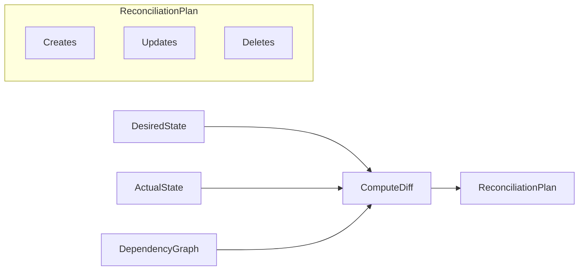

# C1: Diff Algorithm Core Implementation

## Summary

Implement `ComputeDiff()` function that compares `DesiredState` with `ActualState` to produce a `ReconciliationPlan` containing creates, updates, and deletes. This is the heart of the reconciliation engine - it determines what changes need to be applied to align actual state with desired state.

## Architecture Context




The diff algorithm is the bridge between Phase B (dependency graph) and Phase D (CRUD handlers). It takes the parsed states and produces an actionable plan.

## Files to Create

### 1. `diff.go` (Primary Implementation)

Main file containing the diff algorithm:

```go
// ComputeDiff compares desired state with actual state and returns a reconciliation plan.
//
// The algorithm iterates all four resource types and categorizes each resource:
// - Creates: Resources in desired but not in actual
// - Updates: Resources in both with different specs (ignoring metadata)
// - Deletes: Resources in actual but not in desired (orphans)
//
// The graph parameter is currently unused in C1 but will be used in C2
// for computing execution order. It's accepted here for API consistency.
func ComputeDiff(desired *DesiredState, actual *ActualState, graph *DependencyGraph) *ReconciliationPlan
```

Internal helpers:

- `diffResourceType[T proto.Message]()` - Generic diff for a single resource type
- `specEquals(desired, actual proto.Message) bool` - Compare spec fields only

### 2. `diff_test.go` (Comprehensive Tests)

30 tests organized into categories:

- **Basic Functionality** (5 tests): nil/empty states, empty plan scenarios
- **Creates** (6 tests): single resource, multiple types, all resource kinds
- **Updates** (6 tests): spec changes detected, metadata changes ignored, no false positives
- **Deletes** (6 tests): orphan detection, multiple orphans, all resource kinds
- **Mixed Operations** (4 tests): combinations of creates/updates/deletes
- **Real-World Scenarios** (3 tests): typical project reconciliation patterns

## Implementation Details

### ComputeDiff Algorithm

```go
func ComputeDiff(desired *DesiredState, actual *ActualState, graph *DependencyGraph) *ReconciliationPlan {
    // 1. Handle nil/empty cases early
    if desired == nil { desired = EmptyDesiredState() }
    if actual == nil { actual = EmptyActualState() }
    
    var creates, updates, deletes []ResourceChange
    
    // 2. Diff each resource type (order: mcp_servers, skills, agents, workflows)
    diffResourceType(apiresourcekind.ApiResourceKind_mcp_server, 
        desired.McpServers(), actual.McpServers(), &creates, &updates, &deletes)
    diffResourceType(apiresourcekind.ApiResourceKind_skill,
        desired.Skills(), actual.Skills(), &creates, &updates, &deletes)
    // ... agents, workflows
    
    // 3. Return immutable plan
    return NewReconciliationPlan(creates, updates, deletes)
}
```

### specEquals Function

The critical comparison function that **only compares spec fields**, ignoring metadata (id, timestamps, etc.):

```go
func specEquals(desired, actual proto.Message) bool {
    // Type switch for each resource type
    switch d := desired.(type) {
    case *agentv1.Agent:
        a, ok := actual.(*agentv1.Agent)
        if !ok { return false }
        return proto.Equal(d.GetSpec(), a.GetSpec())
    case *workflowv1.Workflow:
        // similar...
    // ... mcp_server, skill
    }
    return proto.Equal(desired, actual) // fallback
}
```

**Why spec-only comparison matters:**

- Metadata fields like `id`, `created_at`, `updated_at` change on every database save
- Comparing full protos would cause false update detections
- Only the spec represents user intent; metadata is system-managed

### Prerequisite: Add GetResource to DesiredState

Need to add a helper method to [desired_state.go](backend/services/stigmer-server/pkg/domain/project/reconcile/desired_state.go) for API consistency:

```go
// GetResource returns a resource by its key, or nil if not found.
func (s *DesiredState) GetResource(key ResourceKey) proto.Message {
    switch key.Kind() {
    case apiresourcekind.ApiResourceKind_agent:
        if agent := s.agents[key.Slug()]; agent != nil {
            return agent
        }
    // ... other kinds
    }
    return nil
}
```

## Test Coverage Strategy


| Category   | Tests | Description                                      |
| ---------- | ----- | ------------------------------------------------ |
| Nil/Empty  | 5     | Handle nil states, both empty, no changes needed |
| Creates    | 6     | Detect new resources in desired state            |
| Updates    | 6     | Detect spec differences, ignore metadata         |
| Deletes    | 6     | Detect orphans in actual state                   |
| Mixed      | 4     | Combinations of all operation types              |
| Real-World | 3     | Typical project scenarios                        |


**Key test scenarios for specEquals:**

- Same spec, different metadata -> NO update
- Different spec, same metadata -> YES update
- Different description field -> YES update
- Different instructions field -> YES update

## Quality Requirements

Following established patterns from A2/A3/B1/B2/B3:

- All functions under 50 lines
- All files under 300 lines
- Table-driven tests with descriptive names
- Comprehensive godoc with examples
- Zero linter errors
- 100% test pass rate

## Build Configuration

Update [BUILD.bazel](backend/services/stigmer-server/pkg/domain/project/reconcile/BUILD.bazel):

```python
# Add to srcs
"diff.go",

# Add to test srcs  
"diff_test.go",
```

## Dependencies

Existing (no new dependencies):

- `google.golang.org/protobuf/proto` - for proto.Equal on spec comparison
- All resource proto types already imported

## Expected Output

After implementation:

- `diff.go`: ~150 lines (main function, type helpers, specEquals)
- `diff_test.go`: ~600-700 lines (30 tests with fixtures)
- Modified `desired_state.go`: +25 lines (GetResource method)
- Modified `desired_state_test.go`: +50 lines (GetResource tests)

