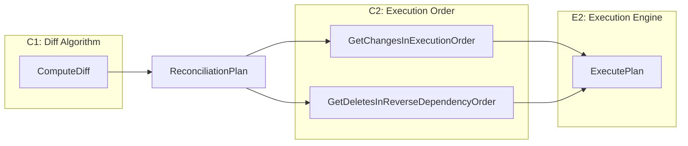

# C2: Execution Order Implementation

## Summary

Add two critical methods to `ReconciliationPlan` that determine the safe execution order for reconciliation changes:

- `**GetChangesInExecutionOrder()**` - Returns creates and updates in topological order (dependencies first, dependents after)
- `**GetDeletesInReverseDependencyOrder()**` - Returns deletes in reverse dependency order (dependents first, dependencies after), with kind hierarchy fallback

This is the bridge between the diff algorithm (C1) and the execution engine (E2). Without correct ordering, resources could be created before their dependencies exist, or deleted while still referenced.

## Architecture Context




## Key Design Decisions

### 1. Graph Storage in ReconciliationPlan

The `ReconciliationPlan` must store the `DependencyGraph` to compute execution order. This requires:

- Adding a `graph` field to the struct
- Creating a new constructor `NewReconciliationPlanWithGraph()`
- Updating `ComputeDiff()` to pass the graph to the plan

### 2. Deletion Kind Hierarchy Fallback

When the dependency graph doesn't fully cover delete candidates (orphans may not have been in the dependency graph built from desired state), fall back to kind-based ordering:

```
Workflows -> Agents -> MCP Servers -> Skills
```

This is safe because:

- Workflows depend on Agents (delete workflows first)
- Agents depend on MCP Servers and Skills (delete agents second)
- MCP Servers and Skills are leaf nodes (delete last)

### 3. Deterministic Ordering

Within the same precedence level (same topological rank or same kind), sort by slug for deterministic results.

## Files to Modify/Create

### 1. Modify `[reconciliation_plan.go](backend/services/stigmer-server/pkg/domain/project/reconcile/reconciliation_plan.go)`

Add graph field and new constructor:

```go
type ReconciliationPlan struct {
    creates []ResourceChange
    updates []ResourceChange
    deletes []ResourceChange
    graph   *DependencyGraph  // NEW: for execution order computation
}

// NewReconciliationPlanWithGraph creates a plan with dependency graph for execution ordering.
func NewReconciliationPlanWithGraph(
    creates, updates, deletes []ResourceChange,
    graph *DependencyGraph,
) *ReconciliationPlan
```

Add execution order methods:

```go
// GetChangesInExecutionOrder returns creates and updates in dependency order.
// Dependencies come before dependents (e.g., MCP servers before agents that use them).
// Uses topological sort when graph is available, falls back to kind-based ordering.
func (p *ReconciliationPlan) GetChangesInExecutionOrder() []ResourceChange

// GetDeletesInReverseDependencyOrder returns deletes in safe deletion order.
// Dependents come before dependencies (e.g., workflows before agents they reference).
// Uses reverse topological sort when graph covers all deletes, falls back to kind hierarchy.
func (p *ReconciliationPlan) GetDeletesInReverseDependencyOrder() []ResourceChange
```

### 2. Modify `[diff.go](backend/services/stigmer-server/pkg/domain/project/reconcile/diff.go)`

Update `ComputeDiff` to use the new constructor:

```go
func ComputeDiff(desired *DesiredState, actual *ActualState, graph *DependencyGraph) *ReconciliationPlan {
    // ... existing diff logic ...
    
    // Use new constructor that preserves the graph
    return NewReconciliationPlanWithGraph(creates, updates, deletes, graph)
}
```

### 3. Create `[execution_order.go](backend/services/stigmer-server/pkg/domain/project/reconcile/execution_order.go)` (NEW)

Contains the execution order logic, keeping `reconciliation_plan.go` focused on the container:

```go
package reconcile

import (
    "sort"
    "github.com/stigmer/stigmer/apis/stubs/go/ai/stigmer/commons/apiresource/apiresourcekind"
)

// deletionKindOrder defines the safe order for deleting resources by kind.
// Workflows first (depend on agents), then agents (depend on MCP/skills), then leaf nodes.
var deletionKindOrder = []apiresourcekind.ApiResourceKind{
    apiresourcekind.ApiResourceKind_workflow,
    apiresourcekind.ApiResourceKind_agent,
    apiresourcekind.ApiResourceKind_mcp_server,
    apiresourcekind.ApiResourceKind_skill,
}

// creationKindOrder is the reverse - leaf nodes first for create/update.
var creationKindOrder = []apiresourcekind.ApiResourceKind{
    apiresourcekind.ApiResourceKind_skill,
    apiresourcekind.ApiResourceKind_mcp_server,
    apiresourcekind.ApiResourceKind_agent,
    apiresourcekind.ApiResourceKind_workflow,
}
```

Internal helpers:

- `sortByKindAndSlug(changes []ResourceChange, kindOrder []ApiResourceKind)` - Sort by kind hierarchy, then slug
- `kindPriority(kind ApiResourceKind, kindOrder []ApiResourceKind)` - Get sort priority for a kind
- `extractKeys(changes []ResourceChange)` - Extract ResourceKeys for topological sort lookup
- `buildChangeMap(changes []ResourceChange)` - Build key -> change map for O(1) lookup

### 4. Create `[execution_order_test.go](backend/services/stigmer-server/pkg/domain/project/reconcile/execution_order_test.go)` (NEW)

20+ comprehensive tests organized by category:

**Empty/Edge Cases (4 tests):**

- Empty plan returns empty slice
- Single create returns that create
- Single delete returns that delete
- Nil graph falls back to kind ordering

**Create/Update Ordering (6 tests):**

- Linear chain: MCP -> Agent -> Workflow (creates MCP first)
- Diamond: Agent depends on 2 MCP servers (both MCPs before agent)
- No dependencies: sorted by kind then slug
- Mixed creates and updates in same order
- Real-world: data pipeline with multiple dependencies
- Deterministic: same inputs always produce same output

**Delete Ordering (6 tests):**

- Linear chain: Workflow -> Agent -> MCP (deletes Workflow first)
- Kind hierarchy fallback when graph empty
- Kind hierarchy fallback when graph doesn't cover all deletes
- Orphans from different projects (no graph edges)
- Deterministic slug ordering within same kind
- All four kinds deleted in correct order

**Integration Scenarios (4 tests):**

- Full reconciliation: creates in topo order, deletes in reverse
- Incremental update with dependencies
- First apply (all creates, no graph edges needed)
- Complete teardown (all deletes)

### 5. Update `[BUILD.bazel](backend/services/stigmer-server/pkg/domain/project/reconcile/BUILD.bazel)`

Add new source and test files:

```python
go_library(
    srcs = [
        # ... existing ...
        "execution_order.go",  # NEW
    ],
)

go_test(
    srcs = [
        # ... existing ...
        "execution_order_test.go",  # NEW
    ],
)
```

### 6. Update `[README.md](backend/services/stigmer-server/pkg/domain/project/reconcile/README.md)`

Add Phase C2 documentation section with:

- Method signatures and examples
- Explanation of kind hierarchy
- Execution order guarantees

## Implementation Algorithm

### GetChangesInExecutionOrder()

```go
func (p *ReconciliationPlan) GetChangesInExecutionOrder() []ResourceChange {
    // 1. Combine creates and updates
    changes := make([]ResourceChange, 0, len(p.creates)+len(p.updates))
    changes = append(changes, p.creates...)
    changes = append(changes, p.updates...)
    
    if len(changes) == 0 {
        return changes
    }
    
    // 2. If no graph, use kind-based ordering
    if p.graph == nil || p.graph.IsEmpty() {
        return sortByKindAndSlug(changes, creationKindOrder)
    }
    
    // 3. Extract keys and build lookup map
    keys := extractKeys(changes)
    changeMap := buildChangeMap(changes)
    
    // 4. Topological sort the keys
    sorted, err := p.graph.TopologicalSortSubset(keys)
    if err != nil {
        // Cycle detected - fall back to kind ordering
        return sortByKindAndSlug(changes, creationKindOrder)
    }
    
    // 5. Map sorted keys back to changes
    result := make([]ResourceChange, 0, len(sorted))
    for _, key := range sorted {
        if change, ok := changeMap[key]; ok {
            result = append(result, change)
        }
    }
    
    // 6. Add any changes not in graph (shouldn't happen, but defensive)
    if len(result) < len(changes) {
        // Add remaining changes sorted by kind
        // ...
    }
    
    return result
}
```

### GetDeletesInReverseDependencyOrder()

```go
func (p *ReconciliationPlan) GetDeletesInReverseDependencyOrder() []ResourceChange {
    if len(p.deletes) == 0 {
        return []ResourceChange{}
    }
    
    // 1. First, sort by kind hierarchy (workflows before agents, etc.)
    sortedByKind := sortByKindAndSlug(p.deletes, deletionKindOrder)
    
    // 2. If no graph, return kind-sorted order
    if p.graph == nil || p.graph.IsEmpty() {
        return sortedByKind
    }
    
    // 3. Try topological sort on delete keys
    keys := extractKeys(p.deletes)
    changeMap := buildChangeMap(p.deletes)
    
    sorted, err := p.graph.TopologicalSortSubset(keys)
    if err != nil {
        // Cycle - fall back to kind ordering
        return sortedByKind
    }
    
    // 4. Reverse for deletion order
    slices.Reverse(sorted)
    
    // 5. Map to changes
    result := make([]ResourceChange, 0, len(sorted))
    for _, key := range sorted {
        if change, ok := changeMap[key]; ok {
            result = append(result, change)
        }
    }
    
    // 6. If topo sort doesn't cover all deletes, fall back
    if len(result) != len(p.deletes) {
        return sortedByKind
    }
    
    return result
}
```

## Quality Requirements

Following established patterns from A2/A3/B1/B2/B3/C1:

- All functions under 50 lines
- All files under 300 lines
- Table-driven tests with descriptive names
- Comprehensive godoc with examples
- Zero linter errors (go vet, gofmt)
- Deterministic output for same inputs
- Defensive handling of nil/empty inputs

## Test Coverage Verification

After implementation, run:

```bash
bazel test //backend/services/stigmer-server/pkg/domain/project/reconcile:reconcile_test --test_output=all
```

Expected: 20+ new tests passing, total test count increases accordingly.

## Dependencies

No new external dependencies. Uses existing:

- `slices` (Go stdlib) - for Reverse
- `sort` (Go stdlib) - for deterministic ordering
- Existing `DependencyGraph.TopologicalSortSubset()`

