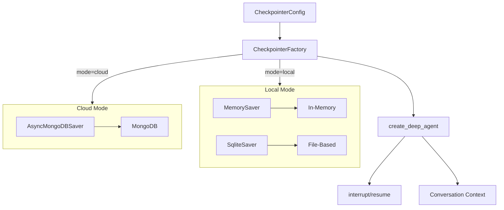

# Checkpointer Infrastructure Implementation

## Context

The HITL approval flow (Phase 3B) added checkpointer parameter plumbing to graphton, but no checkpointer is instantiated in `execute_graphton.py`. Without a checkpointer, `interrupt()` calls will fail at runtime, and conversational context will not persist across agent executions.

## Architecture Decision




## Key Files

- [backend/services/agent-runner/worker/config.py](backend/services/agent-runner/worker/config.py) - Add CheckpointerConfig
- [backend/services/agent-runner/worker/checkpointer/](backend/services/agent-runner/worker/checkpointer/) - New module for factory
- [backend/services/agent-runner/worker/activities/execute_graphton.py](backend/services/agent-runner/worker/activities/execute_graphton.py) - Integrate checkpointer
- [backend/services/agent-runner/pyproject.toml](backend/services/agent-runner/pyproject.toml) - Add dependencies

## Checkpointer Selection


| Mode  | Default           | Alternative | Persistence      |
| ----- | ----------------- | ----------- | ---------------- |
| Local | MemorySaver       | SqliteSaver | Ephemeral / File |
| Cloud | AsyncMongoDBSaver | -           | MongoDB          |


---

## Sub-Task 1: Add CheckpointerConfig to Worker Configuration (45-60 min)

**Goal**: Add configuration dataclass for checkpointer settings following existing patterns.

**Files to Modify**:

- `backend/services/agent-runner/worker/config.py`

**Implementation**:

```python
@dataclass
class CheckpointerConfig:
    """Checkpointer configuration for LangGraph state persistence.
    
    Enables HITL approval flow (interrupt/resume) and conversational
    context preservation across agent executions.
    """
    type: str  # "memory" | "sqlite" | "mongodb"
    
    # SQLite settings (local mode)
    sqlite_path: str | None = None
    
    # MongoDB settings (cloud mode)
    mongodb_uri: str | None = None
    mongodb_db_name: str = "stigmer_checkpoints"
    mongodb_ttl_seconds: int | None = None  # Optional TTL for auto-cleanup
    
    @classmethod
    def load_from_env(cls, mode: str) -> "CheckpointerConfig": ...
    
    def validate(self) -> None: ...
```

**Environment Variables**:

- `STIGMER_CHECKPOINTER_TYPE`: "memory" | "sqlite" | "mongodb" (default: mode-aware)
- `STIGMER_CHECKPOINTER_SQLITE_PATH`: Path for SQLite file (local only)
- `STIGMER_CHECKPOINTER_MONGODB_URI`: MongoDB connection string (cloud only)
- `STIGMER_CHECKPOINTER_MONGODB_DB`: Database name (default: "stigmer_checkpoints")
- `STIGMER_CHECKPOINTER_TTL`: TTL in seconds for checkpoint expiration

**Testing**: Unit tests for config loading, validation, mode-aware defaults.

---

## Sub-Task 2: Create Checkpointer Factory Module (60-75 min)

**Goal**: Create factory that instantiates appropriate checkpointer based on configuration.

**Files to Create**:

- `backend/services/agent-runner/worker/checkpointer/__init__.py`
- `backend/services/agent-runner/worker/checkpointer/factory.py`

**Implementation**:

```python
# factory.py
from langgraph.checkpoint.memory import MemorySaver
from langgraph.checkpoint.base import BaseCheckpointSaver

async def create_checkpointer(config: CheckpointerConfig) -> BaseCheckpointSaver:
    """Create checkpointer based on configuration.
    
    Factory pattern for mode-aware checkpointer instantiation:
    - memory: In-memory (ephemeral, fast, no setup)
    - sqlite: File-based (persistent, local only)
    - mongodb: Database (persistent, cloud, shared)
    """
    if config.type == "memory":
        return MemorySaver()
    
    elif config.type == "sqlite":
        from langgraph.checkpoint.sqlite.aio import AsyncSqliteSaver
        return AsyncSqliteSaver.from_conn_string(config.sqlite_path)
    
    elif config.type == "mongodb":
        from langgraph.checkpoint.mongodb.aio import AsyncMongoDBSaver
        return await AsyncMongoDBSaver.from_conn_string(
            config.mongodb_uri,
            db_name=config.mongodb_db_name,
            ttl=config.mongodb_ttl_seconds,
        )
```

**Testing**: Unit tests with mocked dependencies, integration test pattern.

---

## Sub-Task 3: Add Dependencies to pyproject.toml (15-20 min)

**Goal**: Add langgraph-checkpoint-mongodb and langgraph-checkpoint-sqlite dependencies.

**Files to Modify**:

- `backend/services/agent-runner/pyproject.toml`

**Changes**:

```toml
# LangGraph checkpointers (for HITL and conversation persistence)
langgraph-checkpoint-sqlite = "^2.0.0"
langgraph-checkpoint-mongodb = "^0.3.0"
```

**Testing**: Verify import works, run existing tests to ensure no conflicts.

---

## Sub-Task 4: Integrate Checkpointer in execute_graphton.py (60-75 min)

**Goal**: Instantiate and pass checkpointer to create_deep_agent().

**Files to Modify**:

- `backend/services/agent-runner/worker/activities/execute_graphton.py`

**Implementation**:

```python
# After worker_config = Config.load_from_env()
# Create checkpointer (mode-aware)
checkpointer_config = worker_config.checkpointer
checkpointer = await create_checkpointer(checkpointer_config)

activity_logger.info(
    f"Created {checkpointer_config.type} checkpointer for HITL/context persistence"
)

# In create_deep_agent() call
agent_graph = create_deep_agent(
    # ... existing params ...
    checkpointer=checkpointer,  # Enable interrupt/resume
    approval_checker=approval_checker,
)
```

**Key Considerations**:

- Checkpointer creation is async (MongoDB needs connection setup)
- Handle connection failures gracefully
- Log checkpointer type for debugging
- Ensure cleanup on activity completion (if needed)

**Testing**: Integration tests for checkpointer integration.

---

## Sub-Task 5: Write Comprehensive Unit Tests (75-90 min)

**Goal**: Full test coverage for checkpointer infrastructure.

**Files to Create**:

- `backend/services/agent-runner/tests/test_checkpointer_config.py`
- `backend/services/agent-runner/tests/test_checkpointer_factory.py`

**Test Cases**:

**Config Tests**:

- Default to memory in local mode
- Default to mongodb in cloud mode  
- Environment variable overrides
- Validation errors for invalid types
- MongoDB URI required in cloud mode
- SQLite path defaults

**Factory Tests**:

- Creates MemorySaver for memory type
- Creates AsyncSqliteSaver for sqlite type
- Creates AsyncMongoDBSaver for mongodb type
- Handles connection failures gracefully
- Proper error messages for missing dependencies

**Integration Tests**:

- End-to-end checkpointer creation in local mode
- Config + Factory integration
- Verify checkpointer is passed to create_deep_agent

---

## Risk Mitigation

1. **MongoDB Connection Failures**: Factory handles gracefully, falls back to MemorySaver with warning
2. **Import Errors**: Lazy imports for optional dependencies, clear error messages
3. **Existing Tests**: Run full test suite after each sub-task to catch regressions
4. **Production Safety**: Default to memory (safest) if config invalid

## Success Criteria

After all sub-tasks complete:

- HITL `interrupt()` works in local mode with MemorySaver
- HITL `interrupt()` works in cloud mode with MongoDB
- Conversational context persists across executions (same thread_id)
- All existing tests pass
- New tests cover all checkpointer scenarios
- Zero technical debt (no TODOs, clean abstractions)

## Non-Goals (Future Work)

- PostgresSaver support (not using PostgreSQL currently)
- Checkpoint migration tools
- Checkpoint cleanup jobs (TTL handles this for MongoDB)
- UI for checkpoint management

