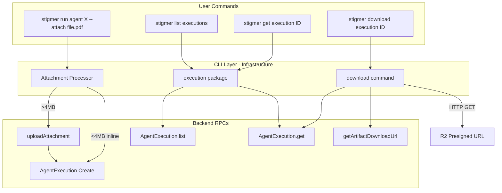

# CLI Artifact Lifecycle Implementation

## Architecture Overview

This implementation follows Stigmer CLI's verb-first pattern and extends it for execution management and artifact handling.




## Key Design Decisions

### 1. Execution is NOT a CLI-Relevant Kind in Registry

**Important Discovery**: Unlike agents/workflows/skills, `execution` does NOT go through the unified `SearchService`. It has its own `AgentExecutionQueryController` with dedicated `list()` and `get()` RPCs.

**Decision**: Do NOT add `agent_execution` to `cliRelevantKinds` in registry. Instead, handle execution as a special case in commands, similar to how the current `run` command handles streaming.

**Rationale**:

- Executions use different list/get RPCs (not SearchService)
- Executions don't support apply/validate/push verbs
- Adding to registry would break the registry's SearchService assumption

### 2. Attachment Processing Hidden in CLI Layer

The CLI will transparently handle file size limits:

- Files < 4MB: Embed `content` bytes inline in `Attachment`
- Files >= 4MB: Upload via `uploadAttachment` RPC, use returned `storage_key`

User never sees storage keys or upload mechanics.

### 3. Download as a New Verb

Add `VerbDownload` to the verb system. It's execution-specific but follows the verb-first pattern.

---

## Implementation Plan

### Phase 1: Foundation - Type System Extensions

**Files to modify:**

1. **[verb.go](client-apps/cli/internal/cli/types/verb.go)** - Add download verb

```go
// Add to constants
VerbDownload Verb = "download"

// Add to AllVerbs()
// Add to VerbFromString()
```

1. **[verb_support.go](client-apps/cli/internal/cli/types/verb_support.go)** - Add execution verb support

```go
// Add new entry (execution is special - not in cliRelevantKinds)
// This is for documentation/validation purposes
apiresourcekind.ApiResourceKind_agent_execution: {
    VerbGet:      true,
    VerbList:     true,
    VerbDelete:   true,   // Maps to cancel
    VerbDownload: true,   // New verb
},
```

**Note**: Do NOT add `agent_execution` to `cliRelevantKinds` in [registry.go](client-apps/cli/internal/cli/types/registry.go) - it uses different RPCs.

---

### Phase 2: Execution Package - Core Operations

**Create new package**: `client-apps/cli/internal/cli/execution/`

#### File: `get.go`

```go
// GetFromBackend retrieves an agent execution by ID.
func GetFromBackend(conn grpc.ClientConnInterface, executionID string) (*agentexecutionv1.AgentExecution, error) {
    // Uses AgentExecutionQueryController.get()
    // Execution IDs are always IDs (aex_xxx), never org/slug
}
```

#### File: `list.go`

```go
// ListOptions for filtering executions
type ListOptions struct {
    Conn     grpc.ClientConnInterface
    Phase    agentexecutionv1.ExecutionPhase  // Optional filter
    PageSize int32
}

// List retrieves executions with optional filtering.
func List(opts *ListOptions) (*agentexecutionv1.AgentExecutionList, error) {
    // Uses AgentExecutionQueryController.list()
}
```

#### File: `display.go`

```go
// DisplayGetResult shows execution details including artifacts.
func DisplayGetResult(exec *agentexecutionv1.AgentExecution, format string) {
    // Table format shows:
    // - Execution metadata (ID, agent, status, duration)
    // - Artifacts table (name, size, kind, created_at)
}

// DisplayListResult shows execution list.
func DisplayListResult(list *agentexecutionv1.AgentExecutionList, format string) {
    // Table shows: ID, Agent, Status, Started, Duration
}
```

#### File: `cancel.go`

```go
// Cancel stops a running execution.
func Cancel(conn grpc.ClientConnInterface, executionID string) error {
    // Uses AgentExecutionCommandController.cancel()
}
```

---

### Phase 3: Attachment Processing

**Create new file**: `client-apps/cli/cmd/stigmer/root/run_attachments.go`

```go
const MaxInlineSize = 4 * 1024 * 1024 // 4MB

// AttachmentProcessor handles file attachments for run command.
type AttachmentProcessor struct {
    conn grpc.ClientConnInterface
}

// ProcessFiles converts file paths to Attachment protos.
// - Small files (< 4MB): inline content
// - Large files (>= 4MB): upload via uploadAttachment, use storage_key
func (p *AttachmentProcessor) ProcessFiles(paths []string) ([]*agentexecutionv1.Attachment, error) {
    // 1. Read each file
    // 2. Detect content type from extension
    // 3. If size < 4MB: create Attachment with content bytes
    // 4. If size >= 4MB: call uploadAttachment, create Attachment with storage_key
    // 5. Return slice of Attachments
}
```

**Modify**: [run.go](client-apps/cli/cmd/stigmer/root/run.go)

```go
// Add flags
var attachFlags []string
var waitFlag bool
var downloadDir string

cmd.Flags().StringArrayVar(&attachFlags, "attach", []string{},
    "file to attach as input (can be repeated)")
cmd.Flags().BoolVar(&waitFlag, "wait", false,
    "wait for execution to complete")
cmd.Flags().StringVar(&downloadDir, "download", "",
    "download artifacts to directory when complete (implies --wait)")
```

**Modify**: [run_create.go](client-apps/cli/cmd/stigmer/root/run_create.go)

```go
// Update createAgentExecution signature
func createAgentExecution(
    agentID, orgID, message string,
    env envfile.EnvMap,
    attachments []*agentexecutionv1.Attachment,  // NEW
    conn *grpc.ClientConn,
) (*agentexecutionv1.AgentExecution, error) {
    // Include attachments in spec
    spec.Attachments = attachments
}
```

**Modify**: [run_handlers.go](client-apps/cli/cmd/stigmer/root/run_handlers.go)

```go
func runAgent(ref, message string, env envfile.EnvMap, 
    attachPaths []string, wait bool, downloadDir string,  // NEW params
    follow bool, orgID string, conn *grpc.ClientConn) error {
    
    // 1. Resolve agent
    // 2. Process attachments
    // 3. Create execution
    // 4. If wait || downloadDir != "": wait for completion
    // 5. If downloadDir != "": download artifacts
    // 6. Else if follow: stream logs
}
```

---

### Phase 4: Command Extensions

#### 4.1 List Command - Add Execution Support

**Modify**: [list.go](client-apps/cli/cmd/stigmer/root/list.go)

```go
// In NewListCommand(), update Long description to include executions

// Add execution-specific flags
var statusFilter string
var agentFilter string

// In executeList(), add special case for "execution" type
if opts.TypeArg == "execution" || opts.TypeArg == "executions" {
    return listExecutions(opts)
}

func listExecutions(opts listOptions) error {
    // Uses execution.List() - NOT search.List()
}
```

#### 4.2 Get Command - Add Execution Support

**Modify**: [get.go](client-apps/cli/cmd/stigmer/root/get.go)

```go
// In executeGet(), add special case for "execution" type
if opts.TypeArg == "execution" {
    return getExecution(opts.Reference, opts.OutputFormat, conn)
}

func getExecution(ref, format string, conn *grpc.ClientConn) error {
    // Validate ref is an execution ID (aex_xxx)
    // Uses execution.GetFromBackend()
}
```

#### 4.3 Delete Command - Add Execution Cancel

**Modify**: [delete.go](client-apps/cli/cmd/stigmer/root/delete.go)

```go
// In executeDelete(), add special case for "execution" type
if opts.TypeArg == "execution" {
    return cancelExecution(opts.Reference, conn)
}

func cancelExecution(ref string, conn *grpc.ClientConn) error {
    // Uses execution.Cancel()
}
```

#### 4.4 New Download Command

**Create**: `client-apps/cli/cmd/stigmer/root/download.go`

```go
func NewDownloadCommand() *cobra.Command {
    var artifactName string
    var outputDir string
    var all bool

    cmd := &cobra.Command{
        Use:   "download <type> <id>",
        Short: "Download artifacts from an execution",
        Long: `Download artifacts produced by an agent execution.

Currently only supports execution type.`,
        Example: `  # Download all artifacts
  stigmer download execution aex_01abc123

  # Download specific artifact
  stigmer download execution aex_01abc123 --artifact report.pdf

  # Download to specific directory
  stigmer download execution aex_01abc123 --output-dir ./results`,
        Args: cobra.ExactArgs(2),
    }
    
    cmd.Flags().StringVar(&artifactName, "artifact", "", "specific artifact to download")
    cmd.Flags().StringVarP(&outputDir, "output-dir", "o", ".", "output directory")
    cmd.Flags().BoolVar(&all, "all", true, "download all artifacts")
    
    return cmd
}
```

**Create**: `client-apps/cli/cmd/stigmer/root/download_execution.go`

```go
// downloadExecutionArtifacts downloads artifacts from an execution.
func downloadExecutionArtifacts(executionID string, opts downloadOptions, conn *grpc.ClientConn) error {
    // 1. Get execution to retrieve artifact list
    exec, err := execution.GetFromBackend(conn, executionID)
    
    // 2. Filter artifacts if --artifact specified
    artifacts := filterArtifacts(exec.Status.Artifacts, opts.ArtifactName)
    
    // 3. For each artifact:
    //    a. Check if download_url is valid/not expired
    //    b. If expired: call getArtifactDownloadUrl to refresh
    //    c. HTTP GET the presigned URL
    //    d. Save to output directory with progress indicator
    
    // 4. Display summary
}
```

**Create**: `client-apps/cli/internal/cli/httputil/download.go`

```go
// DownloadFile downloads a file from a URL to the specified path.
// Shows progress bar for large files.
func DownloadFile(url, destPath string) error {
    // 1. HTTP GET with streaming response
    // 2. Create destination file
    // 3. Copy with progress tracking
    // 4. Close and return
}
```

---

### Phase 5: Wire Commands to Root

**Modify**: [root.go](client-apps/cli/cmd/stigmer/root.go)

```go
// Add download command
rootCmd.AddCommand(root.NewDownloadCommand())
```

---

## File Summary


| Action | Path                                     | Description                            |
| ------ | ---------------------------------------- | -------------------------------------- |
| Modify | `types/verb.go`                          | Add `VerbDownload` constant            |
| Modify | `types/verb_support.go`                  | Add execution verb support             |
| Create | `internal/cli/execution/get.go`          | GetFromBackend for executions          |
| Create | `internal/cli/execution/list.go`         | List executions                        |
| Create | `internal/cli/execution/display.go`      | Display formatting                     |
| Create | `internal/cli/execution/cancel.go`       | Cancel execution                       |
| Create | `internal/cli/httputil/download.go`      | HTTP download utility                  |
| Create | `cmd/stigmer/root/run_attachments.go`    | Attachment processing                  |
| Create | `cmd/stigmer/root/download.go`           | Download command                       |
| Create | `cmd/stigmer/root/download_execution.go` | Download execution handler             |
| Modify | `cmd/stigmer/root/run.go`                | Add --attach, --wait, --download flags |
| Modify | `cmd/stigmer/root/run_create.go`         | Add attachments parameter              |
| Modify | `cmd/stigmer/root/run_handlers.go`       | Handle attachments and wait            |
| Modify | `cmd/stigmer/root/list.go`               | Add execution support                  |
| Modify | `cmd/stigmer/root/get.go`                | Add execution support                  |
| Modify | `cmd/stigmer/root/delete.go`             | Add execution cancel                   |
| Modify | `cmd/stigmer/root.go`                    | Wire download command                  |


---

## Testing Strategy

1. **Unit tests** for:
  - Attachment processor (size detection, content type)
  - Reference parsing for execution IDs
2. **Integration tests** for:
  - `stigmer run agent X --attach small.txt` (inline)
  - `stigmer run agent X --attach large.pdf` (upload)
  - `stigmer list executions`
  - `stigmer get execution aex_xxx`
  - `stigmer download execution aex_xxx`
3. **Edge cases**:
  - File not found
  - Permission denied
  - Network failures during upload/download
  - Expired presigned URLs

---

## Risk Considerations

1. **Execution list uses different RPC than other resources** - Handled by special-casing in list.go instead of using SearchService
2. **Large file handling** - 4MB threshold matches gRPC message limits; uploadAttachment handles larger files
3. **Presigned URL expiration** - Download handler checks expiry and refreshes if needed
4. **Progress indicators** - Use existing cliprint utilities for consistent UX

