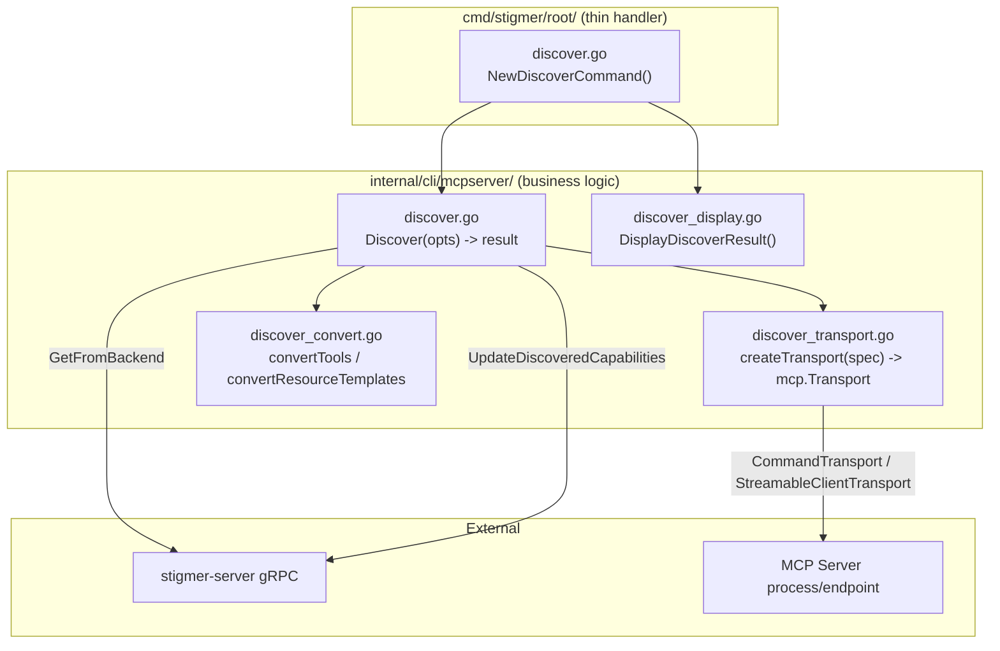

# Phase 4: CLI Discovery Command

## Command UX

```
stigmer discover mcp-server <ref> [--org <org>] [--timeout 30s] [--dry-run]
```

- `<ref>` resolves via existing `reference.Parse` (supports slug, org/slug, resource ID)
- Transport type (stdio vs HTTP) is auto-detected from the MCP server's spec
- Env vars for stdio subprocesses come from the current shell environment (credentials stay local)
- `--dry-run` discovers and displays results without pushing to backend
- `--timeout` controls how long to wait for MCP server connection + discovery

## Architecture

Following the [CLI coding guidelines](client-apps/cli/.cursor/rules/client-apps/cli/coding-guidelines.mdc): thin command handler, business logic in `internal/`, SRP file splits.




## Data Flow

1. Fetch `McpServer` from backend via `mcpserver.GetFromBackend(conn, orgID, ref)`
2. Inspect `McpServer.Spec` to determine transport type (stdio oneof vs http oneof)
3. Build `mcp.Transport`:
  - **stdio**: `&mcp.CommandTransport{Command: exec.Command(command, args...)}` -- inherits `os.Environ()`
  - **HTTP**: `&mcp.StreamableClientTransport{Endpoint: url, HTTPClient: httpClientWithHeaders}`
4. Create `mcp.Client` + `client.Connect(ctx, transport, nil)` -> `*mcp.ClientSession`
5. Call `session.ListTools(ctx, nil)` and `session.ListResourceTemplates(ctx, nil)` (handles pagination via iterators)
6. Convert SDK types to proto types:
  - `mcp.Tool` -> `mcpserverv1.DiscoveredTool` (name, description, inputSchema as `*structpb.Struct`)
  - `mcp.ResourceTemplate` -> `mcpserverv1.DiscoveredResourceTemplate` (uriTemplate, name, description, mimeType)
7. Build `UpdateDiscoveredCapabilitiesInput` with `mcp_server_id` + `DiscoveredCapabilities` (source=`cli`, timestamp=now)
8. Call `McpServerCommandControllerClient.UpdateDiscoveredCapabilities(ctx, input)`
9. Display results

## Files to Create

### 1. `[client-apps/cli/cmd/stigmer/root/discover.go](client-apps/cli/cmd/stigmer/root/discover.go)`

Thin Cobra command (~80 lines). `NewDiscoverCommand()` returns a parent `discover` command with `mcp-server` as a subcommand.

- Parse flags (`--org`, `--timeout`, `--dry-run`)
- Setup backend connection (config load, daemon ensure, `backend.NewConnection()`)
- Delegate to `mcpserver.Discover(opts)`
- Display result via `mcpserver.DisplayDiscoverResult(result)`

Pattern follows `[get.go](client-apps/cli/cmd/stigmer/root/get.go)`.

### 2. `[client-apps/cli/internal/cli/mcpserver/discover.go](client-apps/cli/internal/cli/mcpserver/discover.go)`

Main orchestration (~100 lines).

```go
type DiscoverOptions struct {
    Conn    grpc.ClientConnInterface
    OrgID   string
    Ref     string
    Timeout time.Duration
    DryRun  bool
}

type DiscoverResult struct {
    McpServer    *mcpserverv1.McpServer
    Capabilities *mcpserverv1.DiscoveredCapabilities
    Updated      *mcpserverv1.McpServer  // nil if dry-run
}

func Discover(ctx context.Context, opts *DiscoverOptions) (*DiscoverResult, error)
```

Steps: fetch server -> create transport -> connect MCP client -> list tools/templates -> convert -> push (unless dry-run).

### 3. `[client-apps/cli/internal/cli/mcpserver/discover_transport.go](client-apps/cli/internal/cli/mcpserver/discover_transport.go)`

Transport factory (~80 lines). Creates `mcp.Transport` from `McpServerSpec`.

```go
func createTransport(spec *mcpserverv1.McpServerSpec) (mcp.Transport, error)
```

- Stdio: `exec.Command(stdio.Command, stdio.Args...)` with `cmd.Env = os.Environ()`
- HTTP: `StreamableClientTransport{Endpoint: http.Url}` with headers from `http.Headers`
- Returns clear error if neither transport is configured

### 4. `[client-apps/cli/internal/cli/mcpserver/discover_convert.go](client-apps/cli/internal/cli/mcpserver/discover_convert.go)`

Type conversion (~80 lines). Pure functions mapping MCP SDK types to proto types.

```go
func convertTools(tools []*mcp.Tool) ([]*mcpserverv1.DiscoveredTool, error)
func convertResourceTemplates(templates []*mcp.ResourceTemplate) []*mcpserverv1.DiscoveredResourceTemplate
```

Key conversion: `mcp.Tool.InputSchema` (`any` / `map[string]any`) -> `*structpb.Struct` via `structpb.NewStruct()`.

### 5. `[client-apps/cli/internal/cli/mcpserver/discover_display.go](client-apps/cli/internal/cli/mcpserver/discover_display.go)`

Display formatting (~60 lines).

```go
func DisplayDiscoverResult(result *DiscoverResult)
```

Outputs: server name, transport type, tools list (name + description), resource templates list (name + URI template), and confirmation of push.

## Files to Modify

- `[client-apps/cli/cmd/stigmer/root.go](client-apps/cli/cmd/stigmer/root.go)` -- register `NewDiscoverCommand()` in `resource` group
- `[client-apps/cli/cmd/stigmer/root/BUILD.bazel](client-apps/cli/cmd/stigmer/root/BUILD.bazel)` -- add `discover.go` to srcs
- `[client-apps/cli/internal/cli/mcpserver/BUILD.bazel](client-apps/cli/internal/cli/mcpserver/BUILD.bazel)` -- add new source files + MCP SDK dependency

## Key Type Mappings

- `mcp.Tool.Name` -> `DiscoveredTool.name`
- `mcp.Tool.Description` -> `DiscoveredTool.description`
- `mcp.Tool.InputSchema` (any) -> `DiscoveredTool.input_schema` (structpb.Struct)
- `mcp.ResourceTemplate.URITemplate` -> `DiscoveredResourceTemplate.uri_template`
- `mcp.ResourceTemplate.Name` -> `DiscoveredResourceTemplate.name`
- `mcp.ResourceTemplate.Description` -> `DiscoveredResourceTemplate.description`
- `mcp.ResourceTemplate.MIMEType` -> `DiscoveredResourceTemplate.mime_type`

## Dependencies

- `github.com/modelcontextprotocol/go-sdk v1.3.0` -- promoted from indirect to direct in `cli/go.mod`
- `google.golang.org/protobuf/types/known/structpb` -- for InputSchema conversion
- `google.golang.org/protobuf/types/known/timestamppb` -- for `last_discovered_at`

## SDK API Reference (confirmed from source)

```go
client := mcp.NewClient(&mcp.Implementation{Name: "stigmer-cli", Version: "..."}, nil)
transport := &mcp.CommandTransport{Command: exec.Command(command, args...)}
session, err := client.Connect(ctx, transport, nil)
defer session.Close()

toolsResult, err := session.ListTools(ctx, nil)        // returns *ListToolsResult{Tools: []*Tool}
tmplResult, err := session.ListResourceTemplates(ctx, nil) // returns *ListResourceTemplatesResult{ResourceTemplates: []*ResourceTemplate}
```

## Edge Cases and Error Handling

- **Binary not found**: `exec.Command` fails -> wrap with "MCP server command not found: . Ensure it is installed and in your PATH"
- **Server fails to start**: `client.Connect` fails -> wrap with "failed to connect to MCP server: "
- **Timeout**: context deadline exceeded -> wrap with "MCP server did not respond within "
- **No tools/resources**: Valid result (empty lists) -- display "no tools discovered" message, still push
- **InputSchema type assertion**: If `Tool.InputSchema` is not `map[string]any`, skip with warning
- **Neither stdio nor HTTP configured**: Return error "MCP server has no transport configured"

