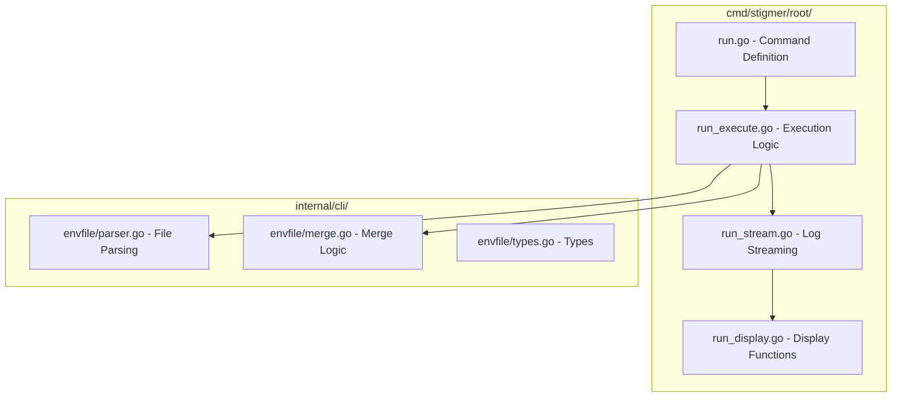

# CLI Environment Integration Plan

## Problem Statement

The `stigmer run` command needs enhanced environment variable support for the runtime variables flow. While `--runtime-env` exists, we need:

1. A more intuitive `--env` alias (consistent with Docker, Kubernetes)
2. `--env-file` support for bulk loading from files
3. Architectural cleanup - `run.go` at 895 lines violates the 250-line max guideline

## Architecture Overview



## Key Files

### New Files to Create

| File | Purpose | Lines |

|------|---------|-------|

| `internal/cli/envfile/parser.go` | Parse env files (KEY=VALUE, comments, quotes) | ~120 |

| `internal/cli/envfile/merge.go` | Merge multiple env sources with precedence | ~80 |

| `internal/cli/envfile/types.go` | Type definitions and interfaces | ~50 |

| `internal/cli/envfile/parser_test.go` | Comprehensive tests | ~250 |

| `cmd/stigmer/root/run_execute.go` | Agent/workflow execution logic | ~180 |

| `cmd/stigmer/root/run_stream.go` | Log streaming functions | ~150 |

| `cmd/stigmer/root/run_display.go` | Display/formatting functions | ~120 |

### Files to Modify

| File | Changes |

|------|---------|

| `cmd/stigmer/root/run.go` | Slim down to ~150 lines - command definition only |

## Implementation Details

### 1. Environment File Format

Support industry-standard `.env` file format:

```bash
# Comments start with #
API_KEY=abc123
DATABASE_URL="postgres://localhost/db"

# Secrets use the existing secret: prefix
secret:AWS_SECRET_KEY=supersecret

# Empty lines are ignored
DEBUG=true
```

Features:

- Lines starting with `#` are comments
- Empty lines ignored
- `KEY=VALUE` format (no `export` prefix needed)
- Quoted values preserve whitespace
- `secret:KEY=VALUE` marks as secret (consistent with `--runtime-env`)

### 2. Flag Design

```bash
# Shorthand alias (more intuitive)
stigmer run my-agent --env API_KEY=abc123

# Load from file
stigmer run my-agent --env-file .env

# Combine multiple sources (precedence: later flags override earlier)
stigmer run my-agent \
  --env-file .env.defaults \
  --env-file .env.local \
  --env API_KEY=override
```

Precedence (highest to lowest):

1. `--env` flags (inline)
2. Later `--env-file` flags
3. Earlier `--env-file` flags

### 3. Parser Implementation

[`internal/cli/envfile/parser.go`](internal/cli/envfile/parser.go):

```go
// ParseFile reads and parses an environment file.
// Supports comments (#), empty lines, quoted values, and secret: prefix.
func ParseFile(path string) (map[string]*executioncontextv1.ExecutionValue, error)

// ParseLine parses a single KEY=VALUE line.
// Returns key, value, isSecret, error.
func ParseLine(line string) (string, string, bool, error)

// ParseFlags parses --env flag values (KEY=VALUE or secret:KEY=VALUE).
// Same format as existing --runtime-env parsing.
func ParseFlags(envVars []string) (map[string]*executioncontextv1.ExecutionValue, error)
```

### 4. Merge Logic

[`internal/cli/envfile/merge.go`](internal/cli/envfile/merge.go):

```go
// MergeEnvSources merges multiple environment sources with precedence.
// Later sources override earlier sources.
func MergeEnvSources(sources ...map[string]*executioncontextv1.ExecutionValue) map[string]*executioncontextv1.ExecutionValue
```

### 5. Command Handler Refactor

The current `run.go` (895 lines) will be split:

**run.go (~150 lines)** - Command definition only:

- Flag definitions
- Cobra command setup
- Orchestration calls to other functions

**run_execute.go (~180 lines)** - Execution logic:

- `runReferenceMode()`
- `runAutoDiscoveryMode()`
- `executeAgent()`
- `executeWorkflow()`
- `createAgentExecution()`
- `createWorkflowExecution()`

**run_stream.go (~150 lines)** - Streaming:

- `streamAgentExecutionLogs()`
- `streamWorkflowExecutionLogs()`

**run_display.go (~120 lines)** - Display functions:

- `displayAgentPhaseChange()`
- `displayAgentMessage()`
- `displayWorkflowPhaseChange()`
- `displayWorkflowTask()`
- `displayAgentExecutionComplete()`
- `displayWorkflowExecutionComplete()`

### 6. Error Handling

Follow existing patterns:

```go
if err != nil {
    return nil, errors.Wrap(err, "failed to parse environment file")
}
```

Specific error messages:

- "failed to read environment file: %s"
- "failed to parse line %d in %s: invalid format"
- "empty key in environment file %s at line %d"

### 7. Testing Strategy

Unit tests for:

- Basic KEY=VALUE parsing
- Quoted value handling
- Comment and empty line handling
- Secret prefix detection
- File not found errors
- Invalid format errors
- Merge precedence

Integration tests:

- End-to-end flag parsing with actual command

## Quality Checklist

- [ ] Every file under 250 lines
- [ ] Every function under 50 lines
- [ ] Every error wrapped with specific context
- [ ] No business logic in command handlers
- [ ] File names are descriptive
- [ ] Imports properly organized
- [ ] Comprehensive test coverage
- [ ] Run `gazelle` to update BUILD.bazel