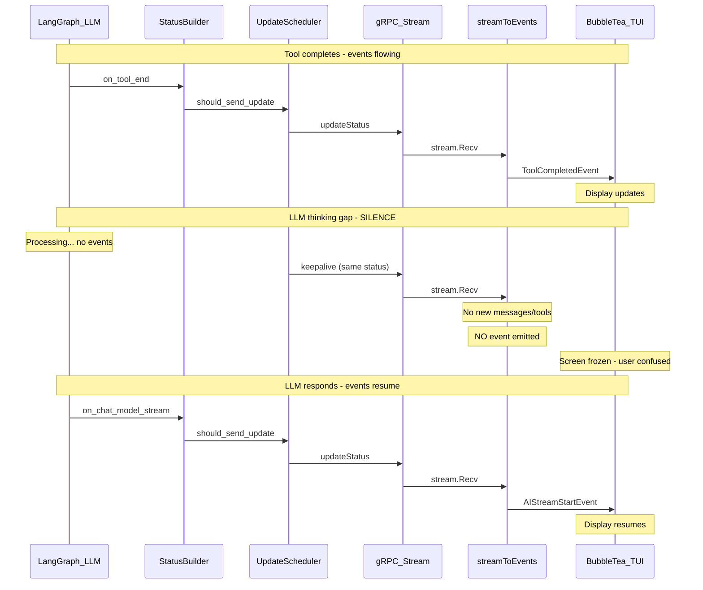

# CLI Live Activity Feedback

## Problem

When the agent finishes reading files and enters its "thinking" phase (LLM processing before generating the next response), the CLI shows a completely static screen. No spinner, no indicator, nothing. The user cannot distinguish between:

- The agent actively thinking (normal)
- The agent being stuck (problem)
- A network disconnection (problem)

This happens because the TUI is purely event-driven: it only updates when new messages or tool state changes arrive. During LLM thinking, no LangGraph events are emitted, so no TUI events fire, and the display freezes.

## Root Cause Analysis

The silence originates from a gap between two layers:

1. **Backend keepalive sends updates every 5s** (`StreamingUpdateScheduler` max_interval), but these contain the same status (no new messages/tools).
2. **CLI `streamToEvents` only emits events on content changes** -- keepalive updates with no meaningful delta produce zero TUI events.
3. **TUI has no timer/tick during `in_progress**` -- the spinner only runs during `pending` phase and stops the moment execution starts.

## Solution: Two-Layer Approach

### Layer 1: CLI Thinking Indicator (Primary -- Self-Contained)

Add a timer-driven activity indicator to the TUI that activates during idle periods in the `in_progress` phase. This is entirely CLI-side with no backend dependency.

**How it works:**

- Track `lastEventAt time.Time` in the model -- reset on every meaningful event
- Start a `tea.Tick` (1s interval) when phase transitions to `in_progress`
- On each tick: if `time.Since(lastEventAt) > 2s`, show an animated thinking indicator at the bottom of the viewport
- On next meaningful event: remove the thinking indicator
- The indicator uses the existing `spinner.Model` (reuse the pending-phase spinner)

**Files to change:**

- `[client-apps/cli/pkg/executiontui/model.go](client-apps/cli/pkg/executiontui/model.go)`: Add `lastEventAt time.Time`, `thinkingVisible bool`, and `activityTicker` state. Keep the spinner running beyond "pending" phase.
- `[client-apps/cli/pkg/executiontui/update.go](client-apps/cli/pkg/executiontui/update.go)`: Handle `activityTickMsg`. On tick: check if idle >2s during `in_progress`, toggle `thinkingVisible`, refresh viewport. Continue spinner ticks during `in_progress`.
- `[client-apps/cli/pkg/executiontui/handle_events.go](client-apps/cli/pkg/executiontui/handle_events.go)`: On every event dispatch, reset `lastEventAt = time.Now()` and clear `thinkingVisible` if set.
- `[client-apps/cli/pkg/executiontui/view.go](client-apps/cli/pkg/executiontui/view.go)`: When `thinkingVisible`, render the spinner in the header alongside the phase (replacing the static icon with the animated spinner during idle). This keeps the header alive without inserting ephemeral blocks into the content area.
- `[client-apps/cli/pkg/executiontui/render_blocks.go](client-apps/cli/pkg/executiontui/render_blocks.go)`: (Only if we decide to add a "thinking" block at the bottom of the viewport instead of/in addition to the header spinner.)

**Design decision -- Header spinner vs. content block:**

- **Header spinner (recommended):** During idle, replace the static `in_progress` icon with the animated spinner in the header bar. Clean, non-intrusive, no content pollution. The header becomes `Execution: <id>  [spinner] in_progress` during idle, `Execution: <id>  [arrow] in_progress` when events are flowing.
- **Content block (alternative):** Append a "thinking" block at the bottom of the viewport. More visible but adds/removes blocks which complicates the block indexing logic.
- We can start with the header approach and add a content-area indicator later if users want more visibility.

### Layer 2: Backend Liveness Awareness (Secondary -- Connection Health)

Make the CLI aware of whether the backend is still sending keepalive updates, so it can distinguish "agent is thinking" from "connection lost."

**How it works:**

- Add a `HeartbeatEvent` type to the TUI event system
- In `streamToEvents`, emit a `HeartbeatEvent` on every `stream.Recv()` call, even when there are no message/tool changes
- TUI tracks `lastBackendUpdate time.Time` -- reset on every `HeartbeatEvent`
- If no `HeartbeatEvent` for >15s, show a connection warning in the footer: `Connection may be interrupted...`
- This is critical for reliability: the user needs to know if their agent is alive on the backend vs. if the connection dropped

**Files to change:**

- `[client-apps/cli/pkg/executiontui/events.go](client-apps/cli/pkg/executiontui/events.go)`: Add `HeartbeatEvent` type
- `[client-apps/cli/cmd/stigmer/root/run_stream_events.go](client-apps/cli/cmd/stigmer/root/run_stream_events.go)`: Emit `HeartbeatEvent` after every `stream.Recv()` call, before processing messages
- `[client-apps/cli/pkg/executiontui/model.go](client-apps/cli/pkg/executiontui/model.go)`: Add `lastBackendUpdate time.Time`
- `[client-apps/cli/pkg/executiontui/handle_events.go](client-apps/cli/pkg/executiontui/handle_events.go)`: Handle `HeartbeatEvent` -- update `lastBackendUpdate`, no viewport change
- `[client-apps/cli/pkg/executiontui/update.go](client-apps/cli/pkg/executiontui/update.go)`: On activity tick, check `lastBackendUpdate` for staleness
- `[client-apps/cli/pkg/executiontui/view.go](client-apps/cli/pkg/executiontui/view.go)`: Show connection warning in footer when stale

## What This Does NOT Include (Future Considerations)

- **Backend activity state tracking**: Adding an `activity_hint` field (e.g., "thinking", "generating", "executing_tool") to the proto status so the CLI can show specific messages. This requires proto schema changes and Java service updates -- valuable but higher effort. Should be a separate task.
- `**on_llm_start` event capture**: LangGraph emits `on_llm_start` when the LLM call begins (before tokens). Capturing this in StatusBuilder could provide an earlier "generating" signal. Worth exploring but not blocking for the core UX fix.

## Expected User Experience After Changes

| Scenario                        | Before                                         | After                                                  |
| ------------------------------- | ---------------------------------------------- | ------------------------------------------------------ |
| Agent thinking after tool calls | Static screen, no feedback                     | Header spinner animates, user sees system is alive     |
| Agent generating response       | Streaming tokens appear                        | Same (already works)                                   |
| Tool executing                  | Static spinner icon                            | Same (already works)                                   |
| Backend connection drops        | Static screen, indistinguishable from thinking | Footer shows "Connection may be interrupted" after 15s |
| Agent stuck for 5+ minutes      | Static screen until stall timeout (300s)       | Header spinner + eventual backend stall detection      |

