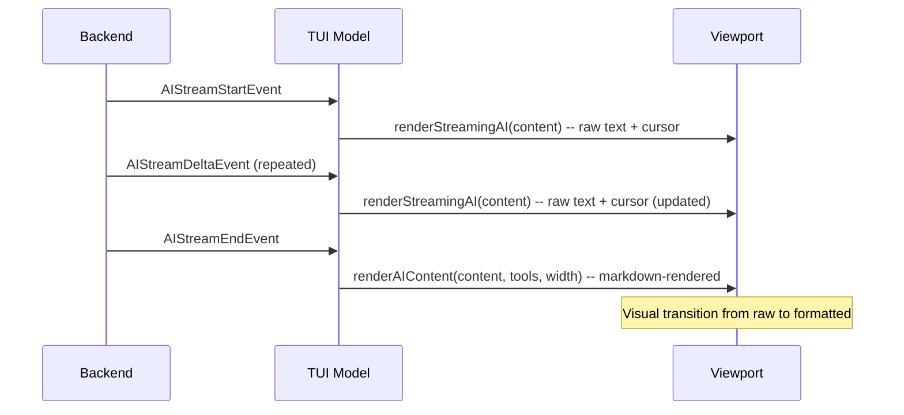

# Markdown Rendering for CLI Agent Responses

## Problem

Agent responses arrive as markdown (headers, bold, code blocks, lists), but both the TUI and non-TUI rendering paths print them as raw plain text. The rendering functions -- `renderAIContent` in `[pkg/executiontui/render_blocks.go](client-apps/cli/pkg/executiontui/render_blocks.go)` and `displayAIMessage` / `writeCompleteMessage` in `[cmd/stigmer/root/run_display.go](client-apps/cli/cmd/stigmer/root/run_display.go)` and `[cmd/stigmer/root/run_display_stream.go](client-apps/cli/cmd/stigmer/root/run_display_stream.go)` -- all do a simple `fmt.Sprintf("🤖 Agent: %s", content)` with no formatting.

## Design

### Library: `glamour` (Charmbracelet)

`[glamour](https://github.com/charmbracelet/glamour)` converts markdown to ANSI-styled terminal output. It is from the same Charmbracelet ecosystem as the already-used `lipgloss`, `bubbletea`, and `bubbles`. It supports:

- Styled headers (bold, colored)
- Bold, italic, strikethrough
- Code blocks with syntax highlighting (via `chroma`, also already a dependency)
- Lists (ordered and unordered)
- Tables, blockquotes, horizontal rules
- Width-aware word wrapping

### New package: `pkg/mdrender/`

A thin, domain-agnostic wrapper around `glamour` following the CLI's [coding guidelines](client-apps/cli/.cursor/rules/coding-guidelines.mdc) (`pkg/` = reusable, no Stigmer-specific logic, no `internal/` imports).

**API surface:**

```go
package mdrender

// Render converts markdown to ANSI-styled terminal text.
// Falls back to raw content on error (never fails from caller's perspective).
// width controls word wrapping (0 = no wrap).
func Render(content string, width int) string
```

The function is intentionally error-free at the call site -- if glamour fails for any reason, the raw content is returned unmodified. This prevents a rendering library from ever breaking the CLI's core display path.

Internally, `glamour.TermRenderer` instances are cached by width using `sync.Map` since terminal width rarely changes.

**Files:**

- `pkg/mdrender/render.go` (~50-60 lines) -- core rendering logic, caching, graceful fallback
- `pkg/mdrender/render_test.go` -- verify headers/bold/code blocks produce ANSI output, fallback on empty/error, width wrapping

### Integration: TUI mode (primary target)

The TUI is the primary interactive experience. The integration is clean because the viewport rebuilds from block content on every event.

**Streaming flow (no change during streaming, render on finalize):**




**Changes in `[render_blocks.go](client-apps/cli/pkg/executiontui/render_blocks.go)`:**

- `renderAIContent(content string, toolCalls []ToolCallInfo)` gains a `width int` parameter
- Content is passed through `mdrender.Render(content, width)` before being formatted
- The `"🤖 Agent: "` prefix moves to its own line when markdown is rendered (rendered content has its own formatting that would conflict with inline prefix)
- `renderStreamingAI` stays unchanged -- raw text + cursor during streaming is the expected UX (same pattern as web-based AI chat UIs)

**Changes in `[handle_events.go](client-apps/cli/pkg/executiontui/handle_events.go)`:**

- `AIMessageEvent` and `AIStreamEndEvent` handlers pass `m.width` to `renderAIContent`

### Integration: Non-TUI mode

Non-TUI has two sub-paths:

1. **Complete messages** (`writeCompleteMessage` in `run_display_stream.go`, `displayAIMessage` in `run_display.go`): Apply `mdrender.Render` to the content before printing. This covers late-subscription (execution already done when CLI connects) and `stigmer get execution` replay. Terminal width is detected via `golang.org/x/term` (already a dependency).
2. **Streaming messages** (`beginAIStream` / `printDelta` / `finalizeAIStream`): This is where raw text is printed incrementally as tokens arrive. Re-rendering after streaming would require ANSI cursor manipulation to clear and rewrite, which is fragile across terminal emulators and doesn't work when stdout is piped. **For v1, streaming in non-TUI mode stays raw.** This is a deliberate trade-off: the TUI is the primary interactive experience, and non-TUI streaming is a fallback. We can enhance this in a follow-up with a clear-and-rerender approach if needed.

### Prefix format change

When content is markdown-rendered, the `"🤖 Agent: "` prefix should be on its own line:

```
🤖 Agent:

  # Analysis Results

  The codebase has **3 issues**:

  1. Missing error handling in `main.go`
  2. ...
```

For plain text (no markdown detected or rendering disabled), the current inline format is preserved:

```
🤖 Agent: I'll read the file for you.
```

Detection heuristic: if `mdrender.Render` produces output different from the input (i.e., markdown was actually rendered), use multi-line prefix. Otherwise, keep inline.

### Test updates

- `[render_blocks_test.go](client-apps/cli/pkg/executiontui/render_blocks_test.go)`: Update `TestRenderAIContent_TextOnly` and `TestRenderAIContent_WithToolCalls` to account for the new width parameter and markdown rendering. Add tests for markdown content (headers, code blocks, lists).
- `[run_display_stream_test.go](client-apps/cli/cmd/stigmer/root/run_display_stream_test.go)`: Update `TestRenderer_CompleteAIMessage` and `TestRenderer_LateSubscription_AllMessagesComplete` to verify markdown rendering in complete messages.
- New `pkg/mdrender/render_test.go`: Core rendering tests.

## Scope boundary

**In scope (this plan):**

- `pkg/mdrender/` package
- TUI markdown rendering (streaming raw + finalized rendered)
- Non-TUI complete-message markdown rendering
- Test updates

**Out of scope (future enhancements):**

- Non-TUI streaming clear-and-rerender
- Custom glamour theme/style tuning
- User-configurable markdown rendering toggle (e.g., `--no-markdown`)
- Markdown rendering for human messages or system messages

