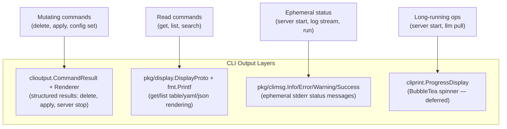

# cliprint Sunset: Migrate to stderr Messaging + Shrink to ProgressDisplay

## Scope Discovery

- **Original estimate**: ~10 importers
- **Actual**: **27 files** (8 display.go + 19 command files), **47 function calls** + 3 constant usages
- ProgressDisplay (BubbleTea) remains in `cliprint` — deferred to separate project per prior agreement

## Architecture After Migration

Three distinct output layers, each with a single responsibility:




## Locked-In Design Decisions

1. **Drop cyan from display.go**: Replace `cliprint.PrintInfo` with `fmt.Printf`. Blanket decoration is not semantic color. Item 4 (table modernization) is the right place for deliberate per-field color.
2. **Dual-layer climsg API**: `Writer` struct for DI/testing + package-level convenience functions for mechanical migration. No mutable `SetOutput`. Matches Go `slog` pattern.

## Phase 1: Create `pkg/climsg/` Package

Create `client-apps/cli/pkg/climsg/` with:

- `**climsg.go`** (~35 lines): `Writer` struct, `New(w io.Writer) *Writer`, 4 methods (`Info`, `Error`, `Warning`, `Success`), package-level `stderr` default, 4 convenience functions
- `**climsg_test.go`** (~60 lines): Tests using `climsg.New(&buf)` — verify format, newline, all 4 levels
- `**BUILD.bazel**`: Source, test, `fatih/color` dep

Key implementation detail — all output goes to **stderr**, not stdout:

```go
var stderr = New(os.Stderr)

func Info(format string, args ...any)    { stderr.Info(format, args...) }
func Error(format string, args ...any)   { stderr.Error(format, args...) }
```

**Verification**: `go build`, `go vet`, `go test`

## Phase 2: Migrate display.go Files (8 files)

Replace `cliprint.PrintInfo` with `fmt.Printf` (add `\n` since `PrintInfo` appends it automatically). Replace any `cliprint.PrintError` with `fmt.Fprintf(os.Stderr, ...)` (errors in display functions should go to stderr).

**Files** (all under `client-apps/cli/internal/cli/`):


| File                   | cliprint calls                    | Migration                                         |
| ---------------------- | --------------------------------- | ------------------------------------------------- |
| `search/display.go`    | PrintInfo x2                      | `fmt.Printf`                                      |
| `execution/display.go` | PrintInfo x many, PrintError x1   | `fmt.Printf` + `fmt.Fprintf(os.Stderr)` for error |
| `session/display.go`   | PrintInfo x many                  | `fmt.Printf`                                      |
| `project/display.go`   | PrintInfo x many, PrintSuccess x1 | `fmt.Printf`                                      |
| `workflow/display.go`  | PrintInfo x many                  | `fmt.Printf`                                      |
| `agent/display.go`     | PrintInfo x many                  | `fmt.Printf`                                      |
| `mcpserver/display.go` | PrintInfo x many                  | `fmt.Printf`                                      |
| `skill/display.go`     | PrintInfo x many                  | `fmt.Printf`                                      |


For each file: remove `cliprint` import, add `fmt` if not present, update BUILD.bazel to drop cliprint dep.

**Note on `PrintSuccess` in project/display.go**: This is `DisplayValidationSuccess` — a validation result message. It uses green color. Since this is primary output (not ephemeral), replace with `fmt.Printf` and accept the color loss. Validation success messaging can get semantic color in Item 4.

**Verification**: `go build`, `go vet`, `go test` for all 8 packages

## Phase 3: Migrate Command Files (19 files)

Replace `cliprint.Print*` with `climsg.*` in all command files under `client-apps/cli/cmd/stigmer/root/`. This is mechanical: same function names, different package.

**Sub-batch 3a — Server files (4 files):**


| File                    | Print* calls                                                  | ProgressDisplay?                               |
| ----------------------- | ------------------------------------------------------------- | ---------------------------------------------- |
| `server.go`             | PrintInfo x8, PrintError x2, PrintSuccess x2, PrintWarning x2 | Yes — keep cliprint import for ProgressDisplay |
| `server_llm.go`         | PrintInfo x6, PrintError x2, PrintWarning x2, PrintSuccess x1 | Yes — keep cliprint import for ProgressDisplay |
| `server_logs.go`        | PrintInfo x3, PrintError x6, PrintWarning x1                  | No                                             |
| `server_logs_stream.go` | PrintInfo x5                                                  | No                                             |


For `server.go` and `server_llm.go`: replace Print* with climsg.*, keep cliprint import solely for `NewProgressDisplay`/`PhaseStarting`/`PhaseDeploying`/`PhaseInstalling`.

**Sub-batch 3b — Run files (8 files):**

- `run_stream.go` — PrintSuccess x2
- `run_session.go` — PrintError x1, PrintInfo x3, PrintWarning x1
- `run_handlers.go` — PrintInfo x5, PrintError x1, PrintWarning x2, PrintSuccess x1
- `run_display.go` — PrintInfo x2, PrintSuccess x3, PrintError x1, PrintWarning x1
- `run_attachments.go` — PrintInfo x4, PrintSuccess x1
- `run_attachments_zip.go` — PrintWarning x1
- `run_approval.go` — PrintSuccess x1, PrintWarning x1, PrintError x1, PrintInfo x1
- `run_resolve.go` — PrintError x4, PrintInfo x3

**Sub-batch 3c — Other command files (7 files):**

- `list.go` — PrintInfo x5, PrintWarning x1
- `push.go` — PrintInfo x2
- `download_execution.go` — PrintInfo x5, PrintWarning x2, PrintSuccess x1
- `validate.go` — PrintSuccess x2
- `verb_helpers.go` — PrintInfo x5, PrintError x1
- `draft_skill_handler.go` — PrintInfo x7, PrintError x1, PrintWarning x1, PrintSuccess x1
- `draft_agent_handler.go` — PrintInfo x7, PrintError x1, PrintWarning x1, PrintSuccess x1

For each file: swap `cliprint` import to `climsg`, mechanical find-replace of function calls. Update BUILD.bazel.

**Verification after each sub-batch**: `go build`, `go vet`

## Phase 4: Shrink cliprint + Final Cleanup

After all migrations:

1. **Remove `PrintSuccess`, `PrintError`, `PrintInfo`, `PrintWarning`** from `cliprint.go` along with their color variables
2. **Verify** only 2 files import cliprint: `server.go` and `server_llm.go` (for ProgressDisplay only)
3. **Remove unused deps** from cliprint's BUILD.bazel (`fatih/color` — check if ProgressDisplay uses it)
4. **Final verification**: `go build`, `go vet`, `go test ./client-apps/cli/...`

Post-state of `cliprint`: Contains only `progress.go` (ProgressDisplay, ProgressState, ProgressPhase types). Ready for future ProgressDisplay migration project.

## Risk Mitigation

- **Visual regression in display.go**: Intentional — cyan removal is a deliberate design decision, not a bug. Document in commit message.
- `**\n` handling**: `cliprint.PrintInfo` appends `\n` automatically. `fmt.Printf` does not. Every replacement must add `\n` to the format string. This is a common source of bugs — verify line-by-line.
- **stderr vs stdout**: All `climsg.`* calls write to stderr. This is correct for ephemeral messages but would break any code that pipes status output. Verify no command relies on grepping `cliprint.PrintInfo` output from stdout.

## Files Created

- `client-apps/cli/pkg/climsg/climsg.go` (~35 lines)
- `client-apps/cli/pkg/climsg/climsg_test.go` (~60 lines)
- `client-apps/cli/pkg/climsg/BUILD.bazel` (~20 lines)

## Files Modified

- 8 display.go files + their BUILD.bazel files (Phase 2)
- 19 command files + root BUILD.bazel (Phase 3)
- `cliprint/cliprint.go` + `cliprint/BUILD.bazel` (Phase 4)

**Total: ~30 files touched**