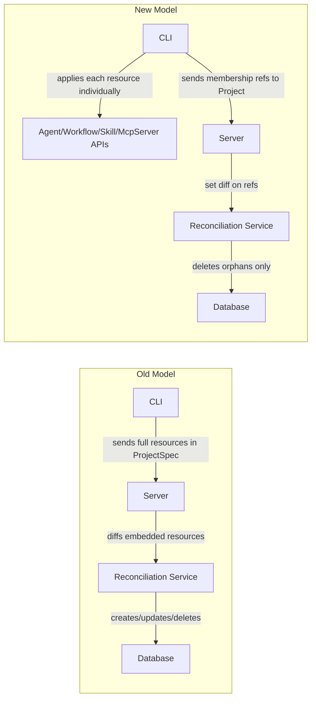

# Cloud Project Tenancy Migration: Fix Existing Issues and Rearchitect Reconciliation

## Phase 1: Pre-existing Build Failures (Surgical Fixes)

These are compile errors in files unrelated to the project migration. Each is a small, self-contained fix.

### 1.1 SkillPushHandler.java (4 issues)

**File:** `backend/services/stigmer-service/src/main/java/ai/stigmer/domain/agentic/skill/request/handler/SkillPushHandler.java`


| Line(s)  | Broken Code                                   | Fix                                                                          |
| -------- | --------------------------------------------- | ---------------------------------------------------------------------------- |
| ~351-352 | `request.hasSource()` / `request.getSource()` | Remove `source` handling — `PushSkillRequest` no longer has a `source` field |
| ~362     | `SkillState.READY`                            | Change to `SkillState.SKILL_STATE_READY`                                     |
| ~369-371 | `ApiResourceSpecAudit`                        | Change to `ApiResourceAuditInfo` (type was renamed)                          |
| ~450     | `skill.getMetadata().getOwnerScope()`         | Remove — `getOwnerScope()` was removed from `ApiResourceMetadata`            |


**Design question for line ~450:** `getOwnerScope()` was used to determine what "owns" the skill. We need to understand what this logic was doing and find the correct replacement (possibly `getOrg()` from metadata). Will investigate during implementation and surface findings.

### 1.2 CreateExecutionContextStep.java (2 files, same fix)

**Files:**

- `backend/services/stigmer-service/src/main/java/ai/stigmer/domain/agentic/workflowexecution/request/step/CreateExecutionContextStep.java`
- `backend/services/stigmer-service/src/main/java/ai/stigmer/domain/agentic/agentexecution/request/step/CreateExecutionContextStep.java`

**Fix:** Change import from `protos.ai.stigmer.commons.apiresource.io.ApiResourceReference` to `protos.ai.stigmer.commons.apiresource.ApiResourceReference`.

### 1.3 WorkflowExecutionSendSignalHandler.java

**File:** `backend/services/stigmer-service/src/main/java/ai/stigmer/domain/agentic/workflowexecution/request/handler/WorkflowExecutionSendSignalHandler.java`

**Fix:** Replace `context.setAttribute(key, value)` / `context.getAttribute(key)` with typed `Context.Key` pattern:

```java
private static final Context.Key<Boolean> DEDUPE_CLAIMED_KEY = Context.key("dedupe_claimed");
private static final Context.Key<Boolean> DEDUPE_SKIPPED_KEY = Context.key("dedupe_skipped");
// context.put(DEDUPE_CLAIMED_KEY, true) / context.get(DEDUPE_CLAIMED_KEY)
```

This aligns with how other handlers (e.g., `WorkflowExecutionCancelHandler`) use the context API.

### 1.4 AgentInstanceGrpcAutoController.java (+ handler imports)

**File:** `backend/services/stigmer-service/src/main/java/ai/stigmer/domain/agentic/agentinstance/request/controller/AgentInstanceGrpcAutoController.java`

**Fix:** Change `AgentInstanceQueryServiceGrpc` to `AgentInstanceQueryControllerGrpc` (the stub class that actually exists). Also fix imports in `AgentInstanceGetHandler`, `AgentInstanceGetByAgentHandler`, `AgentInstanceGetByReferenceHandler`.

### 1.5 McpServerCreateHandler.java / McpServerUpdateHandler.java

**Files:**

- `backend/services/stigmer-service/src/main/java/ai/stigmer/domain/agentic/mcpserver/request/handler/McpServerCreateHandler.java`
- `backend/services/stigmer-service/src/main/java/ai/stigmer/domain/agentic/mcpserver/request/handler/McpServerUpdateHandler.java`

**Fix:** Remove `DockerServerConfig` and `VolumeMount` imports and all `DOCKER` case handling. The `McpServerSpec.ServerTypeCase` only supports `STDIO` and `HTTP` now. Any validation logic for Docker volumes must be removed.

---

## Phase 2: Reconciliation Rearchitecture

This is the blocked work. The reconciliation subsystem was designed for embedded resources and must be redesigned for the reference-based membership model.

### Current vs New Mental Model




### 2.1 Design Decisions (require your input before implementation)

**Decision 1: What to do with DependencyGraph, DependencyGraphBuilder, DependencyDiscoverer?**

The migration doc says "likely remove." These are well-tested, generic graph utilities (~1,250 lines of tests). Two options:

- **(a) Delete entirely** — they're dead code, keeping them is technical debt. If needed later, git history preserves them.
- **(b) Move to a shared utility package** — if we foresee graph-based ordering needs elsewhere.

My recommendation: **(a) Delete**. Unused code is a maintenance burden, and the tests create false confidence. Git history is the safety net.

**Decision 2: Should server-side dry-run be retained?**

Doc says "CLI handles preview." But `ReconciliationOptions.dryRun` costs nothing to keep and provides defense-in-depth.

My recommendation: **Keep dry-run**. The new reconciliation is so simple that dry-run adds negligible complexity (just skip the delete calls and return what would be deleted).

**Decision 3: Orphan deletion strategy**

In the new model, `ApiResourceReference` has `(org, kind, slug)` but no resource ID. Current repos only support `deleteById`. Two approaches:

- **(a) Look up then delete** — for each orphan ref, call `repo.findByOrgAndSlug(org, slug)` to get the ID, then `repo.deleteById(id)`. Uses existing infrastructure, two DB calls per orphan.
- **(b) Add `deleteByOrgAndSlug`** — add to `AbstractMongoApiResourceRepository`. Single DB call per orphan, but changes shared infrastructure.

My recommendation: **(a) Look up then delete** for now. Orphan pruning is infrequent and small-cardinality. Avoid touching shared infrastructure for a marginal optimization. We can add `deleteByOrgAndSlug` later if profiling shows it matters.

### 2.2 Reconciliation Files — Change Plan

**Files to simplify (keep but rewrite):**


| File                                | Current                                                                                                   | New                                                                                                  |
| ----------------------------------- | --------------------------------------------------------------------------------------------------------- | ---------------------------------------------------------------------------------------------------- |
| `DesiredState.java`                 | Record with `Map<String, Agent>`, `Map<String, Workflow>`, `Map<String, McpServer>`, `Map<String, Skill>` | Record wrapping `Set<ApiResourceReference>` representing current `spec.members`                      |
| `ActualState.java`                  | Same 4-map structure                                                                                      | Record wrapping `Set<ApiResourceReference>` representing previous `spec.members` from stored project |
| `ReconciliationPlan.java`           | Full resource diffs, creates/updates/deletes, dependency ordering                                         | Set difference: `orphans = actualState - desiredState`. Only produces deletes.                       |
| `ResourceChange.java`               | Holds full proto `Message` for create/update/delete                                                       | Simplified to hold `ApiResourceReference` + `ChangeType` (only `DELETE` used server-side)            |
| `ProjectReconciliationService.java` | Complex: parses specs, fetches from repos, builds dependency graph, executes plan                         | Simplified: compares two member sets, looks up orphans, deletes them                                 |
| `ReconciliationResult.java`         | Already adapted to `ApiResourceReference`                                                                 | Keep as-is (minor adjustments if needed)                                                             |
| `ReconciliationError.java`          | Pure domain type                                                                                          | Keep as-is                                                                                           |
| `ReconciliationOptions.java`        | `pruneEnabled`, `dryRun`                                                                                  | Keep as-is (pending Decision 2)                                                                      |


**Files to delete (pending Decision 1):**

- `DependencyGraph.java` and `DependencyGraphTest.java`
- `DependencyGraphBuilder.java` and `DependencyGraphBuilderTest.java`
- `DependencyDiscoverer.java` and `DependencyDiscovererTest.java`
- `ChangeType.java` — if server only does deletes, the enum is unnecessary (or keep with single `DELETE` value for clarity)

### 2.3 Handler Updates


| File                        | Change                                                                                                                                                                                        |
| --------------------------- | --------------------------------------------------------------------------------------------------------------------------------------------------------------------------------------------- |
| `ProjectApplyHandler.java`  | No change needed (delegates to create/update)                                                                                                                                                 |
| `ProjectCreateHandler.java` | Ensure it persists `ProjectSpec` with `members` list (no embedded resources). No reconciliation on create (no previous members to diff against).                                              |
| `ProjectUpdateHandler.java` | This is where reconciliation triggers. After merging specs, call `ProjectReconciliationService.reconcile()` to prune orphans. Remove references to `getAgentsList()` etc. in `BuildNewState`. |
| `ProjectDeleteHandler.java` | Consider: should project deletion also delete all member resources? Currently it does not.                                                                                                    |


### 2.4 Test Rewrites


| Test File                                            | Impact                                                                                                                                                                                           |
| ---------------------------------------------------- | ------------------------------------------------------------------------------------------------------------------------------------------------------------------------------------------------ |
| `ProjectReconciliationServiceTest.java` (1237 lines) | **Full rewrite** — all tests construct `ProjectSpec` with embedded resources. New tests should: create projects with `members`, verify orphan detection, verify orphan deletion, verify dry-run. |
| `DesiredStateTest.java` (195 lines)                  | **Full rewrite** — test the new `Set<ApiResourceReference>` model                                                                                                                                |
| `ActualStateTest.java` (225 lines)                   | **Full rewrite** — same                                                                                                                                                                          |
| `ReconciliationPlanTest.java` (868 lines)            | **Full rewrite** — test set-difference logic instead of full resource diffs                                                                                                                      |
| `ResourceChangeTest.java` (205 lines)                | **Simplify** — if only delete operations remain                                                                                                                                                  |
| `ReconciliationResultTest.java` (305 lines)          | **Minor updates** — already uses `ApiResourceReference`                                                                                                                                          |
| `ProjectUpdateHandlerTest.java` (386 lines)          | **Update** — remove `getAgentsList()`/`getWorkflowsList()` etc., use `getMembersList()`                                                                                                          |
| `ProjectApplyHandlerTest.java` (393 lines)           | **Update** — remove `setRuntime()`, adjust `ProjectSpec` construction                                                                                                                            |
| `ProjectCreateHandlerTest.java` (438 lines)          | **Update** — remove `setRuntime()`, adjust `ProjectSpec` construction                                                                                                                            |


---

## Execution Order

Phase 1 is independent and can be done first to reduce build noise. Phase 2 depends on resolving the 3 design decisions above.

Within Phase 2, the order is:

1. Simplify domain types (`DesiredState`, `ActualState`, `ReconciliationPlan`, `ResourceChange`)
2. Rewrite `ProjectReconciliationService`
3. Delete dependency graph files (if Decision 1 = delete)
4. Update handlers
5. Rewrite tests
6. Build and verify

