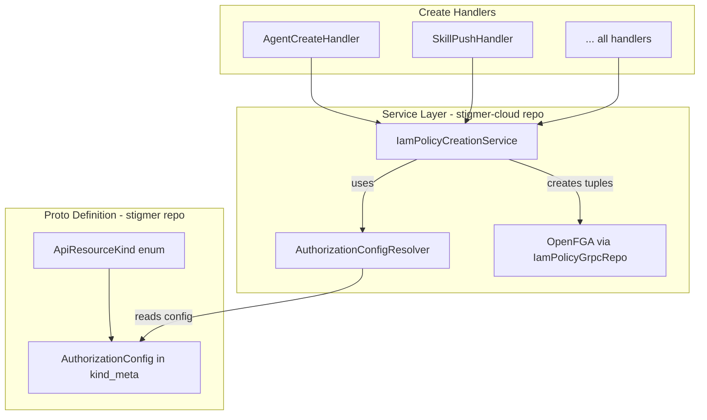

# Configuration-Driven FGA Authorization

## Problem Statement

The current `IamPolicyCreationService` has hardcoded logic for tuple creation that:

- Doesn't cover all resource types correctly
- Requires code changes for each new resource
- Duplicates authorization knowledge across code and FGA models

## Solution: Proto-Driven Configuration

Embed authorization configuration directly in the `ApiResourceKind` enum metadata. The service reads this configuration at runtime and creates the appropriate FGA tuples.

## Architecture




## Complete Resource Authorization Mapping

Based on FGA model analysis:


| Resource             | Scope Type   | Owner Type | Parent Relation |
| -------------------- | ------------ | ---------- | --------------- |
| organization         | PLATFORM     | DIRECT     | -               |
| identity_account     | PLATFORM     | SELF       | -               |
| agent                | ORGANIZATION | DIRECT     | -               |
| skill                | ORGANIZATION | DIRECT     | -               |
| workflow             | ORGANIZATION | DIRECT     | -               |
| environment          | ORGANIZATION | DIRECT     | -               |
| session              | ORGANIZATION | DIRECT     | -               |
| mcp_server           | ORGANIZATION | DIRECT     | -               |
| workflow_execution   | ORGANIZATION | DIRECT     | -               |
| iam_policy           | ORGANIZATION | DIRECT     | -               |
| agent_instance       | ORGANIZATION | DIRECT     | agent           |
| workflow_instance    | ORGANIZATION | DIRECT     | workflow        |
| agent_execution      | PARENT       | INHERITED  | session         |
| api_key              | OWNER_ONLY   | DIRECT     | -               |
| platform             | NONE         | NONE       | -               |
| credential           | NONE         | NONE       | -               |
| api_resource_version | NONE         | NONE       | -               |
| execution_context    | NONE         | NONE       | -               |


---

## Phase 1: Proto Changes (stigmer repo)

### 1.1 Add Authorization Enums

**File:** [apis/ai/stigmer/commons/apiresource/apiresourcekind/authorization_config.proto](apis/ai/stigmer/commons/apiresource/apiresourcekind/authorization_config.proto) (new)

```protobuf
syntax = "proto3";
package ai.stigmer.commons.apiresource.apiresourcekind;

// Primary scope linkage for FGA authorization
enum AuthorizationScopeType {
  AUTHORIZATION_SCOPE_TYPE_UNSPECIFIED = 0;
  
  // Links to platform singleton (organization, identity_account)
  // FGA: resource#platform@platform:stigmer
  AUTHORIZATION_SCOPE_TYPE_PLATFORM = 1;
  
  // Links to organization (most resources)
  // FGA: resource#organization@organization:<org_id>
  AUTHORIZATION_SCOPE_TYPE_ORGANIZATION = 2;
  
  // Links to a parent resource (agent_execution -> session)
  // FGA: resource#<relation>@<parent_kind>:<parent_id>
  AUTHORIZATION_SCOPE_TYPE_PARENT = 3;
  
  // Owner link only, no scope (api_key)
  // FGA: resource#owner@identity_account:<owner_id>
  AUTHORIZATION_SCOPE_TYPE_OWNER_ONLY = 4;
  
  // No FGA tuples needed (internal resources)
  AUTHORIZATION_SCOPE_TYPE_NONE = 5;
}

// How owner attribution is handled
enum OwnerAttributionType {
  OWNER_ATTRIBUTION_TYPE_UNSPECIFIED = 0;
  
  // Creator becomes owner via direct tuple
  // FGA: resource#owner@identity_account:<creator_id>
  OWNER_ATTRIBUTION_TYPE_DIRECT = 1;
  
  // Owner computed from parent (no tuple created)
  OWNER_ATTRIBUTION_TYPE_INHERITED = 2;
  
  // Self-ownership (identity_account owns itself)
  // FGA: resource#owner@identity_account:<resource_id>
  OWNER_ATTRIBUTION_TYPE_SELF = 3;
  
  // No owner attribution
  OWNER_ATTRIBUTION_TYPE_NONE = 4;
}
```

### 1.2 Add AuthorizationConfig Message

**File:** [apis/ai/stigmer/commons/apiresource/apiresourcekind/authorization_config.proto](apis/ai/stigmer/commons/apiresource/apiresourcekind/authorization_config.proto) (continued)

```protobuf
// Additional parent relation configuration
message ParentRelationConfig {
  // Parent resource kind (e.g., agent for agent_instance)
  ApiResourceKind kind = 1;
  // Relation name in FGA (e.g., "agent", "workflow", "session")
  string relation = 2;
}

// FGA authorization tuple configuration for a resource kind
message AuthorizationConfig {
  // Primary scope type - determines main linkage
  AuthorizationScopeType scope_type = 1;
  
  // Owner attribution type
  OwnerAttributionType owner_type = 2;
  
  // For PARENT scope: parent resource configuration
  ParentRelationConfig parent = 3;
  
  // Additional parent relations (agent_instance needs agent link)
  repeated ParentRelationConfig additional_parents = 4;
}
```

### 1.3 Update ApiResourceKindMeta

**File:** [apis/ai/stigmer/commons/apiresource/apiresourcekind/api_resource_kind.proto](apis/ai/stigmer/commons/apiresource/apiresourcekind/api_resource_kind.proto)

Add import and field:

```protobuf
import "ai/stigmer/commons/apiresource/apiresourcekind/authorization_config.proto";

message ApiResourceKindMeta {
  ApiResourceGroup group = 1;
  ApiResourceVersion version = 2;
  string name = 3;
  string display_name = 4;
  string id_prefix = 5;
  bool is_versioned = 6;
  bool not_search_indexed = 7;
  ResourceTier tier = 8;
  
  // FGA authorization configuration
  AuthorizationConfig authorization = 9;
}
```

### 1.4 Configure Each Resource Kind

Update all enum values with authorization config:

```protobuf
// Standard org-scoped
agent = 40 [(kind_meta) = {
  group: agentic, version: v1, name: "Agent", display_name: "Agent",
  id_prefix: "agt", tier: TIER_OPEN_SOURCE,
  authorization: {
    scope_type: AUTHORIZATION_SCOPE_TYPE_ORGANIZATION
    owner_type: OWNER_ATTRIBUTION_TYPE_DIRECT
  }
}];

// Platform-linked
organization = 30 [(kind_meta) = {
  group: tenancy, version: v1, name: "Organization", display_name: "Organization",
  id_prefix: "org", tier: TIER_CLOUD_ONLY,
  authorization: {
    scope_type: AUTHORIZATION_SCOPE_TYPE_PLATFORM
    owner_type: OWNER_ATTRIBUTION_TYPE_DIRECT
  }
}];

// Self-owned
identity_account = 11 [(kind_meta) = {
  group: iam, version: v1, name: "IdentityAccount", display_name: "Identity Account",
  id_prefix: "ida", tier: TIER_CLOUD_ONLY,
  authorization: {
    scope_type: AUTHORIZATION_SCOPE_TYPE_PLATFORM
    owner_type: OWNER_ATTRIBUTION_TYPE_SELF
  }
}];

// Parent-bound with inherited owner
agent_execution = 41 [(kind_meta) = {
  group: agentic, version: v1, name: "AgentExecution", display_name: "Agent Execution",
  id_prefix: "aex", tier: TIER_OPEN_SOURCE,
  authorization: {
    scope_type: AUTHORIZATION_SCOPE_TYPE_PARENT
    owner_type: OWNER_ATTRIBUTION_TYPE_INHERITED
    parent: { kind: session, relation: "session" }
  }
}];

// Org-scoped with additional parent
agent_instance = 45 [(kind_meta) = {
  group: agentic, version: v1, name: "AgentInstance", display_name: "Agent Instance",
  id_prefix: "ain", tier: TIER_OPEN_SOURCE,
  authorization: {
    scope_type: AUTHORIZATION_SCOPE_TYPE_ORGANIZATION
    owner_type: OWNER_ATTRIBUTION_TYPE_DIRECT
    additional_parents: [{ kind: agent, relation: "agent" }]
  }
}];

// Owner-only (no org link)
api_key = 12 [(kind_meta) = {
  group: iam, version: v1, name: "ApiKey", display_name: "API Key",
  id_prefix: "key", tier: TIER_CLOUD_ONLY,
  authorization: {
    scope_type: AUTHORIZATION_SCOPE_TYPE_OWNER_ONLY
    owner_type: OWNER_ATTRIBUTION_TYPE_DIRECT
  }
}];

// No FGA
platform = 31 [(kind_meta) = {
  group: tenancy, version: v1, name: "Platform", display_name: "Platform",
  id_prefix: "plt", tier: TIER_CLOUD_ONLY,
  authorization: {
    scope_type: AUTHORIZATION_SCOPE_TYPE_NONE
    owner_type: OWNER_ATTRIBUTION_TYPE_NONE
  }
}];
```

---

## Phase 2: Service Implementation (stigmer-cloud repo)

### 2.1 Create AuthorizationConfigResolver

**File:** [backend/libs/java/api/api-shape/src/main/java/ai/stigmer/apishape/authorization/AuthorizationConfigResolver.java](backend/libs/java/api/api-shape/src/main/java/ai/stigmer/apishape/authorization/AuthorizationConfigResolver.java) (new)

```java
@UtilityClass
public class AuthorizationConfigResolver {
    
    public static AuthorizationConfig resolve(ApiResourceKind kind) {
        ApiResourceKindMeta meta = ApiResourceKindMetaResolver.resolve(kind);
        return meta.hasAuthorization() 
            ? meta.getAuthorization() 
            : AuthorizationConfig.getDefaultInstance();
    }
    
    public static boolean requiresAuthorization(ApiResourceKind kind) {
        return resolve(kind).getScopeType() != AUTHORIZATION_SCOPE_TYPE_NONE;
    }
}
```

### 2.2 Rewrite IamPolicyCreationService

**File:** [backend/services/stigmer-service/src/main/java/ai/stigmer/apiauthorization/service/IamPolicyCreationService.java](backend/services/stigmer-service/src/main/java/ai/stigmer/apiauthorization/service/IamPolicyCreationService.java)

Complete rewrite with configuration-driven logic:

```java
@Slf4j
@Service
@RequiredArgsConstructor
public class IamPolicyCreationService {
    
    private final IamPolicyGrpcRepo iamPolicyGrpcRepo;
    
    /**
     * Creates FGA tuples for a newly created resource based on its authorization config.
     * Reads configuration from ApiResourceKind metadata - no hardcoded logic.
     */
    public void createTuples(TupleCreationRequest request) {
        AuthorizationConfig config = AuthorizationConfigResolver.resolve(request.kind());
        
        if (config.getScopeType() == AUTHORIZATION_SCOPE_TYPE_NONE) {
            log.debug("No authorization tuples needed for {}", request.kind());
            return;
        }
        
        // 1. Create primary scope link
        createScopeLink(config, request);
        
        // 2. Create additional parent links
        for (ParentRelationConfig parent : config.getAdditionalParentsList()) {
            createParentLink(request.kind(), request.resourceId(), parent, request);
        }
        
        // 3. Create owner relation
        createOwnerRelation(config, request);
    }
}
```

### 2.3 Create TupleCreationRequest Record

**File:** [backend/services/stigmer-service/src/main/java/ai/stigmer/apiauthorization/service/TupleCreationRequest.java](backend/services/stigmer-service/src/main/java/ai/stigmer/apiauthorization/service/TupleCreationRequest.java) (new)

```java
public record TupleCreationRequest(
    ApiResourceKind kind,
    String resourceId,
    String orgId,           // For ORGANIZATION scope
    String creatorId,       // For DIRECT owner
    String parentId,        // For PARENT scope
    Map<ApiResourceKind, String> additionalParentIds  // For additional parents
) {
    // Builder pattern for clean construction
    public static Builder builder(ApiResourceKind kind, String resourceId) {
        return new Builder(kind, resourceId);
    }
}
```

---

## Phase 3: Update Create Handlers

Each handler calls the service with a simple request:

```java
// Before (hardcoded logic)
createPlatformScopeLink(agentRef);
createOrganizationScopeLink(agentRef, orgId);
createOwnerRelation(agentRef, creatorId);

// After (configuration-driven)
iamPolicyCreationService.createTuples(
    TupleCreationRequest.builder(ApiResourceKind.agent, agentId)
        .withOrg(orgId)
        .withCreator(creatorId)
        .build()
);
```

**Handlers to update (10 files):**

- AgentCreateHandler
- SkillPushHandler
- WorkflowCreateHandler
- EnvironmentCreateHandler
- SessionCreateHandler
- McpServerCreateHandler
- AgentInstanceCreateHandler (with additional parent)
- WorkflowInstanceCreateHandler (with additional parent)
- WorkflowExecutionCreateHandler
- OrganizationCreateHandler

---

## Phase 4: Testing

### 4.1 Configuration Validation Test

Verify every resource kind has valid authorization config:

```java
@Test
void everyResourceKindShouldHaveValidAuthorizationConfig() {
    for (ApiResourceKind kind : ApiResourceKindsGetter.get()) {
        AuthorizationConfig config = AuthorizationConfigResolver.resolve(kind);
        assertNotNull(config, "Missing config for " + kind);
        
        if (config.getScopeType() == AUTHORIZATION_SCOPE_TYPE_PARENT) {
            assertTrue(config.hasParent(), 
                kind + " has PARENT scope but no parent config");
        }
    }
}
```

### 4.2 Tuple Creation Tests

Parameterized tests for each resource pattern:

```java
@ParameterizedTest
@EnumSource(value = ApiResourceKind.class, names = {
    "agent", "skill", "workflow", "environment", "session"
})
void shouldCreateOrgAndOwnerTuplesForOrgScopedResources(ApiResourceKind kind) {
    // Test org + owner tuples created
}

@Test
void shouldCreateSessionLinkOnlyForAgentExecution() {
    // No owner tuple, only session link
}
```

---

## Files Summary

### stigmer repo (Proto)


| File                                  | Action |
| ------------------------------------- | ------ |
| `apis/.../authorization_config.proto` | Create |
| `apis/.../api_resource_kind.proto`    | Modify |


### stigmer-cloud repo (Java)


| File                                                    | Action   |
| ------------------------------------------------------- | -------- |
| `api-shape/.../AuthorizationConfigResolver.java`        | Create   |
| `stigmer-service/.../IamPolicyCreationService.java`     | Rewrite  |
| `stigmer-service/.../TupleCreationRequest.java`         | Create   |
| `stigmer-service/.../IamPolicyCreationException.java`   | Keep     |
| `stigmer-service/.../IamPolicyCreationServiceTest.java` | Rewrite  |
| 10 create handlers                                      | Simplify |


---

## Benefits

1. **Self-documenting**: Proto IS the documentation
2. **Single source of truth**: Authorization rules in one place
3. **Compile-time safety**: Invalid configs caught by proto validation
4. **Extensibility**: New resources just need proto config
5. **Auditability**: Easy to review all authorization patterns
6. **Testability**: Validate config completeness automatically

---

## Verification Checklist

- All 18 resource kinds have authorization config
- Proto compiles and stubs regenerate
- AuthorizationConfigResolver reads config correctly
- IamPolicyCreationService creates correct tuples per pattern
- All 10 handlers updated to use new service
- Tests cover all 5 scope types and 4 owner types
- FGA model and proto config are in sync

