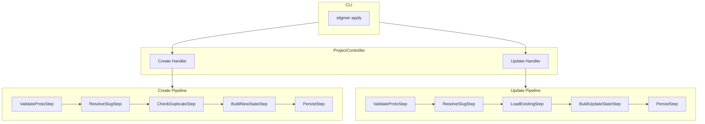

# D1: Project Create and Update Handlers

## Overview

Implement two CRUD handlers for the Project controller following the established pipeline pattern used by Agent and other controllers. The Project entity is simpler than Agent (no default instance creation), so we use only standard pipeline steps.

## Architecture Context




## Files to Create

- `backend/services/stigmer-server/pkg/domain/project/controller/create.go` (~65 lines)
- `backend/services/stigmer-server/pkg/domain/project/controller/update.go` (~45 lines)
- `backend/services/stigmer-server/pkg/domain/project/controller/create_test.go` (~250 lines)
- `backend/services/stigmer-server/pkg/domain/project/controller/update_test.go` (~200 lines)

## Files to Modify

- `backend/services/stigmer-server/pkg/domain/project/controller/BUILD.bazel` - Add new source files

## Implementation Details

### 1. Create Handler (`create.go`)

**Function Signature:**

```go
func (c *ProjectController) Create(ctx context.Context, project *projectv1.Project) (*projectv1.Project, error)
```

**Pipeline Steps (standard, no custom steps):**

1. `ValidateProtoStep` - Validates buf.validate constraints (api_version, kind, metadata required, spec.runtime required)
2. `ResolveSlugStep` - Generates slug from metadata.name
3. `CheckDuplicateStep` - Verifies no duplicate exists by slug within org
4. `BuildNewStateStep` - Generates ID (prj-{ulid}), clears status, sets audit fields
5. `PersistStep` - Saves project to repository

**Key Implementation Notes:**

- Unlike Agent, Project has NO custom steps (no default instance creation)
- Use standard pipeline framework from `backend/libs/go/grpc/request/pipeline`
- Import standard steps from `backend/libs/go/grpc/request/pipeline/steps`
- Follow exact import patterns from [create.go](backend/services/stigmer-server/pkg/domain/agent/controller/create.go)

### 2. Update Handler (`update.go`)

**Function Signature:**

```go
func (c *ProjectController) Update(ctx context.Context, project *projectv1.Project) (*projectv1.Project, error)
```

**Pipeline Steps:**

1. `ValidateProtoStep` - Validates proto field constraints
2. `ResolveSlugStep` - Generates slug from metadata.name
3. `LoadExistingStep` - Loads existing project from repository by ID or slug
4. `BuildUpdateStateStep` - Merges spec, preserves IDs, updates timestamps
5. `PersistStep` - Saves updated project to repository

**Key Implementation Notes:**

- LoadExistingStep handles lookup by ID first, then falls back to slug
- BuildUpdateStateStep preserves immutable fields: metadata.id, metadata.slug, metadata.org
- Status is system-managed - cleared from input, preserved from existing
- Audit fields: preserves created_by/created_at, updates updated_by/updated_at

### 3. Test Coverage (`create_test.go`)

**Test Categories (12+ tests):**

- **Successful Creation (3 tests):**
  - Creates project with valid proto
  - Verifies ID generation (prj-{ulid} format)
  - Verifies slug generation from name
- **Duplicate Detection (2 tests):**
  - Rejects duplicate slug within same org
  - Allows same slug in different org (if applicable)
- **Validation Errors (5+ tests):**
  - Rejects missing metadata
  - Rejects missing name
  - Rejects invalid api_version
  - Rejects invalid kind
  - Rejects missing spec.runtime
- **Embedded Resources (2 tests):**
  - Creates project with embedded agents
  - Creates project with embedded workflows

### 4. Test Coverage (`update_test.go`)

**Test Categories (10+ tests):**

- **Successful Update (3 tests):**
  - Updates spec.description
  - Updates spec.entry_point
  - Preserves existing metadata (id, slug, org)
- **Error Cases (4 tests):**
  - Rejects update of non-existent project
  - Rejects update with missing ID and slug
  - Rejects validation errors
- **Immutability (3 tests):**
  - Preserves metadata.id even if client changes it
  - Preserves metadata.slug
  - Preserves metadata.org

### 5. BUILD.bazel Updates

Add new source and test files:

```python
go_library(
    name = "controller",
    srcs = [
        "project_controller.go",
        "create.go",      # NEW
        "update.go",      # NEW
    ],
    deps = [
        # ... existing deps ...
        "//backend/libs/go/grpc/request/pipeline",
        "//backend/libs/go/grpc/request/pipeline/steps",
    ],
)

go_test(
    name = "controller_test",
    srcs = [
        "project_controller_test.go",
        "create_test.go",   # NEW
        "update_test.go",   # NEW
    ],
    # ... existing config ...
)
```

## Quality Requirements

- All functions under 50 lines
- All files under 300 lines
- Table-driven tests with descriptive names
- Follow Agent controller patterns exactly
- Zero linter errors
- Comprehensive error messages
- Pass bazel build and test

## Test Execution

```bash
bazel test //backend/services/stigmer-server/pkg/domain/project/controller:controller_test
```

## Key Patterns to Follow

Reference implementations:

- [agent/controller/create.go](backend/services/stigmer-server/pkg/domain/agent/controller/create.go) - Pipeline pattern (lines 39-64)
- [agent/controller/update.go](backend/services/stigmer-server/pkg/domain/agent/controller/update.go) - Update handler (lines 24-47)
- [agent/controller/agent_controller_test.go](backend/services/stigmer-server/pkg/domain/agent/controller/agent_controller_test.go) - Test patterns

## Important: Project vs Agent Differences

Project is **simpler** than Agent:

- NO AgentInstance creation (no downstream client needed)
- NO custom pipeline steps
- Uses ONLY standard steps from the pipeline framework

This makes the implementation cleaner and more straightforward.