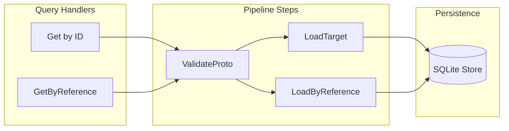

# D2: Project Get and GetByReference Handlers

## Objective

Implement query handlers for retrieving Project resources by ID and by reference (slug), completing the read operations for the Project controller.

## Architecture




## Files to Create

### 1. `get.go` (~55 lines)

**Location**: [backend/services/stigmer-server/pkg/domain/project/controller/get.go](backend/services/stigmer-server/pkg/domain/project/controller/get.go)

**Implementation Pattern** (following [get.go](backend/services/stigmer-server/pkg/domain/agent/controller/get.go)):

```go
func (c *ProjectController) Get(ctx context.Context, projectId *projectv1.ProjectId) (*projectv1.Project, error) {
    reqCtx := pipeline.NewRequestContext(ctx, projectId)
    p := c.buildGetPipeline()
    if err := p.Execute(reqCtx); err != nil {
        return nil, err
    }
    project := reqCtx.Get(steps.TargetResourceKey).(*projectv1.Project)
    return project, nil
}

func (c *ProjectController) buildGetPipeline() *pipeline.Pipeline[*projectv1.ProjectId] {
    return pipeline.NewPipeline[*projectv1.ProjectId]("project-get").
        AddStep(steps.NewValidateProtoStep[*projectv1.ProjectId]()).
        AddStep(steps.NewLoadTargetStep[*projectv1.ProjectId, *projectv1.Project](c.store)).
        Build()
}
```

### 2. `get_by_reference.go` (~60 lines)

**Location**: [backend/services/stigmer-server/pkg/domain/project/controller/get_by_reference.go](backend/services/stigmer-server/pkg/domain/project/controller/get_by_reference.go)

**Implementation Pattern** (following [get_by_reference.go](backend/services/stigmer-server/pkg/domain/agent/controller/get_by_reference.go)):

```go
func (c *ProjectController) GetByReference(ctx context.Context, ref *apiresource.ApiResourceReference) (*projectv1.Project, error) {
    reqCtx := pipeline.NewRequestContext(ctx, ref)
    p := c.buildGetByReferencePipeline()
    if err := p.Execute(reqCtx); err != nil {
        return nil, err
    }
    project := reqCtx.Get(steps.TargetResourceKey).(*projectv1.Project)
    return project, nil
}

func (c *ProjectController) buildGetByReferencePipeline() *pipeline.Pipeline[*apiresource.ApiResourceReference] {
    return pipeline.NewPipeline[*apiresource.ApiResourceReference]("project-get-by-reference").
        AddStep(steps.NewValidateProtoStep[*apiresource.ApiResourceReference]()).
        AddStep(steps.NewLoadByReferenceStep[*projectv1.Project](c.store)).
        Build()
}
```

### 3. `get_test.go` (~250 lines, 8 tests)

**Location**: [backend/services/stigmer-server/pkg/domain/project/controller/get_test.go](backend/services/stigmer-server/pkg/domain/project/controller/get_test.go)

**Test Cases**:

- `TestGet_SuccessfulRetrieval` - Get existing project by ID
- `TestGet_ReturnsCompleteProject` - Verify all fields are preserved (metadata, spec, status)
- `TestGet_PreservesEmbeddedResources` - Projects with agents/workflows retain embedded data
- `TestGet_NonExistentID` - Returns NotFound error for missing ID
- `TestGet_EmptyID` - Returns InvalidArgument for empty ID
- `TestGet_MalformedID` - Returns appropriate error for invalid ID format
- `TestGet_MultipleProjects` - Get correct project when multiple exist
- `TestGet_AfterUpdate` - Get returns updated state

### 4. `get_by_reference_test.go` (~300 lines, 10 tests)

**Location**: [backend/services/stigmer-server/pkg/domain/project/controller/get_by_reference_test.go](backend/services/stigmer-server/pkg/domain/project/controller/get_by_reference_test.go)

**Test Cases**:

- `TestGetByReference_SuccessfulRetrieval` - Get existing project by slug
- `TestGetByReference_ReturnsCompleteProject` - Verify all fields preserved
- `TestGetByReference_MatchesSlugNotName` - Lookup uses slug, not display name
- `TestGetByReference_OrgScoped` - Respects org boundary in lookup
- `TestGetByReference_NonExistentSlug` - Returns NotFound for missing slug
- `TestGetByReference_EmptySlug` - Returns InvalidArgument for empty slug
- `TestGetByReference_EmptyOrg` - Handles platform-scoped lookup (if applicable)
- `TestGetByReference_SameSlugDifferentOrgs` - Correct project returned per org
- `TestGetByReference_AfterUpdate` - Returns updated state
- `TestGetByReference_CaseInsensitiveSlug` - Slug matching is case-insensitive

## Files to Modify

### 5. `BUILD.bazel`

**Location**: [backend/services/stigmer-server/pkg/domain/project/controller/BUILD.bazel](backend/services/stigmer-server/pkg/domain/project/controller/BUILD.bazel)

**Changes**:

- Add `get.go` and `get_by_reference.go` to library srcs
- Add `get_test.go` and `get_by_reference_test.go` to test srcs
- Add `//apis/stubs/go/ai/stigmer/commons/apiresource` to library deps (for ApiResourceReference)

### 6. `project_controller_test.go`

**Location**: [backend/services/stigmer-server/pkg/domain/project/controller/project_controller_test.go](backend/services/stigmer-server/pkg/domain/project/controller/project_controller_test.go)

**Changes**:

- Remove Get and GetByReference from `TestProjectController_UnimplementedMethodsReturnError` (they will now be implemented)

## Implementation Details

### Pipeline Steps Used


| Handler        | Step 1            | Step 2              |
| -------------- | ----------------- | ------------------- |
| Get            | ValidateProtoStep | LoadTargetStep      |
| GetByReference | ValidateProtoStep | LoadByReferenceStep |


### Key Dependencies

```go
import (
    "context"
    projectv1 "github.com/stigmer/stigmer/apis/stubs/go/ai/stigmer/agentic/project/v1"
    "github.com/stigmer/stigmer/apis/stubs/go/ai/stigmer/commons/apiresource"
    "github.com/stigmer/stigmer/backend/libs/go/grpc/request/pipeline"
    "github.com/stigmer/stigmer/backend/libs/go/grpc/request/pipeline/steps"
)
```

### Context Key for Result

The loaded project is stored in `steps.TargetResourceKey` and retrieved via type assertion:

```go
project := reqCtx.Get(steps.TargetResourceKey).(*projectv1.Project)
```

## Quality Requirements

- Functions under 50 lines (handlers will be ~15 lines each)
- Files under 300 lines
- Table-driven tests with descriptive names
- Comprehensive doc comments on handlers
- 100% test coverage for new code
- Pass `go vet`, `gofmt`, and Bazel build

## Verification

After implementation:

1. Run `bazel test //backend/services/stigmer-server/pkg/domain/project/controller:controller_test`
2. Verify all 18+ new tests pass
3. Confirm no regressions in existing Create/Update tests

## Estimated Output

- **get.go**: ~55 lines
- **get_by_reference.go**: ~60 lines
- **get_test.go**: ~250 lines (8 tests)
- **get_by_reference_test.go**: ~300 lines (10 tests)
- **BUILD.bazel modifications**: ~10 lines changed
- **project_controller_test.go modifications**: ~15 lines removed

**Total**: ~665 new lines, 18 tests