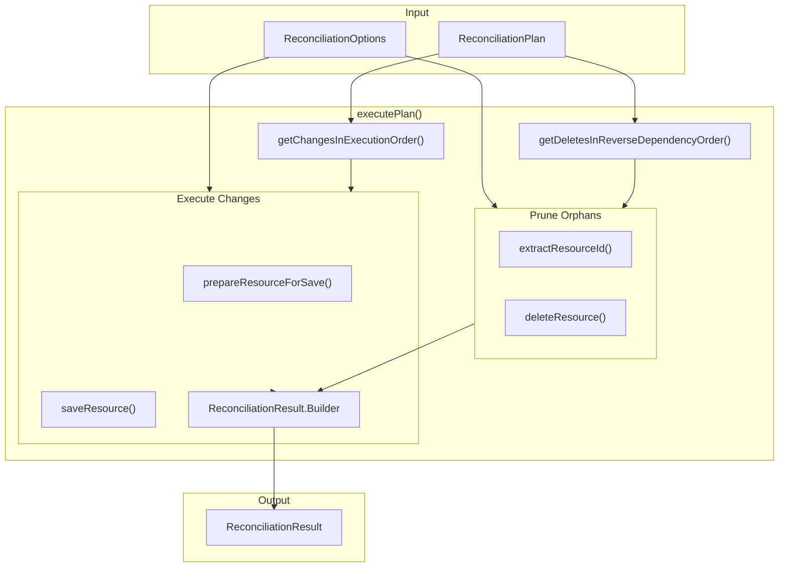

# T05.19: Dependency-Ordered Apply

## Overview

Implement the core execution engine that applies reconciliation plan changes to the database. This replaces the current stub in `ProjectReconciliationService.executePlan()` with production-ready code that:

1. Executes creates/updates in **dependency order** (dependencies before dependents)
2. Executes deletes in **reverse dependency order** (dependents before dependencies)
3. Tracks all results and errors using `ReconciliationResult.Builder`
4. Handles partial failures gracefully

## Architecture




## Key Files

**Modify:**

- `[ProjectReconciliationService.java](backend/services/stigmer-service/src/main/java/ai/stigmer/domain/agentic/project/reconcile/ProjectReconciliationService.java)` - Replace stub with full implementation

**Reference (no changes):**

- `ReconciliationPlan.java` - Provides `getChangesInExecutionOrder()`, `getDeletesInReverseDependencyOrder()`
- `ReconciliationResult.java` - Provides `Builder` for tracking results
- `ResourceChange.java` - Holds change details (kind, slug, desiredState, actualState)
- `AbstractMongoApiResourceRepository.java` - `save()` and `deleteById()` methods

## Implementation Plan

### Step 1: Add Helper Methods

Add private helper methods to `ProjectReconciliationService`:

`**prepareResourceForSave()**` - Prepares a resource with proper metadata:

- For CREATE: Generate new ID using `IdGenerator`, set org from project, set name/slug
- For UPDATE: Preserve existing ID from actualState, update spec from desiredState
- Always: Set project ownership annotation (`stigmer.ai/sdk.project`)

`**saveResource()**` - Routes to correct repository based on kind:

- agent -> `agentRepo.save()`
- workflow -> `workflowRepo.save()`
- mcp_server -> `mcpServerRepo.save()`
- skill -> `skillRepo.save()`

`**deleteResource()**` - Routes to correct repository based on kind:

- agent -> `agentRepo.deleteById()`
- workflow -> `workflowRepo.deleteById()`
- mcp_server -> `mcpServerRepo.deleteById()`
- skill -> `skillRepo.deleteById()`

`**extractResourceId()**` - Extracts metadata.id from any resource proto using reflection

`**createChangeRecord()**` - Creates `ResourceChangeRecord` from a completed change

### Step 2: Implement executePlan()

Replace the stub with:

```java
ReconciliationResult executePlan(ReconciliationPlan plan, ReconciliationOptions options, Project project) {
    if (plan.isEmpty()) {
        log.info("No changes to execute");
        return ReconciliationResult.empty();
    }
    
    ReconciliationResult.Builder resultBuilder = ReconciliationResult.builder();
    String projectId = project.getMetadata().getId();
    String orgId = project.getMetadata().getOrg();
    
    // Execute creates/updates in dependency order
    for (ResourceChange change : plan.getChangesInExecutionOrder()) {
        try {
            Message prepared = prepareResourceForSave(change, projectId, orgId);
            Message saved = saveResource(change.kind(), prepared);
            String resourceId = extractResourceId(saved);
            
            ResourceChangeRecord record = createChangeRecord(change.kind(), change.slug(), resourceId);
            if (change.isCreate()) {
                resultBuilder.addCreated(record);
            } else {
                resultBuilder.addUpdated(record);
            }
        } catch (Exception e) {
            resultBuilder.addError(new ReconciliationError(change.resourceKey(), e.getMessage(), e));
            // Continue processing other resources
        }
    }
    
    // Execute deletes in reverse dependency order (if pruning enabled)
    if (options.pruneEnabled()) {
        for (ResourceChange delete : plan.getDeletesInReverseDependencyOrder()) {
            try {
                String resourceId = extractResourceId(delete.actualState());
                deleteResource(delete.kind(), resourceId);
                resultBuilder.addDeleted(createChangeRecord(delete.kind(), delete.slug(), resourceId));
            } catch (Exception e) {
                resultBuilder.addError(new ReconciliationError(delete.resourceKey(), e.getMessage(), e));
            }
        }
    }
    
    return resultBuilder.build();
}
```

### Step 3: Update reconcile() Method

Modify the `reconcile()` method to pass the `Project` to `executePlan()`:

- Change method signature from `executePlan(plan, options)` to `executePlan(plan, options, project)`
- This provides access to project ID and org for metadata preparation

### Step 4: Add Comprehensive Tests

Create test methods in `ProjectReconciliationServiceTest.java`:

**ExecutePlanTests** (nested class):

- `shouldReturnEmptyResultForEmptyPlan`
- `shouldExecuteCreatesInDependencyOrder`
- `shouldExecuteUpdatesPreservingExistingId`
- `shouldExecuteDeletesInReverseDependencyOrder`
- `shouldSkipDeletesWhenPruneDisabled`
- `shouldContinueOnPartialFailure`
- `shouldSetProjectOwnershipAnnotation`
- `shouldHandleAllFourResourceTypes`

**Integration Scenarios**:

- `shouldHandleDataPipelineScenario` - MCP servers -> Skills -> Agents -> Workflows
- `shouldHandleMixedCreatesUpdatesDeletes`
- `shouldHandleResourceRename` - Delete old + Create new

## Dependencies

**Required imports to add:**

- `protos.ai.stigmer.agentic.project.v1.ResourceChangeRecord` (already imported via ReconciliationResult)

**ID Generation:**

- Use existing `IdGenerator` utility for creating new resource IDs
- Or use `UUID.randomUUID().toString()` for simplicity (check existing patterns)

## Test Strategy

1. **Unit tests with mocked repos**: Verify correct repository method calls
2. **Ordering verification**: Ensure dependency order is respected
3. **Error handling**: Verify partial failures don't halt execution
4. **Annotation verification**: Ensure project ownership is set

## Risk Mitigation

1. **No transactions**: Each save/delete is independent. Partial failures may leave inconsistent state - this is acceptable for MVP, tracked as technical debt
2. **FGA tuples**: Authorization tuples are NOT managed here (handled by handlers). This service is for direct database operations only
3. **Event publishing**: NOT handled here - reconciliation is internal to apply flow

## Success Criteria

- All creates execute in correct dependency order (MCP servers before agents)
- All deletes execute in correct reverse order (workflows before agents)
- Partial failures tracked but don't halt execution
- Project ownership annotation set on all resources
- 10+ comprehensive test methods covering all scenarios
- Zero linter errors
- Existing tests continue to pass

## Estimated Duration

60-75 minutes (as specified in Phase 5 plan)