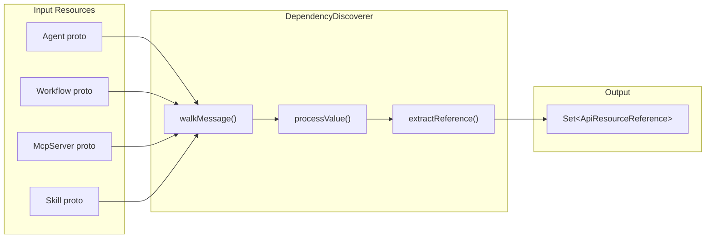

# T05.13: DependencyDiscoverer - Reflection-Based Scanner

## Goal

Create a domain component that discovers ALL `ApiResourceReference` fields in any proto message tree using proto reflection. This is the foundation for dependency graph construction - schema-driven discovery ensures the system automatically handles new reference fields without code changes.

## Architecture Context




## Key Design Decisions

**1. Return `Set<ApiResourceReference>` directly (no wrapper)**

- Uses proto type directly - no duplication
- `DesiredState.toResourceKey(kind, slug)` already exists for key conversion
- DependencyGraphBuilder (T05.14) will convert to keys

**2. Type detection via descriptor full name**

- Match `ai.stigmer.commons.apiresource.ApiResourceReference`
- No hardcoded field paths - works for ANY field of this type
- Automatically discovers new reference fields when protos evolve

**3. Recursive traversal pattern**

- Follow established patterns from `RequestInputFieldsValidator.java` and `DynamicProtobufSorter.java`
- Handle: repeated fields, nested messages, map fields

## Reference Fields to Discover (Auto-discovered, not hardcoded)

**Agent spec:**

- `spec.mcp_server_usages[].mcp_server_ref` (McpServer, kind=44)
- `spec.skill_refs[]` (Skill, kind=43)
- `spec.sub_agents[].skill_refs[]` (Skill, kind=43)

**Note:** Workflow uses `google.protobuf.Struct` for task_config with string-based agent references - these require separate handling in T05.14 or later.

## Implementation

### File: `DependencyDiscoverer.java`

Location: `backend/services/stigmer-service/src/main/java/ai/stigmer/domain/agentic/project/reconcile/DependencyDiscoverer.java`

**Core Structure:**

```java
@Component
public class DependencyDiscoverer {

    private static final String API_RESOURCE_REFERENCE_TYPE = 
        "ai.stigmer.commons.apiresource.ApiResourceReference";

    /**
     * Discovers all ApiResourceReference messages in the proto tree.
     * Schema-driven: works automatically when new reference fields are added.
     */
    public Set<ApiResourceReference> discoverDependencies(Message resource) {
        Set<ApiResourceReference> references = new HashSet<>();
        walkMessage(resource, references);
        return Collections.unmodifiableSet(references);
    }

    private void walkMessage(Message message, Set<ApiResourceReference> refs) {
        for (var entry : message.getAllFields().entrySet()) {
            FieldDescriptor field = entry.getKey();
            Object value = entry.getValue();
            
            if (field.isRepeated()) {
                for (Object item : (List<?>) value) {
                    processValue(field, item, refs);
                }
            } else {
                processValue(field, value, refs);
            }
        }
    }

    private void processValue(FieldDescriptor field, Object value, 
                              Set<ApiResourceReference> refs) {
        if (!(value instanceof Message msg)) {
            return; // Skip primitives
        }
        
        String typeName = msg.getDescriptorForType().getFullName();
        
        if (API_RESOURCE_REFERENCE_TYPE.equals(typeName)) {
            refs.add(extractReference(msg));
        } else {
            walkMessage(msg, refs); // Recurse
        }
    }

    private ApiResourceReference extractReference(Message refMessage) {
        // Build ApiResourceReference from dynamic message
    }
}
```

### Test File: `DependencyDiscovererTest.java`

Location: `backend/services/stigmer-service/src/test/java/ai/stigmer/domain/agentic/project/reconcile/DependencyDiscovererTest.java`

**Test Coverage:**

1. Empty resource (no references)
2. Agent with skill_refs only
3. Agent with mcp_server_usages only
4. Agent with both skill_refs and mcp_server_usages
5. Agent with sub_agents containing skill_refs (nested discovery)
6. Workflow (no ApiResourceReference fields expected)
7. MCP Server (no dependencies expected)
8. Skill (no dependencies expected)
9. Deeply nested messages
10. Repeated fields with multiple references
11. Empty repeated fields
12. Duplicate references (deduplicated in set)

## Pattern References

**Existing proto reflection patterns in codebase:**

- `[RequestInputFieldsValidator.java](backend/libs/java/grpc/grpc-request/src/main/java/ai/stigmer/grpcrequest/validator/RequestInputFieldsValidator.java)` - Recursive message validation
- `[DynamicProtobufSorter.java](backend/libs/java/utils/src/main/java/ai/stigmer/utils/protobuf/DynamicProtobufSorter.java)` - Recursive field traversal
- `[ApiResourceResponseTransformer.java](backend/libs/java/grpc/grpc-request/src/main/java/ai/stigmer/grpcrequest/response/mapper/ApiResourceResponseTransformer.java)` - Recursive transformation

**Key reflection APIs:**

- `message.getDescriptorForType()` - Get message descriptor
- `message.getAllFields()` - Get populated fields
- `field.getType() == Type.MESSAGE` - Check if nested message
- `field.isRepeated()` - Check if repeated field
- `msg.getDescriptorForType().getFullName()` - Get type name for matching

## Proto Structure Reference

**ApiResourceReference** (`[io.proto](apis/ai/stigmer/commons/apiresource/io.proto)`):

```protobuf
message ApiResourceReference {
  string org = 1;
  ApiResourceKind kind = 2;
  string slug = 3;
  string version = 4;
}
```

**Agent spec** (`[spec.proto](apis/ai/stigmer/agentic/agent/v1/spec.proto)`):

```protobuf
message AgentSpec {
  repeated McpServerUsage mcp_server_usages = 4;
  repeated ApiResourceReference skill_refs = 5;
  repeated SubAgent sub_agents = 6;
}

message McpServerUsage {
  ApiResourceReference mcp_server_ref = 1;
}

message SubAgent {
  repeated ApiResourceReference skill_refs = 5;
}
```

## Success Criteria

1. All ApiResourceReference fields discovered automatically (no hardcoded paths)
2. Recursive traversal handles nested messages
3. Repeated fields handled correctly
4. Returns immutable Set for thread safety
5. Comprehensive test coverage (12+ test cases)
6. Zero linter errors
7. Follows existing codebase patterns

## Engineering Standards

- File size: Target ~150-200 lines (implementation)
- Test coverage: ~300-400 lines with comprehensive scenarios
- All functions under 50 lines
- Comprehensive JavaDoc documenting the Open/Closed design
- Spring @Component for dependency injection

## Estimated Duration

60-75 minutes (as specified in Phase 5 plan)