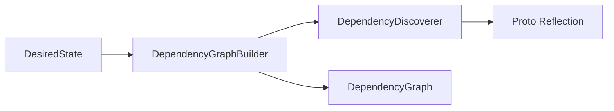

# DependencyGraphBuilder Implementation (T05.14)

## Goal

Create `DependencyGraphBuilder` that builds a `DependencyGraph` from a `DesiredState` by:

1. Iterating through all resource types (agents, workflows, mcp_servers, skills)
2. Using `DependencyDiscoverer` to find all `ApiResourceReference` fields dynamically
3. Building edges in the dependency graph using `DependencyGraph.Builder`

## Architecture Context

The builder sits in the reconciliation pipeline:




**Key Design Principle**: Open/Closed - the builder delegates to `DependencyDiscoverer` which uses proto reflection. When new `ApiResourceReference` fields are added to protos, they're discovered automatically.

## Files to Create

### 1. DependencyGraphBuilder.java (~100 lines)

**Location**: `backend/services/stigmer-service/src/main/java/ai/stigmer/domain/agentic/project/reconcile/DependencyGraphBuilder.java`

**Design**:

```java
@Component
public class DependencyGraphBuilder {
    
    private final DependencyDiscoverer discoverer;
    
    public DependencyGraphBuilder(DependencyDiscoverer discoverer) {
        this.discoverer = discoverer;
    }
    
    /**
     * Builds dependency graph by scanning ALL resources for ApiResourceReference fields.
     * Uses DependencyDiscoverer for reflection-based discovery.
     */
    public DependencyGraph buildFromDesiredState(DesiredState desired) {
        if (desired == null || desired.isEmpty()) {
            return DependencyGraph.empty();
        }
        
        DependencyGraph.Builder builder = DependencyGraph.builder();
        
        // Scan each resource type
        scanResources(ApiResourceKind.agent, desired.agents(), builder);
        scanResources(ApiResourceKind.workflow, desired.workflows(), builder);
        scanResources(ApiResourceKind.mcp_server, desired.mcpServers(), builder);
        scanResources(ApiResourceKind.skill, desired.skills(), builder);
        
        return builder.build();
    }
    
    private <T extends Message> void scanResources(
            ApiResourceKind kind,
            Map<String, T> resources,
            DependencyGraph.Builder builder) {
        
        for (var entry : resources.entrySet()) {
            String slug = entry.getKey();
            T resource = entry.getValue();
            String resourceKey = DesiredState.toResourceKey(kind, slug);
            
            // Discover ALL ApiResourceReference fields dynamically
            Set<ApiResourceReference> dependencies = discoverer.discoverDependencies(resource);
            
            // Add edges for each discovered dependency
            for (ApiResourceReference dep : dependencies) {
                String depKey = DependencyDiscoverer.toResourceKey(dep);
                builder.addDependency(resourceKey, depKey);
            }
        }
    }
}
```

**Key Points**:

- Spring `@Component` for dependency injection
- Constructor injection of `DependencyDiscoverer`
- Generic `scanResources` method handles all resource types uniformly
- Uses existing helper methods: `DesiredState.toResourceKey()`, `DependencyDiscoverer.toResourceKey()`
- Returns `DependencyGraph.empty()` for null/empty input (defensive)

### 2. DependencyGraphBuilderTest.java (~400 lines)

**Location**: `backend/services/stigmer-service/src/test/java/ai/stigmer/domain/agentic/project/reconcile/DependencyGraphBuilderTest.java`

**Test Structure** (following existing patterns from `DependencyDiscovererTest.java`):

```java
@DisplayName("DependencyGraphBuilder Tests")
class DependencyGraphBuilderTest {

    @Nested @DisplayName("Basic Functionality")
    class BasicFunctionalityTests {
        // - null desired state returns empty graph
        // - empty desired state returns empty graph
        // - immutability verification
    }
    
    @Nested @DisplayName("Single Resource Type")
    class SingleResourceTypeTests {
        // - agents only (with skills, mcp_servers)
        // - workflows only (no ApiResourceReference deps)
        // - mcp_servers only (no deps)
        // - skills only (no deps)
    }
    
    @Nested @DisplayName("Multi-Resource Graphs")
    class MultiResourceGraphTests {
        // - agents + mcp_servers + skills
        // - typical project with all resource types
        // - dependencies across orgs
    }
    
    @Nested @DisplayName("Edge Cases")
    class EdgeCaseTests {
        // - empty maps for each type
        // - agent with no dependencies
        // - agent with many dependencies
    }
    
    @Nested @DisplayName("Real-World Scenarios")
    class RealWorldScenarioTests {
        // - data pipeline project
        // - multi-agent project with shared skills
        // - complex graph with diamond dependencies
    }
}
```

**Test Coverage Goals** (~15-20 test methods):

- Empty/null input handling
- Single resource type scenarios
- Multiple resource types with dependencies
- Agent -> skill dependencies
- Agent -> mcp_server dependencies
- Agent -> skill + mcp_server mixed dependencies
- SubAgent nested skill references
- Real-world project scenarios
- Graph structure verification (correct edges, correct keys)

## Implementation Details

### Resource Key Format

Using existing convention: `{kind}:{slug}`

- `agent:etl-agent`
- `skill:web-search`
- `mcp_server:postgres`
- `workflow:data-pipeline`

### Dependency Direction

The graph represents "depends on" relationships:

- `agent:etl -> skill:transform` means agent depends on skill
- For creation: create skills first, then agents
- For deletion: delete agents first, then skills

### Integration with Existing Code

Leverages existing infrastructure:

- `DependencyDiscoverer.discoverDependencies(Message)` - reflection-based scanning
- `DependencyDiscoverer.toResourceKey(ApiResourceReference)` - key conversion
- `DesiredState.toResourceKey(ApiResourceKind, String)` - key construction
- `DependencyGraph.Builder` - incremental graph construction

## Success Criteria

1. All tests pass (~15-20 test methods)
2. Zero linter errors
3. Follows existing test patterns from `DependencyDiscovererTest.java`
4. Comprehensive JavaDoc on public methods
5. Build verified with existing project build system

## Files Reference

**Existing files to leverage**:

- [DependencyDiscoverer.java](backend/services/stigmer-service/src/main/java/ai/stigmer/domain/agentic/project/reconcile/DependencyDiscoverer.java) - reflection-based scanner
- [DependencyGraph.java](backend/services/stigmer-service/src/main/java/ai/stigmer/domain/agentic/project/reconcile/DependencyGraph.java) - immutable value object with Builder
- [DesiredState.java](backend/services/stigmer-service/src/main/java/ai/stigmer/domain/agentic/project/reconcile/DesiredState.java) - input container
- [DependencyDiscovererTest.java](backend/services/stigmer-service/src/test/java/ai/stigmer/domain/agentic/project/reconcile/DependencyDiscovererTest.java) - test patterns

## Estimated Duration

45-60 minutes:

- Implementation: ~20 minutes
- Tests: ~30 minutes
- Documentation + verification: ~10 minutes

