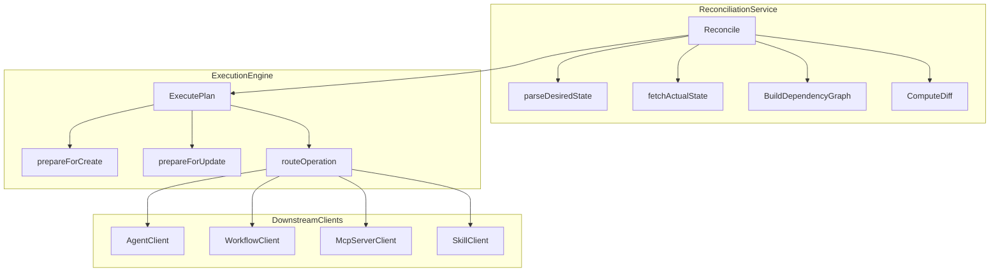

# E2: Execution Engine Implementation

## Current State Analysis

The reconciliation service in `[service.go](backend/services/stigmer-server/pkg/domain/project/reconcile/service.go)` has a **stub** `executePlan` function (lines 331-357) that returns the plan as results without actually executing any changes:

```go
// D4 Stub: Return the plan as a success result without actual execution.
return s.planToResult(plan), nil
```

## Architecture Decision

Create an **ExecutionEngine** as a separate struct within the `reconcile` package. This provides:

- Clear separation of concerns (orchestration vs execution)
- Testability through interface injection
- Clean dependency management for downstream controllers




## Implementation Files

### 1. New Downstream Clients

**File: `[backend/services/stigmer-server/pkg/downstream/mcpserver/client.go](backend/services/stigmer-server/pkg/downstream/mcpserver/client.go)**` (NEW)

Create McpServer downstream client following the pattern from `[agent/client.go](backend/services/stigmer-server/pkg/downstream/agent/client.go)`:

```go
type Client struct {
    conn      *grpc.ClientConn
    cmdClient mcpserverv1.McpServerCommandControllerClient
}

func (c *Client) Create(ctx context.Context, server *mcpserverv1.McpServer) (*mcpserverv1.McpServer, error)
func (c *Client) Update(ctx context.Context, server *mcpserverv1.McpServer) (*mcpserverv1.McpServer, error)
func (c *Client) Delete(ctx context.Context, input *apiresource.ApiResourceDeleteInput) (*mcpserverv1.McpServer, error)
```

**File: `[backend/services/stigmer-server/pkg/downstream/skill/client.go](backend/services/stigmer-server/pkg/downstream/skill/client.go)**` (NEW)

Create Skill downstream client (Skill uses `Push` for create/update):

```go
type Client struct {
    conn      *grpc.ClientConn
    cmdClient skillv1.SkillCommandControllerClient
}

func (c *Client) Push(ctx context.Context, req *skillv1.PushSkillRequest) (*skillv1.Skill, error)
func (c *Client) Delete(ctx context.Context, skillId *skillv1.SkillId) (*skillv1.Skill, error)
```

### 2. Execution Engine

**File: `[backend/services/stigmer-server/pkg/domain/project/reconcile/execution_engine.go](backend/services/stigmer-server/pkg/domain/project/reconcile/execution_engine.go)**` (NEW)

```go
// ResourceController defines the interface for downstream resource operations.
type ResourceController interface {
    CreateAgent(ctx context.Context, agent *agentv1.Agent) (*agentv1.Agent, error)
    UpdateAgent(ctx context.Context, agent *agentv1.Agent) (*agentv1.Agent, error)
    DeleteAgent(ctx context.Context, id string) error
    // ... similar for Workflow, McpServer, Skill
}

// ExecutionEngine executes reconciliation plans against downstream controllers.
type ExecutionEngine struct {
    controllers ResourceController
}

// ExecutePlan executes a reconciliation plan and returns the result.
func (e *ExecutionEngine) ExecutePlan(
    ctx context.Context,
    plan *ReconciliationPlan,
    projectID string,
) *ReconciliationResult
```

Key methods:

- `ExecutePlan`: Main entry point
- `executeCreatesAndUpdates`: Execute in topological order via `plan.GetChangesInExecutionOrder()`
- `executeDeletes`: Execute in reverse order via `plan.GetDeletesInReverseDependencyOrder()`
- `executeChange`: Route to appropriate controller method
- `prepareForCreate`: Set ownership annotation, org, and api version/kind
- `prepareForUpdate`: Merge desired spec with actual metadata (preserve ID, slug, org)
- `buildChangeRecord`: Convert change to `ResourceChangeRecord` proto

### 3. Resource Preparation Logic

**Ownership Annotation**: All created/updated resources get:

```go
metadata.annotations["stigmer.ai/sdk.project"] = projectID
```

**Create Preparation**:

- Copy desired resource
- Set `metadata.org` from project
- Set ownership annotation
- Ensure `api_version` and `kind` are set

**Update Preparation**:

- Preserve `metadata.id` from actual state
- Preserve `metadata.slug` from actual state
- Preserve `metadata.org` from actual state
- Set ownership annotation
- Use desired `spec`

### 4. Service Integration

**File: `[backend/services/stigmer-server/pkg/domain/project/reconcile/service.go](backend/services/stigmer-server/pkg/domain/project/reconcile/service.go)**` (MODIFY)

Update `reconciliationServiceImpl`:

- Add `engine *ExecutionEngine` field
- Inject engine in constructor
- Replace stub `executePlan` with delegation to engine

### 5. Server Wiring

**File: `[backend/services/stigmer-server/pkg/server/server.go](backend/services/stigmer-server/pkg/server/server.go)**` (MODIFY)

- Create McpServer and Skill downstream clients after in-process connection
- Create ExecutionEngine with all clients
- Create ReconciliationService with engine
- Pass to ProjectController

## Key Implementation Details

### Error Handling

Use `ResultBuilder` pattern with **continue on error**:

```go
builder := NewResultBuilder()
for _, change := range plan.GetChangesInExecutionOrder() {
    record, err := e.executeChange(ctx, change, projectID)
    if err != nil {
        builder.AddError(NewReconciliationErrorWithCause(
            change.Key().String(),
            fmt.Sprintf("failed to %s %s", change.ChangeType(), change.Key().Kind()),
            err,
        ))
        continue // Don't fail fast
    }
    e.recordSuccess(builder, change, record)
}
return builder.Build()
```

### Skill Special Handling

Skills use `Push` (idempotent create-or-update) instead of separate Create/Update:

```go
case apiresourcekind.ApiResourceKind_skill:
    if change.IsDelete() {
        return e.controllers.DeleteSkill(ctx, id)
    }
    // Both create and update use Push
    return e.controllers.PushSkill(ctx, prepared.(*skillv1.Skill))
```

### Delete Handling

For deletes, extract resource ID from actual state metadata:

```go
func extractResourceID(change ResourceChange) (string, error) {
    actual := change.ActualState()
    if metaResource, ok := actual.(HasMetadata); ok {
        return metaResource.GetMetadata().GetId(), nil
    }
    return "", fmt.Errorf("cannot extract ID from %s", change.Key())
}
```

## Test Plan (~30 tests)

**File: `[backend/services/stigmer-server/pkg/domain/project/reconcile/execution_engine_test.go](backend/services/stigmer-server/pkg/domain/project/reconcile/execution_engine_test.go)**` (NEW)

### A. ExecutePlan Core Tests (8 tests)

1. `TestExecutePlan_EmptyPlan_ReturnsEmptyResult`
2. `TestExecutePlan_NilPlan_ReturnsEmptyResult`
3. `TestExecutePlan_SingleCreate_Success`
4. `TestExecutePlan_SingleUpdate_Success`
5. `TestExecutePlan_SingleDelete_Success`
6. `TestExecutePlan_MixedOperations_AllSuccess`
7. `TestExecutePlan_CreateError_ContinuesProcessing`
8. `TestExecutePlan_PartialFailure_ReturnsPartialResult`

### B. Ordering Tests (6 tests)

1. `TestExecutePlan_CreatesInDependencyOrder`
2. `TestExecutePlan_DeletesInReverseDependencyOrder`
3. `TestExecutePlan_KindFallbackOrder_Creates`
4. `TestExecutePlan_KindFallbackOrder_Deletes`
5. `TestExecutePlan_MixedCreateUpdate_CorrectOrder`
6. `TestExecutePlan_AllKinds_ExecutedInOrder`

### C. Resource Preparation Tests (8 tests)

1. `TestPrepareForCreate_SetsOwnershipAnnotation`
2. `TestPrepareForCreate_SetsOrgFromProject`
3. `TestPrepareForCreate_PreservesSpec`
4. `TestPrepareForUpdate_PreservesActualID`
5. `TestPrepareForUpdate_PreservesActualSlug`
6. `TestPrepareForUpdate_UsesDesiredSpec`
7. `TestPrepareForUpdate_SetsOwnershipAnnotation`
8. `TestPrepareForDelete_ExtractsCorrectID`

### D. Error Handling Tests (5 tests)

1. `TestExecutePlan_CreateError_RecordsError`
2. `TestExecutePlan_UpdateError_RecordsError`
3. `TestExecutePlan_DeleteError_RecordsError`
4. `TestExecutePlan_MultipleErrors_AllRecorded`
5. `TestExecutePlan_ErrorFormat_IncludesCause`

### E. Integration Tests (3 tests)

1. `TestExecutePlan_SkillUsesPush`
2. `TestExecutePlan_McpServerUseDeleteInput`
3. `TestExecutePlan_BuildsCorrectChangeRecords`

## BUILD.bazel Updates

**File: `[backend/services/stigmer-server/pkg/domain/project/reconcile/BUILD.bazel](backend/services/stigmer-server/pkg/domain/project/reconcile/BUILD.bazel)**` (MODIFY)

Add to `srcs`:

- `execution_engine.go`

Add to test `srcs`:

- `execution_engine_test.go`

Add new deps for downstream clients.

**New BUILD files**:

- `backend/services/stigmer-server/pkg/downstream/mcpserver/BUILD.bazel`
- `backend/services/stigmer-server/pkg/downstream/skill/BUILD.bazel`

## Quality Requirements

- All functions under 50 lines
- All files under 300 lines
- Table-driven tests with descriptive names
- Immutable value object patterns maintained
- Comprehensive error messages with context
- Pass `go vet`, `gofmt`, Bazel build
- Greater than 80% test coverage

