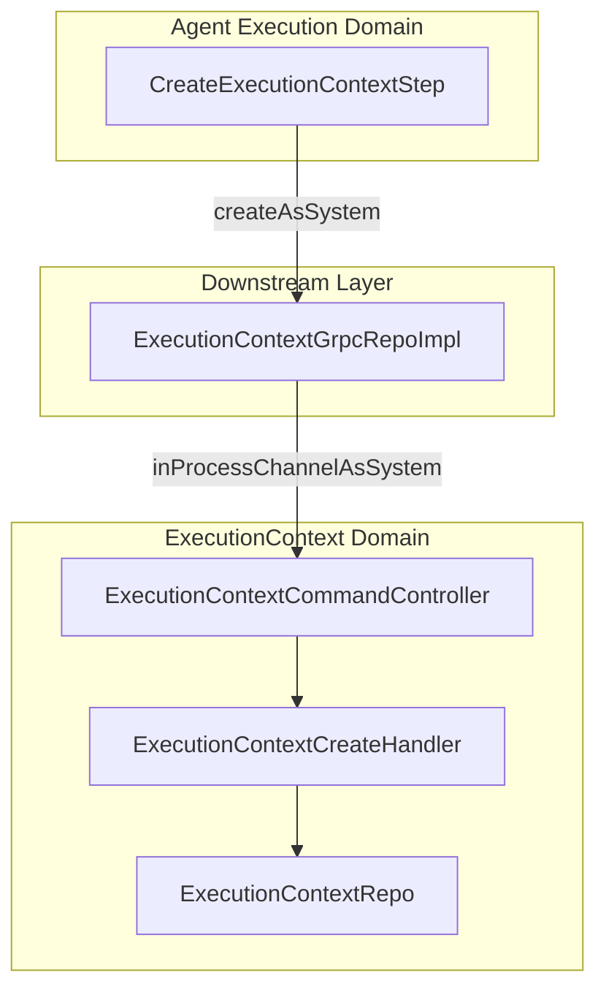

# Refactor ExecutionContext to Use Downstream gRPC Client Pattern

## Problem Statement

The `CreateExecutionContextStep` in both agent and workflow execution handlers directly uses `ExecutionContextRepo.save()` to persist `ExecutionContext` resources:

```76:77:stigmer-cloud/backend/services/stigmer-service/src/main/java/ai/stigmer/domain/agentic/agentexecution/request/step/CreateExecutionContextStep.java
    private final EnvironmentMergeService environmentMergeService;
    private final ExecutionContextRepo executionContextRepo;
```
```145:146:stigmer-cloud/backend/services/stigmer-service/src/main/java/ai/stigmer/domain/agentic/agentexecution/request/step/CreateExecutionContextStep.java
            ExecutionContext executionContext = buildExecutionContext(execution, mergedEnv);
            executionContextRepo.save(executionContext);
```

This violates the established domain ownership pattern. `ExecutionContext` belongs to its own domain, so cross-domain access should go through the in-process gRPC client, similar to how `SessionGrpcRepo` and `AgentInstanceGrpcRepo` work.

## Architecture Pattern



**Benefits:**

- Single source of truth for ExecutionContext creation logic
- All validation, encryption, and persistence handled by ExecutionContext handler
- Microservice-ready (swap channel config, no code changes)
- Consistent with existing patterns (Session, AgentInstance, WorkflowInstance)

## Implementation Details

### Files to Create

**1. Interface:** `ExecutionContextGrpcRepo.java`

- Location: `backend/libs/java/api/api-authorization/src/main/java/ai/stigmer/apiauthorization/repo/`
- Defines `createAsSystem(ExecutionContext)` method
- Follows same pattern as `SessionGrpcRepo`, `AgentInstanceGrpcRepo`

**2. Implementation:** `ExecutionContextGrpcRepoImpl.java`

- Location: `backend/services/stigmer-service/src/main/java/ai/stigmer/downstream/agentic/executioncontext/`
- Uses `@Qualifier("inProcessChannelAsSystem")` for machine account (backend automation)
- Calls `ExecutionContextCommandControllerGrpc.newBlockingStub(systemChannel).create()`

### Files to Modify

**3. Agent Execution Step:** `CreateExecutionContextStep.java`

- Location: `domain/agentic/agentexecution/request/step/`
- Replace `ExecutionContextRepo` with `ExecutionContextGrpcRepo`
- Replace `executionContextRepo.save()` with `executionContextGrpcRepo.createAsSystem()`

**4. Workflow Execution Step:** `CreateExecutionContextStep.java`

- Location: `domain/agentic/workflowexecution/request/step/`
- Same changes as agent execution step

## Key Implementation Notes

**Why System Channel?**

- ExecutionContext creation is backend automation, not user-initiated
- User already authorized parent operation (execution creation)
- System acts on behalf of automation logic

**Handler Pipeline Ensures:**

- Field validation via proto constraints
- Authorization (operator-only at proto level)
- Slug resolution and duplicate checking
- Proper persistence with audit fields
- Event publishing (if enabled)

**Error Handling:**

- gRPC errors propagate naturally as `Status` codes
- Existing try-catch blocks convert to `RequestPipelineStepResultV2.failure()`

## Testing Considerations

- Existing integration tests should pass (behavior unchanged)
- Handler tests may need mock updates for new dependency
- No changes to ExecutionContext proto or handler logic required