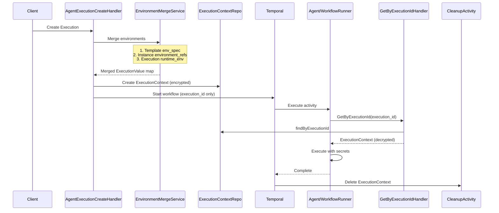

# Milestone 2: ExecutionContext Lifecycle

## Design Overview

The ExecutionContext resource serves as a secure, ephemeral container for merged environment variables during workflow/agent execution. This design eliminates passing secrets through Temporal by:

1. Creating ExecutionContext with merged environments at execution start
2. Passing only `execution_id` to Temporal (no secrets in workflow parameters)
3. Runners query ExecutionContext by execution_id to retrieve decrypted secrets
4. Deleting ExecutionContext when execution completes



## Architecture Decisions

1. **Environment Merge Order** (lowest to highest priority):

                                                - Template `env_spec` (Agent/Workflow defaults)
                                                - Instance `environment_refs` (layered configs)
                                                - Execution `runtime_env` (runtime overrides)

2. **Security Model**:

                                                - ExecutionContext stores encrypted secrets (reuses EnvironmentSecretService)
                                                - GetByExecutionId decrypts for internal/operator callers
                                                - Standard Get/GetByReference always redacts secrets

3. **Cleanup Strategy**:

                                                - Primary: Temporal activity deletes ExecutionContext on workflow completion
                                                - Backup: TTL-based auto-deletion (24h) via MongoDB TTL index

4. **Backward Compatibility**:

                                                - Runners check for ExecutionContext first, fall back to existing flow if not found
                                                - Gradual rollout without breaking existing executions

---

## Part 1: Proto Changes (stigmer)

### 1.1 Add GetByExecutionId RPC

**File**: [`apis/ai/stigmer/agentic/executioncontext/v1/query.proto`](apis/ai/stigmer/agentic/executioncontext/v1/query.proto)

Add new RPC method for execution ID lookup:

```protobuf
// Get an ExecutionContext by the execution ID it belongs to.
// This is the primary lookup method used by runners.
rpc getByExecutionId(ExecutionContextExecutionIdInput) returns (ExecutionContext) {
  option (ai.stigmer.iam.iampolicy.v1.rpcauthorization.config).resource_kind = platform;
  option (ai.stigmer.iam.iampolicy.v1.rpcauthorization.config).permission = operator;
  option (ai.stigmer.iam.iampolicy.v1.rpcauthorization.config).resource_id = "stigmer";
  option (ai.stigmer.iam.iampolicy.v1.rpcauthorization.config).error_msg = "unauthorized to get Execution Context by execution ID (operator-only action)";
}
```

### 1.2 Add Input Message

**File**: [`apis/ai/stigmer/agentic/executioncontext/v1/io.proto`](apis/ai/stigmer/agentic/executioncontext/v1/io.proto)

```protobuf
// Input for getByExecutionId lookup.
message ExecutionContextExecutionIdInput {
  // The workflow or agent execution ID to look up.
  string execution_id = 1 [(buf.validate.field).string.min_len = 1];
}
```

### 1.3 Regenerate Proto Stubs

Run proto generation for Go, Java, Python stubs.

---

## Part 2: Java Service Changes (stigmer-cloud)

### 2.1 EnvironmentMergeService

**New File**: `domain/agentic/executioncontext/service/EnvironmentMergeService.java`

Service to merge environments from multiple sources with correct priority:

```java
@Service
@RequiredArgsConstructor
public class EnvironmentMergeService {
    private final EnvironmentRepo environmentRepo;
    private final EnvironmentSecretService secretService;
    
    /**
     * Merge environment sources with priority ordering.
     * 
     * @param templateEnvSpec Base defaults from Agent/Workflow template (lowest)
     * @param environmentRefs Environment references from Instance (middle)
     * @param runtimeEnv Runtime overrides from Execution (highest)
     * @return Merged map with all secrets encrypted
     */
    public Map<String, ExecutionValue> merge(
            @Nullable EnvironmentSpec templateEnvSpec,
            @Nullable List<ApiResourceReference> environmentRefs,
            @Nullable Map<String, ExecutionValue> runtimeEnv);
}
```

Key implementation details:

- Fetch environments by refs using existing `EnvironmentRepo.findByOrgAndSlug`
- Decrypt environment values (they're stored encrypted)
- Merge in priority order: template -> instance envs -> runtime
- Re-encrypt all secret values for ExecutionContext storage

### 2.2 ExecutionContextGetByExecutionIdHandler

**New File**: `domain/agentic/executioncontext/request/handler/ExecutionContextGetByExecutionIdHandler.java`

Handler for the new `getByExecutionId` RPC:

```java
@Component
@RequiredArgsConstructor
@RequestRoute(controller = ExecutionContextQueryControllerGrpc.class,
        method = ExecutionContextQueryController.Method.getByExecutionId)
public class ExecutionContextGetByExecutionIdHandler 
        extends CustomOperationHandlerV2<ExecutionContextExecutionIdInput, ExecutionContext> {
    
    // Pipeline: validate -> loadByExecutionId -> decrypt -> transform -> respond
}
```

Key differences from standard Get:

- Uses `findByExecutionId` instead of `findById`
- Includes `DecryptSecretValues` step (for internal/operator callers)
- Returns decrypted secrets for runner consumption

### 2.3 CreateExecutionContextStep

**New File**: `domain/agentic/agentexecution/request/step/CreateExecutionContextStep.java`

Pipeline step for AgentExecutionCreateHandler:

```java
@Component
@RequiredArgsConstructor
public class CreateExecutionContextStep implements RequestPipelineStepV2<CreateContextV2<AgentExecution>> {
    private final EnvironmentMergeService mergeService;
    private final ExecutionContextRepo executionContextRepo;
    private final EnvironmentSecretService secretService;
    
    @Override
    public RequestPipelineStepResultV2 execute(CreateContextV2<AgentExecution> context) {
        // 1. Load Agent template (for env_spec)
        // 2. Load AgentInstance (for environment_refs)
        // 3. Get runtime_env from execution
        // 4. Merge all environments
        // 5. Create ExecutionContext with encrypted data
        // 6. Store execution_context_id in context for later use
    }
}
```

Create similar step for WorkflowExecutionCreateHandler.

### 2.4 DeleteExecutionContextActivity

**New File**: `domain/agentic/executioncontext/temporal/DeleteExecutionContextActivity.java`

Temporal activity to clean up ExecutionContext on completion:

```java
@ActivityInterface
public interface DeleteExecutionContextActivity {
    @ActivityMethod
    void deleteByExecutionId(String executionId);
}
```

Integrate into:

- `InvokeAgentExecutionWorkflowImpl.run()` - add cleanup in finally block
- `InvokeWorkflowExecutionWorkflowImpl.run()` - same pattern

### 2.5 Pipeline Integration

Modify existing handlers to include the new step:

**AgentExecutionCreateHandler** - Insert after `setInitialPhaseStep`, before `persist`:

```java
.addStep(createExecutionContextStep)     // NEW: Create ExecutionContext with merged env
.addStep(createSteps.persist)
```

**WorkflowExecutionCreateHandler** - Same pattern.

### 2.6 MongoDB TTL Index (Backup Cleanup)

Add TTL index for automatic cleanup of orphaned ExecutionContexts:

```java
// In ExecutionContextRepo or via migration
mongoTemplate.indexOps(COLLECTION).ensureIndex(
    new Index()
        .on("metadata.createdAt", Sort.Direction.ASC)
        .expire(Duration.ofHours(24))
);
```

---

## Part 3: Runner Changes (stigmer)

### 3.1 Go Workflow-Runner

**New File**: `backend/services/workflow-runner/pkg/grpc_client/execution_context_client.go`

```go
type ExecutionContextClient struct {
    client executioncontextv1grpc.ExecutionContextQueryControllerClient
}

func (c *ExecutionContextClient) GetByExecutionId(ctx context.Context, executionId string) (*executioncontextv1.ExecutionContext, error)
```

**Modify**: `backend/services/workflow-runner/worker/activities/execute_workflow_activity.go`

```go
// Before workflow execution:
// 1. Query ExecutionContext by execution_id
// 2. If found, use merged/decrypted env vars
// 3. If not found (backward compat), fall back to execution.Spec.RuntimeEnv
```

### 3.2 Python Agent-Runner

**New File**: `backend/services/agent-runner/grpc_client/execution_context_client.py`

```python
class ExecutionContextClient:
    async def get_by_execution_id(self, execution_id: str) -> ExecutionContext
```

**Modify**: `backend/services/agent-runner/worker/activities/execute_graphton.py`

Replace current environment merge logic with ExecutionContext lookup:

- Query ExecutionContext by execution_id
- Use pre-merged environment (already decrypted by service)
- Fall back to existing flow if ExecutionContext not found

---

## Part 4: Testing Strategy

### 4.1 Unit Tests

- `EnvironmentMergeServiceTest` - merge priority ordering, encryption handling
- `CreateExecutionContextStepTest` - step execution, error handling
- `ExecutionContextGetByExecutionIdHandlerTest` - decryption, not-found cases

### 4.2 Integration Tests

- `ExecutionContextLifecycleIntegrationTest`:
                                - Create execution -> verify ExecutionContext created
                                - Query by execution_id -> verify decrypted values
                                - Complete execution -> verify cleanup

### 4.3 Cross-Platform Tests

- Go runner -> Java service communication
- Python runner -> Java service communication
- Encryption/decryption round-trip across languages

---

## Key Files Summary

**Proto (stigmer)**:

- `apis/ai/stigmer/agentic/executioncontext/v1/query.proto` - Add RPC
- `apis/ai/stigmer/agentic/executioncontext/v1/io.proto` - Add input message

**Java (stigmer-cloud)**:

- `domain/agentic/executioncontext/service/EnvironmentMergeService.java` - NEW
- `domain/agentic/executioncontext/request/handler/ExecutionContextGetByExecutionIdHandler.java` - NEW
- `domain/agentic/agentexecution/request/step/CreateExecutionContextStep.java` - NEW
- `domain/agentic/workflowexecution/request/step/CreateExecutionContextStep.java` - NEW
- `domain/agentic/executioncontext/temporal/DeleteExecutionContextActivity.java` - NEW
- `domain/agentic/agentexecution/request/handler/AgentExecutionCreateHandler.java` - MODIFY
- `domain/agentic/workflowexecution/request/handler/WorkflowExecutionCreateHandler.java` - MODIFY
- `domain/agentic/agentexecution/temporal/workflow/InvokeAgentExecutionWorkflowImpl.java` - MODIFY
- `domain/agentic/workflowexecution/temporal/workflow/InvokeWorkflowExecutionWorkflowImpl.java` - MODIFY

**Go (stigmer)**:

- `backend/services/workflow-runner/pkg/grpc_client/execution_context_client.go` - NEW
- `backend/services/workflow-runner/worker/activities/execute_workflow_activity.go` - MODIFY

**Python (stigmer)**:

- `backend/services/agent-runner/grpc_client/execution_context_client.py` - NEW
- `backend/services/agent-runner/worker/activities/execute_graphton.py` - MODIFY