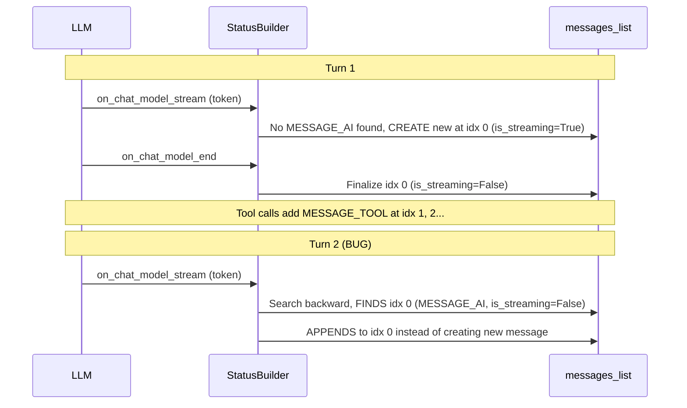

# Fix AI Message Concatenation Bug in Agent Runner

## Root Cause Analysis

The bug is in `[backend/services/agent-runner/worker/activities/graphton/status_builder.py](backend/services/agent-runner/worker/activities/graphton/status_builder.py)`, specifically in `_handle_chat_model_stream_event()` at lines 606-635.

### The Bug (One Line)

When streaming tokens arrive for a new LLM turn, the code searches backward for **any** `MESSAGE_AI` to append to -- it does not check whether that message was already finalized (`is_streaming=False`). This causes every subsequent turn's text to be concatenated onto the very first AI message.

### The Defective Code

```python
# Lines 606-613 in status_builder.py
ai_message = None
for idx in range(len(messages_list) - 1, -1, -1):
    message = messages_list[idx]
    if message.type == MessageType.MESSAGE_AI:  # <-- BUG: no is_streaming check
        ai_message = message
        break
```

### Evidence from Data

The [data.md](_cursor/data.md) file shows a completed execution with:

- **1 MESSAGE_AI** (line 138) containing ALL status text from ~16 LLM turns concatenated together without separators
- **30+ MESSAGE_TOOL / MESSAGE_SYSTEM** messages following it

Expected: ~16 MESSAGE_AI messages interleaved with the tool messages.

### Timeline of the Bug Per Execution




## The Fix

### Change 1 (Primary): Add `is_streaming` guard in `_handle_chat_model_stream_event`

In `[status_builder.py](backend/services/agent-runner/worker/activities/graphton/status_builder.py)` lines 606-613, add `message.is_streaming` to the search condition:

```python
ai_message = None
for idx in range(len(messages_list) - 1, -1, -1):
    message = messages_list[idx]
    if message.type == MessageType.MESSAGE_AI and message.is_streaming:
        ai_message = message
        break
```

This ensures:

- During an active stream, tokens continue appending to the current message (correct, no change)
- After `on_chat_model_end` sets `is_streaming=False`, the next turn creates a NEW message (the fix)

### Change 2 (Robustness): Add same guard in `_handle_chat_model_end_event`

In `[status_builder.py](backend/services/agent-runner/worker/activities/graphton/status_builder.py)` lines 661-667, the backward search for finalization should also prefer the streaming message. While the most recent MESSAGE_AI will already be the current turn's in practice (since it was just created), adding the `is_streaming` check makes this robust against edge cases:

```python
ai_message_index = None
for idx in range(len(messages_list) - 1, -1, -1):
    message = messages_list[idx]
    if message.type == MessageType.MESSAGE_AI and message.is_streaming:
        ai_message_index = idx
        break
```

## Ripple Effect Analysis (No Other Changes Needed)

- **CLI `emitMessageEvents**` (`[run_stream_events.go](client-apps/cli/cmd/stigmer/root/run_stream_events.go)`): Already processes messages sequentially via `displayedCount` cursor. Multiple interleaved AI messages work correctly.
- **TUI `handleExecutionEvent**` (`[handle_events.go](client-apps/cli/pkg/executiontui/handle_events.go)`): Already handles `AIStreamStartEvent`, `AIStreamDeltaEvent`, `AIStreamEndEvent`, and `AIMessageEvent` independently.
- **Proto definition** (`[api.proto](apis/ai/stigmer/agentic/agentexecution/v1/api.proto)`): `AgentMessage` already supports multiple AI messages via `repeated AgentMessage messages` in `AgentExecutionStatus`.
- **Java backend merging**: Receives full status proto with the messages list. No changes required.
- **Token/timing tracking**: `_message_start_times` uses message index as key. Each new AI message gets its own index and timing, so per-message `token_count` and `generation_duration_ms` become accurate (they were previously being overwritten by later turns -- a secondary bug fixed automatically).

## What Improves After the Fix

- Each LLM "thinking out loud" segment becomes a distinct MESSAGE_AI in the conversation history
- CLI users see status updates interleaved with tool calls in real-time (the streaming pipeline already supports this)
- Per-message metrics (`token_count`, `generation_duration_ms`) become accurate per-turn instead of reflecting only the last turn's values
- The `data.md` output would show the expected interleaved pattern: AI -> TOOL -> AI -> TOOL -> AI -> ...

## Risk Assessment

**Very low risk.** The change adds one boolean condition to a search predicate. No new code paths are created. The downstream pipeline (gRPC updates, CLI rendering) already handles multiple AI messages correctly -- they were designed for it but never saw the correct data due to this bug.