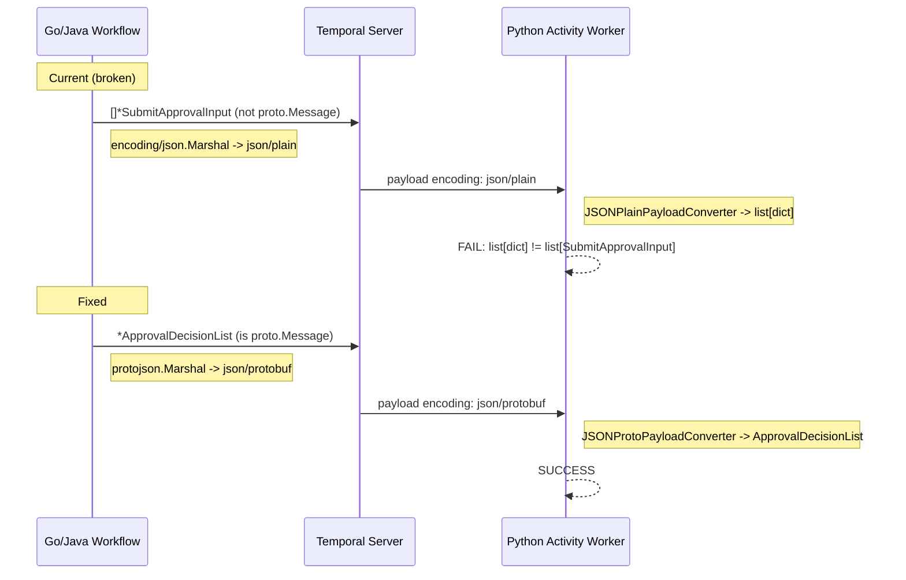

# Fix Approval Submission Deserialization Failure

## Root Cause

When a user approves tool calls, the Go/Java Temporal workflow collects `SubmitApprovalInput` protobuf messages and passes them as `[]*SubmitApprovalInput` (Go) / `List<SubmitApprovalInput>` (Java) to the Python `ExecuteGraphton` activity.

**The fundamental issue**: A bare slice/list of proto messages is **not** a `proto.Message` itself. This means:

1. The Go SDK's `ProtoJSONPayloadConverter` cannot handle it (only handles single `proto.Message` values)
2. Go SDK falls through to `encoding/json.Marshal()`, producing a JSON array with **integer** enum values and **snake_case** field names
3. The Temporal payload gets encoding `json/plain` (not `json/protobuf`)
4. Python SDK's `JSONPlainPayloadConverter` decodes it into a `list[dict]`
5. Python SDK tries to match `list[dict]` against the type hint `list[SubmitApprovalInput] | None` -- **fails**

Error from logs:

```
Failed converting to list[...SubmitApprovalInput] | None from
[{'agent_execution_id': '...', 'tool_call_id': '...', 'action': 1}, ...]
```

Note `action: 1` (integer) -- this confirms `encoding/json` was used (not `protojson`), since proto JSON would emit the string `"APPROVAL_ACTION_APPROVE"`.

## Solution

Introduce a protobuf **wrapper message** `ApprovalDecisionList` containing `repeated SubmitApprovalInput decisions = 1`. Since the wrapper *is* a `proto.Message`, the Go/Java SDKs will use their proto-aware JSON serializer (`json/protobuf` encoding), and the Python SDK's `JSONProtoPayloadConverter` will properly deserialize it.




## Changes Required

### 1. Proto definition -- [apis/ai/stigmer/agentic/agentexecution/v1/io.proto](apis/ai/stigmer/agentic/agentexecution/v1/io.proto) (stigmer repo)

Add wrapper message immediately after `SubmitApprovalInput` (after line 107):

```protobuf
// ApprovalDecisionList wraps a batch of approval decisions for Temporal
// activity transport.
//
// Required for polyglot Temporal serialization: a bare repeated field (Go
// slice / Java List) is NOT a proto.Message, so the SDK falls back to
// json/plain encoding which the Python worker cannot decode into typed
// protobuf objects.  Wrapping in a message ensures the SDK uses the
// json/protobuf payload converter on both sides.
message ApprovalDecisionList {
  repeated SubmitApprovalInput decisions = 1;
}
```

### 2. Regenerate stubs

- **stigmer repo**: `cd apis && make build` (Go + Python stubs)
- **stigmer-cloud repo**: `cd apis && make java-stubs` (Java stubs)

### 3. Go activity interface -- [backend/services/stigmer-server/pkg/domain/agentexecution/temporal/activities/execute_graphton.go](backend/services/stigmer-server/pkg/domain/agentexecution/temporal/activities/execute_graphton.go) (stigmer repo)

- Line 44: Change parameter type from `[]*agentexecutionv1.SubmitApprovalInput` to `*agentexecutionv1.ApprovalDecisionList`
- Line 77: Same change in the stub implementation
- Line 79: Pass the wrapper directly to `workflow.ExecuteActivity`

### 4. Go workflow -- [backend/services/stigmer-server/pkg/domain/agentexecution/temporal/workflows/invoke_workflow_impl.go](backend/services/stigmer-server/pkg/domain/agentexecution/temporal/workflows/invoke_workflow_impl.go) (stigmer repo)

- Line 166: First invocation -- pass `nil` (already nil, type changes from slice to proto pointer)
- Lines 224-257: Build `ApprovalDecisionList` wrapper:
  - Collect signals into a slice as before
  - Wrap in `&agentexecutionv1.ApprovalDecisionList{Decisions: approvalDecisions}`
  - Pass wrapper to activity

### 5. Python activity -- [backend/services/agent-runner/worker/activities/execute_graphton.py](backend/services/agent-runner/worker/activities/execute_graphton.py) (stigmer repo)

- Line 19: Add import for `ApprovalDecisionList`
- Line 233: Change type from `list[SubmitApprovalInput] | None` to `ApprovalDecisionList | None`
- Lines 266-268: Unwrap: extract `.decisions` from wrapper, normalize to empty list if None
- Lines 1352-1355: No changes needed -- the unwrapped list is the same `list[SubmitApprovalInput]`

### 6. Java activity interface -- `ExecuteGraphtonActivity.java` in stigmer-cloud repo

- Change `List<SubmitApprovalInput> approvalDecisions` to `ApprovalDecisionList approvalDecisions`

### 7. Java workflow -- `InvokeAgentExecutionWorkflowImpl.java` in stigmer-cloud repo

- Line 534: First invocation -- change `Collections.emptyList()` to `null` (or `ApprovalDecisionList.getDefaultInstance()`)
- Lines 589-653: Build `ApprovalDecisionList` wrapper from collected decisions before passing to activity

## Deployment

Both repos are on the same branch (`test/agent-execution-flow-2`). The proto change originates in stigmer and stubs are regenerated in both repos. Since the current flow is already broken (approval submission crashes), there is no backward compatibility concern -- the fix makes it work for the first time.