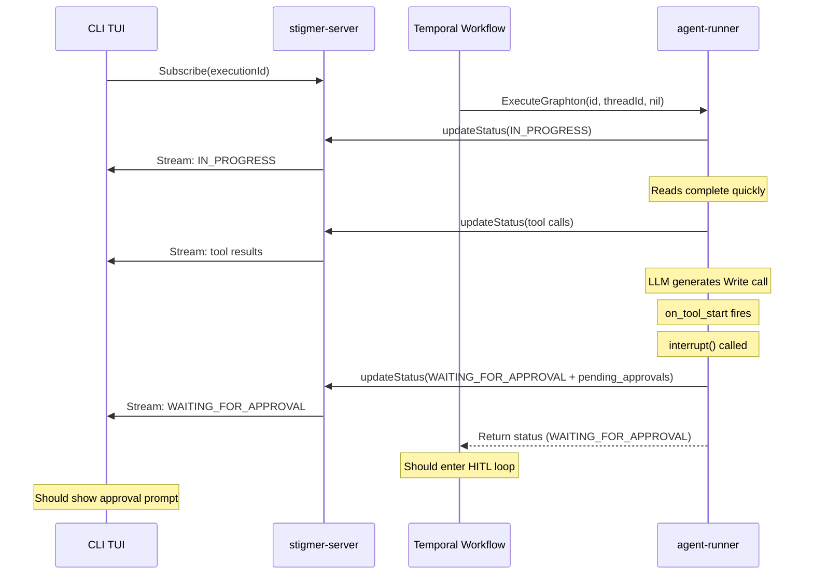

# Fix HITL Approval Interrupt Flow

## Problem Summary

When a Write tool requires approval during agent execution:

1. Read tools complete and display immediately in the CLI
2. The LLM generates the Write tool call -- no "thinking" indicator is shown (separate issue, deferred)
3. The agent-runner correctly detects approval is needed and sets `WAITING_FOR_APPROVAL` phase
4. The agent-runner sends the final gRPC status update with `pending_approvals`
5. **But the CLI never shows the approval prompt**
6. **The execution ends up marked as "completed"**

## Architecture (for context)




## Root Cause Analysis

After thorough investigation, I identified **three interconnected issues** in the chain:

### Issue 1: Go workflow may not correctly enter HITL loop

In `[invoke_workflow_impl.go](backend/services/stigmer-server/pkg/domain/agentexecution/temporal/workflows/invoke_workflow_impl.go)`, line 190:

```go
for finalStatus.GetPhase() == agentexecutionv1.ExecutionPhase_EXECUTION_WAITING_FOR_APPROVAL {
```

If the Temporal proto serialization between the Python activity and Go workflow loses the phase enum value (defaults to 0 = UNSPECIFIED), the loop is never entered. The workflow falls through to line 276:

```go
logger.Info("Graphton execution completed - final status received", ...)
return nil
```

No explicit COMPLETED status update is sent, **but the execution's last DB state is WAITING_FOR_APPROVAL** from the agent-runner's gRPC update. The workflow just exits silently.

**Evidence needed:** We need diagnostic logging of the deserialized `finalStatus.GetPhase()` right after the activity returns (line 166-169 -- no such logging exists today).

### Issue 2: No guaranteed status update when entering HITL loop

The Go workflow enters the HITL loop and waits for the signal, but it does NOT persist/broadcast the WAITING_FOR_APPROVAL status with `pending_approvals`. It relies entirely on the agent-runner's gRPC update having already arrived at the CLI. This creates a race condition.

### Issue 3: CLI's `streamToEvents` treats EOF as generic error

In `[run_stream_events.go](client-apps/cli/cmd/stigmer/root/run_stream_events.go)` lines 49-59:

```go
if err == io.EOF {
    cfg.events <- executiontui.StreamErrorEvent{
        Err: errors.New("execution stream ended unexpectedly"),
    }
}
```

If the gRPC Subscribe stream closes for any reason (e.g., server restart, connection drop), the CLI shows an error and stops. It does NOT re-fetch the latest execution state to check for pending approvals.

## Proposed Changes

### 1. Add diagnostic logging in Go workflow (must do first)

**File:** `[invoke_workflow_impl.go](backend/services/stigmer-server/pkg/domain/agentexecution/temporal/workflows/invoke_workflow_impl.go)`

After `ExecuteGraphton` returns (line 166), add structured logging of the deserialized phase and pending_approvals count. This will immediately reveal if the Temporal serialization is the root cause.

```go
logger.Info("Activity returned status",
    "execution_id", executionID,
    "phase", finalStatus.GetPhase().String(),
    "phase_value", int32(finalStatus.GetPhase()),
    "pending_approvals", len(finalStatus.GetPendingApprovals()),
    "messages", len(finalStatus.GetMessages()),
    "tool_calls", len(finalStatus.GetToolCalls()))
```

### 2. Add defensive HITL detection in Go workflow

**File:** `[invoke_workflow_impl.go](backend/services/stigmer-server/pkg/domain/agentexecution/temporal/workflows/invoke_workflow_impl.go)`

Add a safety check: if `pending_approvals` is non-empty but phase is not `WAITING_FOR_APPROVAL`, log a loud warning and treat it as `WAITING_FOR_APPROVAL`. This handles proto serialization edge cases.

```go
if finalStatus.GetPhase() != agentexecutionv1.ExecutionPhase_EXECUTION_WAITING_FOR_APPROVAL &&
    len(finalStatus.GetPendingApprovals()) > 0 {
    logger.Warn("DEFENSIVE: pending_approvals present but phase is not WAITING_FOR_APPROVAL -- treating as WAITING_FOR_APPROVAL",
        "actual_phase", finalStatus.GetPhase().String())
    // Mutate the status to correct the phase
    finalStatus.Phase = agentexecutionv1.ExecutionPhase_EXECUTION_WAITING_FOR_APPROVAL
}
```

### 3. Persist WAITING_FOR_APPROVAL status before entering HITL wait

**File:** `[invoke_workflow_impl.go](backend/services/stigmer-server/pkg/domain/agentexecution/temporal/workflows/invoke_workflow_impl.go)`

Before calling `waitForApprovalSignal()`, persist the status (with pending_approvals) to the database via the `UpdateExecutionStatus` local activity. This guarantees the CLI receives the approval state even if the agent-runner's gRPC update was missed or arrived too late.

This is the **belt-and-suspenders** approach: the agent-runner sends the update via gRPC, AND the workflow persists it via local activity. Both paths broadcast to subscribers via the StreamBroker.

### 4. Add structured logging in CLI's `streamToEvents`

**File:** `[run_stream_events.go](client-apps/cli/cmd/stigmer/root/run_stream_events.go)`

Add trace logging after `stream.Recv()` to log the received phase and pending_approvals count. This will help diagnose whether the CLI receives the WAITING_FOR_APPROVAL update at all.

### 5. Handle tool calls with `waiting_approval` status in CLI

**File:** `[run_stream_events.go](client-apps/cli/cmd/stigmer/root/run_stream_events.go)`

Currently, `emitToolCallStateEvents` only emits `ToolRunningEvent` for tools in "running" status. Add handling for "waiting_approval" status to emit a visual indicator in the TUI (e.g., a waiting/pending block for the tool call). This ensures the user sees something when the Write tool is about to need approval, even before `pending_approvals` arrives.

## Scope

This plan focuses exclusively on the approval/interrupt flow. The "thinking indicator between reads and writes" (live streaming UX) is a separate issue to be addressed afterwards as discussed.

## Testing Strategy

After implementing fixes:

1. Run an agent with a Write tool that requires approval
2. Verify the Go workflow logs show the correct deserialized phase
3. Verify the CLI receives the WAITING_FOR_APPROVAL update with pending_approvals
4. Verify the approval prompt appears in the TUI
5. Verify approving/skipping/rejecting works end-to-end

