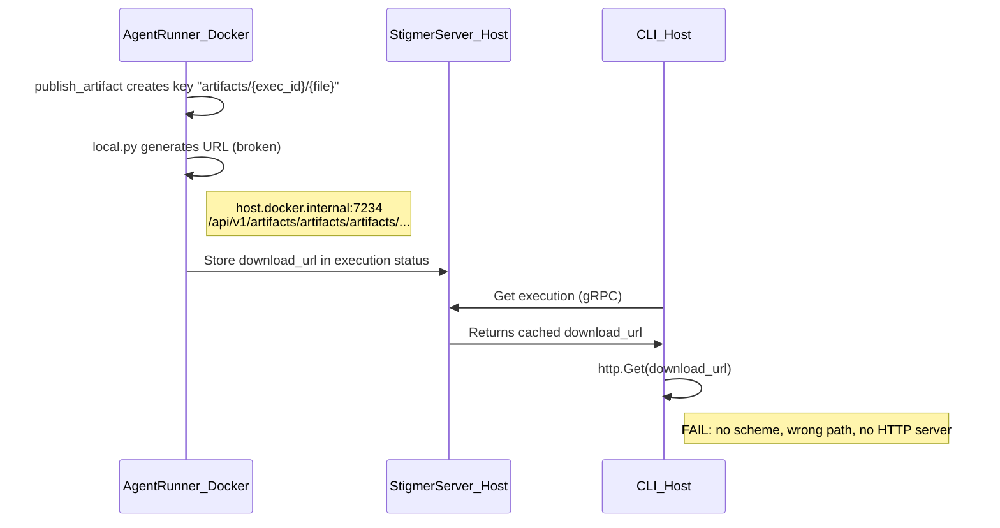
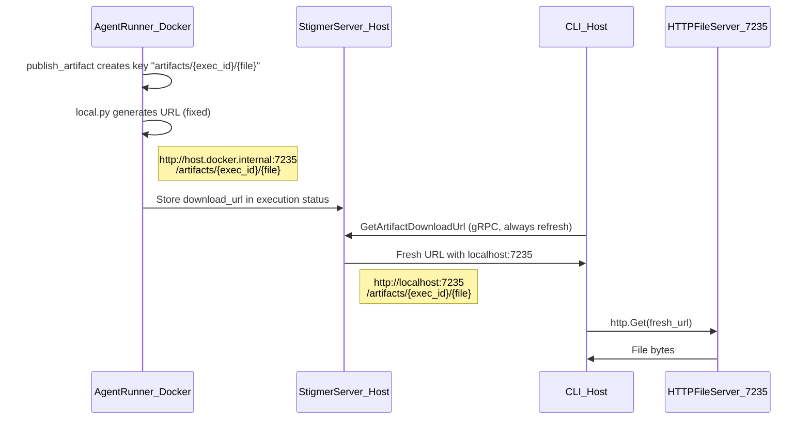

# Fix Artifact Download After Agent Execution

## Root Cause Analysis

The error from the screenshot:

```
Get "host.docker.internal:7234/api/v1/artifacts/artifacts/artifacts/aex-01khk62ndpz2ryvenwg0bzzdgx/agent-drafter.zip": unsupported protocol scheme "host.docker.internal"
```

This is caused by **three compounding bugs** plus a **missing infrastructure** piece:

### Bug 1: Missing `http://` scheme

`[daemon.go](client-apps/cli/internal/cli/daemon/daemon.go)` line 612 and `[supervisor.go](backend/services/stigmer-server/pkg/supervisor/supervisor.go)` line 297 set the agent-runner's `LOCAL_ARTIFACT_SERVE_URL` to `host.docker.internal:7234/api/v1/artifacts` -- no `http://` prefix. Go's `http.Get()` then fails because it can't parse the scheme.

### Bug 2: Triple `artifacts/` path

Three layers each contribute an `artifacts/` segment:

1. **Base URL** includes `/api/v1/artifacts` (set in daemon.go/supervisor.go)
2. **Python `local.py` line 117** adds `/artifacts/` before the key: `f"{self.serve_url_base}/artifacts/{key}"`
3. **Storage key** starts with `artifacts/`: `f"artifacts/{execution_id}/{filename}"` (in `[publish_artifact.py](backend/services/agent-runner/worker/tools/publish_artifact.py)` line 156)

Result: `.../api/v1/artifacts/artifacts/artifacts/{id}/{file}`

### Bug 3: Docker-internal hostname in CLI-facing URLs

The agent-runner (inside Docker) generates URLs using `host.docker.internal`. These get stored in the execution status. The CLI (on the host) reads them directly and tries `http.Get()`. While `host.docker.internal` resolves on macOS, this is architecturally wrong -- the CLI should use `localhost`.

### Missing Infrastructure: No HTTP file server

The `ARTIFACT_LOCAL_SERVE_URL` defaults to `http://localhost:8080/artifacts` (in `[config.go](backend/services/stigmer-server/pkg/config/config.go)` line 45), but **no HTTP server exists** on any port to actually serve artifact files. The stigmer-server only runs a gRPC server on port 7234. Even with a correct URL, nothing would serve the files.

---

## Data Flow (current, broken)




## Data Flow (fixed)




---

## Implementation

### 1. Add HTTP file server to stigmer-server

**File**: `[backend/services/stigmer-server/pkg/server/server.go](backend/services/stigmer-server/pkg/server/server.go)`

Start a lightweight HTTP file server alongside the gRPC server, only in local storage mode. Serves files from `{ArtifactStorage.LocalBasePath}/artifacts/` on a configurable port (default: `GRPCPort + 1` = 7235).

```go
if cfg.ArtifactStorage.Type == "local" {
    artifactDir := filepath.Join(cfg.ArtifactStorage.LocalBasePath, "artifacts")
    mux := http.NewServeMux()
    mux.Handle("/", http.FileServer(http.Dir(artifactDir)))
    httpPort := cfg.ArtifactHTTPPort
    go func() {
        addr := fmt.Sprintf("127.0.0.1:%d", httpPort)
        if err := http.ListenAndServe(addr, mux); err != nil {
            log.Error().Err(err).Msg("Artifact HTTP server failed")
        }
    }()
}
```

Bind to `127.0.0.1` only -- artifact files should not be accessible from external networks.

### 2. Add HTTP port configuration

**File**: `[backend/services/stigmer-server/pkg/config/config.go](backend/services/stigmer-server/pkg/config/config.go)`

- Add `ArtifactHTTPPort` field (env: `ARTIFACT_HTTP_PORT`, default: `GRPCPort + 1`)
- Change `ARTIFACT_LOCAL_SERVE_URL` default from `http://localhost:8080/artifacts` to `http://localhost:7235` (no trailing `/artifacts`)

### 3. Fix Python URL construction -- remove extra `/artifacts/`

**File**: `[backend/services/agent-runner/worker/storage/local.py](backend/services/agent-runner/worker/storage/local.py)`

- Line 117: Change `f"{self.serve_url_base}/artifacts/{key}"` to `f"{self.serve_url_base}/{key}"`
- Update docstrings (lines 46, 113) to reflect: `{serve_url_base}/{key}` instead of `{serve_url_base}/artifacts/{key}`

This aligns Python with Go's `local_storage.go:74` which already does `fmt.Sprintf("%s/%s", s.serveURL, key)`.

### 4. Fix agent-runner env var in daemon.go

**File**: `[client-apps/cli/internal/cli/daemon/daemon.go](client-apps/cli/internal/cli/daemon/daemon.go)`

Line 612: Change from:

```go
"-e", fmt.Sprintf("LOCAL_ARTIFACT_SERVE_URL=%s/api/v1/artifacts", backendAddr),
```

to:

```go
"-e", fmt.Sprintf("LOCAL_ARTIFACT_SERVE_URL=http://%s:%d", resolveDockerHostAddress("localhost"), DaemonPort+1),
```

This adds the `http://` scheme, uses the correct HTTP port (7235), and removes the `/api/v1/artifacts` suffix that was causing path duplication.

### 5. Fix agent-runner env var in supervisor.go

**File**: `[backend/services/stigmer-server/pkg/supervisor/supervisor.go](backend/services/stigmer-server/pkg/supervisor/supervisor.go)`

Line 297: Same fix as daemon.go -- add scheme, use HTTP port, remove path suffix. The supervisor config will need an `ArtifactHTTPPort` field added.

### 6. CLI: Always refresh download URLs via gRPC

**Files**:

- `[client-apps/cli/cmd/stigmer/root/run_handlers.go](client-apps/cli/cmd/stigmer/root/run_handlers.go)` (line 181)
- `[client-apps/cli/cmd/stigmer/root/download_execution.go](client-apps/cli/cmd/stigmer/root/download_execution.go)` (line 99)

Currently the CLI uses the cached `download_url` from the execution status and only refreshes if empty or expired. Since the cached URL was generated inside Docker (with `host.docker.internal`), the CLI should **always** call `GetArtifactDownloadUrl` to get a host-appropriate URL from the server. Change:

```go
downloadURL := artifact.GetDownloadUrl()
if downloadURL == "" || isExpired(artifact.GetExpiresAt()) {
    url, _, err := execution.GetArtifactDownloadURL(...)
    downloadURL = url
}
```

to always refresh:

```go
url, _, err := execution.GetArtifactDownloadURL(conn, executionID, artifact.GetStorageKey())
if err != nil {
    // Fall back to cached URL if gRPC refresh fails
    url = artifact.GetDownloadUrl()
    if url == "" {
        return errors.Wrap(err, "failed to get download URL")
    }
}
downloadURL = url
```

### 7. Update tests

- Update Python unit tests for `local.py` to reflect new URL format (no `/artifacts/` prefix)
- Add a test for the HTTP file server startup (or integration test verifying artifact download)

---

## Important Design Notes

- The `artifacts/` prefix in storage keys (`artifacts/{exec_id}/{file}`) is kept as-is because it's used in security validation on the server side (`get_artifact_download_url.go` line 59: `expectedPrefix := "artifacts/" + req.ExecutionId + "/"`)
- The physical file layout on disk (`{basePath}/artifacts/artifacts/{exec_id}/{file}`) looks redundant but is a consequence of Go's `LocalStorage` adding an `artifacts/` subdirectory under `basePath`. Cleaning this up would be a separate refactoring effort that affects file paths, volume mounts, and existing stored artifacts.
- The HTTP server listens on `127.0.0.1` only. Docker containers reach it via `host.docker.internal` (macOS/Windows) or `localhost` (Linux with `--network host`).

