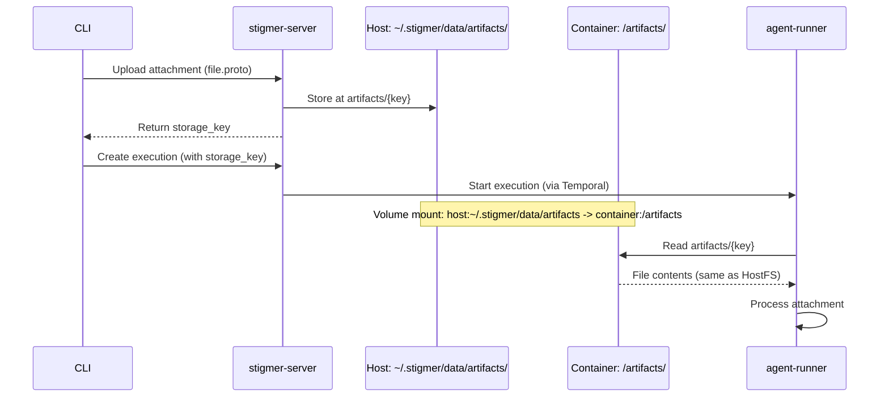

# Fix Agent-Runner Artifact Storage Permission Error

## Problem Analysis

There are **two distinct issues** at play:

### Issue 1: Filesystem Isolation (Primary)

The agent-runner container and stigmer-server are trying to access artifacts from **different filesystems**:


| Component      | Path                      | Location                                           |
| -------------- | ------------------------- | -------------------------------------------------- |
| stigmer-server | `~/.stigmer/artifacts/`   | Host filesystem                                    |
| agent-runner   | `/var/stigmer/artifacts/` | Container filesystem (doesn't exist, can't create) |


When the CLI uploads an attachment via `stigmer draft skill --attach file.proto`:

1. CLI sends file to stigmer-server
2. stigmer-server stores at `~/.stigmer/artifacts/{storage_key}`
3. agent-runner tries to read from `/var/stigmer/artifacts/{storage_key}` - **file not found** or **permission denied**

### Issue 2: status_builder Scoping Bug (Secondary)

When an early exception occurs (before line 735 in [execute_graphton.py](backend/services/agent-runner/worker/activities/execute_graphton.py)), the error handler tries to use `status_builder` which was never initialized:

```python
# Line 735 - status_builder assigned HERE
status_builder = StatusBuilder(execution_id, execution.status, approval_config)

# Lines 535-561 - Attachment injection happens BEFORE status_builder
# If this fails, exception goes to the except block which uses status_builder
```

---

## Proposed Solution

### Part 1: Mount Artifact Directory (daemon.go)

Add a volume mount for artifacts in the Docker run command, and pass `LOCAL_ARTIFACT_PATH` environment variable pointing to the mounted path inside the container.

**File:** [daemon.go](client-apps/cli/internal/cli/daemon/daemon.go)

Changes:

1. Create artifacts directory alongside workspace: `~/.stigmer/data/artifacts/`
2. Add volume mount: `-v ~/.stigmer/data/artifacts:/artifacts`
3. Add env var: `-e LOCAL_ARTIFACT_PATH=/artifacts`
4. Add env var: `-e LOCAL_ARTIFACT_SERVE_URL=http://host.docker.internal:7234/api/v1/artifacts`

**Note:** The serve URL needs to point to stigmer-server's artifact endpoint, which runs on port 7234.

### Part 2: Align stigmer-server Artifact Path

**File:** [config.go](backend/services/stigmer-server/pkg/config/config.go)

The stigmer-server currently defaults to `~/.stigmer/artifacts`. This should be changed to `~/.stigmer/data/artifacts` for consistency with other data directories (workspace, logs, etc.).

This requires updating:

1. `defaultArtifactPath()` to return `~/.stigmer/data/artifacts`
2. Ensure the directory is created during server startup

### Part 3: Fix status_builder Scoping Bug

**File:** [execute_graphton.py](backend/services/agent-runner/worker/activities/execute_graphton.py)

Initialize `status_builder` to `None` at the start of `_execute_graphton_impl`, and check for its existence in the error handler:

```python
async def _execute_graphton_impl(...):
    status_builder = None  # Initialize early
    
    try:
        # ... existing code ...
        status_builder = StatusBuilder(...)  # Assigned later
        # ...
    except Exception as e:
        if status_builder is not None:
            # Use status_builder for rich error reporting
            status_builder.current_status.messages.append(error_msg)
            status_builder.finalize_context_info()
            status_builder.current_status.phase = ExecutionPhase.EXECUTION_FAILED
            return status_builder.current_status
        else:
            # Fall back to minimal error status (similar to outer handler)
            return _create_minimal_failed_status(execution_id, str(e))
```

---

## Data Flow After Fix




---

## Files to Modify

1. **[daemon.go](client-apps/cli/internal/cli/daemon/daemon.go)** - Add volume mount and env vars
2. **[config.go](backend/services/stigmer-server/pkg/config/config.go)** - Change default artifact path to `~/.stigmer/data/artifacts`
3. **[execute_graphton.py](backend/services/agent-runner/worker/activities/execute_graphton.py)** - Fix status_builder scoping

---

## Testing Plan

1. **Unit test:** Verify artifact path resolution in agent-runner
2. **Integration test:**
  - `stigmer server start`
  - `stigmer draft skill --attach file.proto -m "Create a skill"`
  - Verify no permission errors in `docker logs stigmer-agent-runner`
3. **Manual verification:** Check that the mounted directory is accessible inside container

---

## Alternative Considered: Using Workspace Directory

The issue doc suggested using `/workspace/artifacts` since `/workspace` is already mounted. However, this mixes concerns:

- `/workspace` is for agent execution sandboxes (temporary, per-execution)
- `/artifacts` is for persistent attachment storage (shared across executions)

Keeping them separate maintains cleaner semantics and allows different retention policies.

---

## Risks and Mitigations


| Risk                                                    | Mitigation                                                                    |
| ------------------------------------------------------- | ----------------------------------------------------------------------------- |
| Existing users have artifacts in `~/.stigmer/artifacts` | Add migration: symlink or move existing artifacts                             |
| Container restart loses volume reference                | Volume mount is persistent; use `--restart unless-stopped` (already in place) |
| Host directory permissions                              | Create with `0755` before starting container                                  |


