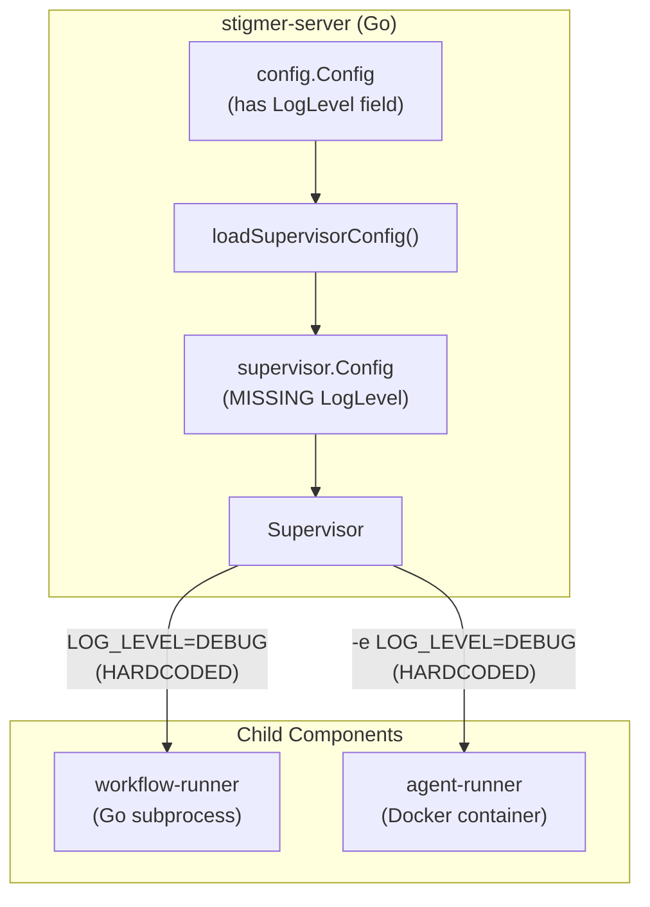

# Fix Debug Log Propagation via Supervisor Config

## Root Cause

The debug logs flooding the Agent Runner output are caused by **two hardcoded `LOG_LEVEL=DEBUG` values** in the supervisor that launches child components:

- [supervisor.go](backend/services/stigmer-server/pkg/supervisor/supervisor.go) **line 176**: `"LOG_LEVEL=DEBUG"` for the workflow-runner subprocess
- [supervisor.go](backend/services/stigmer-server/pkg/supervisor/supervisor.go) **line 286**: `"-e", "LOG_LEVEL=DEBUG"` for the agent-runner Docker container

These override the Dockerfile default (`LOG_LEVEL=INFO`) and the agent-runner's own `logging_config.py`, which already correctly reads `LOG_LEVEL` from the environment and defaults to INFO.

The existing per-component logging infrastructure is already well-designed:

- **agent-runner** (Python): [logging_config.py](backend/services/agent-runner/worker/logging_config.py) reads `LOG_LEVEL` env var, defaults to INFO, pins third-party libraries to WARNING/INFO
- **workflow-runner** (Go): [root.go](backend/services/workflow-runner/cmd/worker/root.go) reads `LOG_LEVEL` via viper, defaults to INFO

The problem is purely in the supervisor not propagating a configurable value.

## Architecture




## Plan

### 1. Add `LogLevel` field to `supervisor.Config`

In [supervisor.go](backend/services/stigmer-server/pkg/supervisor/supervisor.go), add `LogLevel string` to the `Config` struct (around line 58).

### 2. Propagate `LogLevel` in `loadSupervisorConfig()`

In [server.go](backend/services/stigmer-server/pkg/server/server.go) at line 532, add `LogLevel` to the config construction. Use `cfg.LogLevel` (which already reads from `LOG_LEVEL` env var, defaulting to "info" -- see [config.go](backend/services/stigmer-server/pkg/config/config.go) line 42).

```go
LogLevel: strings.ToUpper(cfg.LogLevel),
```

### 3. Replace hardcoded DEBUG in `startWorkflowRunner()`

In [supervisor.go](backend/services/stigmer-server/pkg/supervisor/supervisor.go) line 176, change:

```go
// Before:
"LOG_LEVEL=DEBUG",

// After:
fmt.Sprintf("LOG_LEVEL=%s", s.config.LogLevel),
```

### 4. Replace hardcoded DEBUG in `startAgentRunner()`

In [supervisor.go](backend/services/stigmer-server/pkg/supervisor/supervisor.go) line 286, change:

```go
// Before:
"-e", "LOG_LEVEL=DEBUG",

// After:
"-e", fmt.Sprintf("LOG_LEVEL=%s", s.config.LogLevel),
```

### 5. Fix local kustomize overlay default

In [_kustomize/overlays/local/service.yaml](backend/services/agent-runner/_kustomize/overlays/local/service.yaml) line 13, change `LOG_LEVEL: DEBUG` to `LOG_LEVEL: INFO`. This overlay is for local Kubernetes development and should also default to INFO.

## Files Changed (4 files)

- [backend/services/stigmer-server/pkg/supervisor/supervisor.go](backend/services/stigmer-server/pkg/supervisor/supervisor.go) -- add `LogLevel` to Config, use it in both start functions
- [backend/services/stigmer-server/pkg/server/server.go](backend/services/stigmer-server/pkg/server/server.go) -- propagate `cfg.LogLevel` into supervisor config
- [backend/services/agent-runner/_kustomize/overlays/local/service.yaml](backend/services/agent-runner/_kustomize/overlays/local/service.yaml) -- change DEBUG to INFO

## Usage After Fix

- **Default behavior** (no env var set): All components run at INFO level -- no debug logs
- **Enable debug when needed**: Set `LOG_LEVEL=DEBUG` on stigmer-server, which cascades to all children
- **Per-component override**: Still possible by setting `LOG_LEVEL` directly on a specific component's environment (e.g., Docker), but the supervisor provides the default

## What We Are NOT Changing

- The Python [logging_config.py](backend/services/agent-runner/worker/logging_config.py) -- it is already correct; it reads `LOG_LEVEL` and defaults to INFO
- The Go workflow-runner logging -- it already reads `LOG_LEVEL` and defaults to INFO
- Any debug log statements themselves -- they remain in code, just gated by the log level as intended
- The third-party library suppression in `logging_config.py` -- those are correctly pinned regardless of root level

