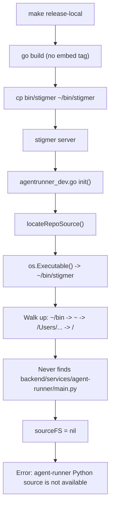

# Fix dev-mode agent-runner source detection

## Root Cause

`make release-local` copies the CLI binary to `~/bin/stigmer`, but the dev-mode source detection in `[agentrunner_dev.go](client-apps/cli/embedded/agentrunner/agentrunner_dev.go)` finds the source by walking up from `os.Executable()`. Since `~/bin/` is outside the repo tree, the walk never reaches `backend/services/agent-runner/main.py`, so `sourceFS` remains `nil`.




## Fix: Inject source path via `-ldflags` at build time

This follows the **exact same pattern** already used by `[version.go](client-apps/cli/embedded/version.go)` for `buildVersion`. The Makefile knows the repo root at build time, so we inject it into the binary.

### File 1: `[client-apps/cli/embedded/agentrunner/agentrunner_dev.go](client-apps/cli/embedded/agentrunner/agentrunner_dev.go)`

- Add `var devSourceDir string` (set via `-ldflags` during local builds)
- In `locateRepoSource()`, check `devSourceDir` first before walking up from the executable
- Keep the existing exe-walk as a fallback (still useful if binary happens to be inside the repo tree)
- Keep the existing `STIGMER_AGENT_RUNNER_SOURCE_DIR` env var as the final fallback

Priority order:

1. `devSourceDir` (ldflags-injected, set by `make release-local`)
2. Walk up from `os.Executable()` (works when binary is in repo tree)
3. `STIGMER_AGENT_RUNNER_SOURCE_DIR` env var (manual override)

### File 2: `[Makefile](Makefile)` (root)

- Add an `AGENT_RUNNER_LDFLAGS` variable that sets `devSourceDir` to `$(CURDIR)/backend/services/agent-runner`
- Update `release-local` target to pass `-ldflags` to `go build`
- Leave `build` target unchanged (it's a quick dev build that runs from repo root anyway)

The ldflags value:

```
-X github.com/stigmer/stigmer/client-apps/cli/embedded/agentrunner.devSourceDir=$(CURDIR)/backend/services/agent-runner
```

## What this does NOT change

- `build-release` / production builds: Unaffected (uses `embed_agentrunner` tag, `agentrunner_dev.go` not compiled)
- CI pipeline: Unaffected (uses `sync.sh` + `-tags embed_agentrunner`)
- `agentrunner_embed.go`: Not touched
- Dev workflow: Python source is still resolved live from the repo tree (no need to rebuild for Python-only changes)

## Verification

After the fix: `make release-local && stigmer server` should proceed past the "Bootstrapping Python runtime" phase without the source-not-available error.