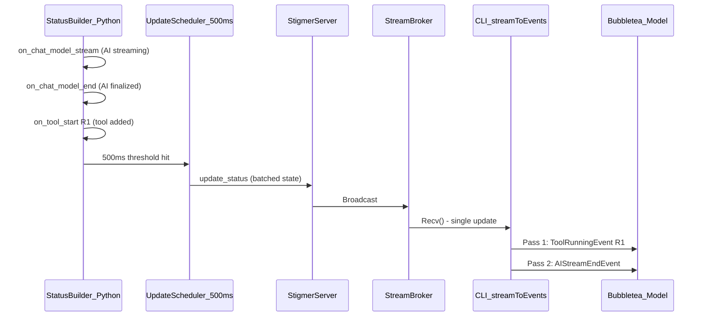

# Fix Duplicate Agent Messages in CLI Execution TUI

## Root Cause Analysis

### The Bug: Streaming Block Misidentification

The duplicate message bug is caused by a **single flawed assumption** in the TUI event handlers: that the streaming AI block is always the last block in `m.blocks`. This assumption is violated by the architecture's two-pass event processing.

### How Events Flow




### The Critical Sequence

Within a single `Recv()` iteration in `[run_stream_events.go](client-apps/cli/cmd/stigmer/root/run_stream_events.go)`:

1. `**emitToolCallStateEvents` runs FIRST** (line 84) -- diffs `tool_calls[]` and emits ToolRunningEvent for new tools
2. `**emitMessageEvents` runs SECOND** (line 92) -- processes the messages cursor and emits AIStreamDelta/EndEvent

The TUI processes these events sequentially from the channel:

```
Step 1: ToolRunningEvent R1
  -> updateToolBadge() appends new block
  -> blocks = [StreamingAI(idx=0), ToolR1(idx=1)]

Step 2: AIStreamDeltaEvent (or AIStreamEndEvent)
  -> m.blocks[len(m.blocks)-1]  // targets blocks[1] = ToolR1!
  -> ToolR1 block content overwritten with AI text
  -> blocks = [StreamingAI(idx=0, stale), AI_content(idx=1, was ToolR1)]
```

**Result**: The user sees the AI text at its original position (stale streaming block) AND at the tool block's position (overwritten) -- the "duplicate agent message". The tool block disappears.

### Why the 500ms Batching Guarantees This Bug

The agent-runner uses a **hybrid update scheduler** (line 2268-2269 of `[execute_graphton.py](backend/services/agent-runner/worker/activities/execute_graphton.py)`) that batches status updates at 500ms intervals. In LangGraph's event stream, `on_chat_model_end` and `on_tool_start` typically happen within milliseconds of each other. They almost always land in the same 500ms batch, meaning the CLI receives a single update where the AI message is finalized AND new tool calls exist -- triggering this bug on nearly every LLM turn that invokes tools.

### Confirming With the Screenshots

**Screenshot 1** (the Read tool calls):

```
[0] Agent: "I'll create a comprehensive agent-drafter skill..."  <-- original streaming block (stale)
[1] Read: /inputs/agent-api.proto  <-- stateful tool block (correct)
[2] Read: /inputs/agent-spec.proto
[3] Read: /inputs/managing-agents.md
[4] Read: /inputs/example-agent.yaml  <-- THIS block was overwritten by AIStreamEndEvent
                                          then restored by ToolCompletedEvent on next update
[?] Agent: "I'll create..."  <-- the AIStreamEndEvent wrote here, creating duplicate
```

The 4th Read block briefly becomes an AI message duplicate. On subsequent updates, `ToolCompletedEvent` restores it, but the AI content has already been appended as a separate block.

**Screenshot 2** (approval - Write tool):

```
Agent: "Now let me create the CLI reference file:"  <-- streaming block
Agent: "Now let me create the CLI reference file:"  <-- AIStreamEnd overwrote the Write tool block
```

The Write tool's `ToolWaitingApprovalEvent` created a block, then `AIStreamEndEvent` overwrote it with AI text. After approval, `ToolCompletedEvent` restores the Write block.

### Why It Self-Heals After Approval

After approval, the execution resumes and the next `Recv()` triggers `ToolCompletedEvent` for the tool, which calls `updateToolBadge()`. This uses `runningTools[toolCallID]` to find the block by its tracked index and replaces it in-place with proper tool content -- effectively undoing the corruption. This is why the tool calls "appear after approval" as the user described.

## The Fix

### Change 1: Track streaming block index in `streamingState`

In `[model.go](client-apps/cli/pkg/executiontui/model.go)` line 35:

```go
type streamingState struct {
    content  string
    blockIdx int  // index into m.blocks of the streaming AI block
}
```

### Change 2: Set index on stream start, use it in delta/end handlers

In `[handle_events.go](client-apps/cli/pkg/executiontui/handle_events.go)`:

- **AIStreamStartEvent** (line 29): Record `blockIdx` when creating the streaming block
- **AIStreamDeltaEvent** (line 36-37): Use `m.streaming.blockIdx` instead of `len(m.blocks)-1`
- **AIStreamEndEvent** (line 44-45): Use `m.streaming.blockIdx` instead of `len(m.blocks)-1`

### Why This Is Sufficient

- Blocks are never deleted or reordered -- only appended or replaced in-place
- There is at most one active streaming state at any time (enforced by the `inStream` boolean in `streamToEvents`)
- The fix is a 3-line change to the struct + 3 lines in handlers -- no new code paths, no architecture changes
- All existing behavior is preserved; only the block targeting changes from "last" to "tracked index"

## Edge Cases to Verify

- **No tool calls during streaming**: blockIdx = len(blocks)-1 anyway, same behavior as before
- **Multiple tool calls during streaming**: All tool blocks appended after streaming block, delta/end correctly target the original index
- **Reconnection to ongoing execution**: New streamingState is created fresh, blockIdx is correct for the reconnection context
- **Tool streaming (ToolStreamDeltaEvent)**: Already uses `runningTools[toolCallID]` for index tracking (correct pattern)

