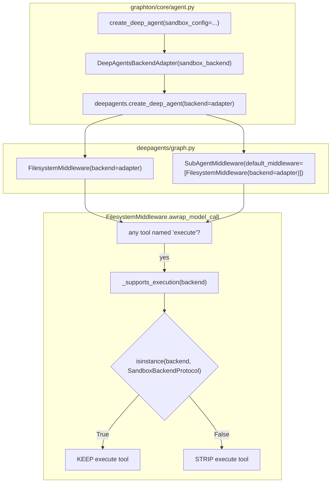

# Bulletproof the Execute Tool: From Duck Typing to Explicit Protocol Inheritance

## Root Cause Analysis

I traced the full execution path end-to-end through 5 source files across graphton and deepagents:




**Verified findings:**

1. The `isinstance(adapter, SandboxBackendProtocol)` check **passes** (empirically confirmed in Python 3.13.3)
2. The adapter file exists and is available to agent-runner via editable install (`graphton.pth`)
3. `sandbox_config` is always populated in `execute_graphton.py` (line 1165, 2002)
4. The code correctly creates the adapter and passes it as `backend` to deepagents
5. `create_agent` merges middleware tools + user tools into `ToolNode.tools_by_name` (last-wins dedup for duplicate names like "execute")

**Most likely cause of persistent failure:** The Temporal worker process was started before the fix was committed. Python caches modules in `sys.modules` at import time. Editable installs point to the right source files, but a running process never re-reads them until restarted.

## Why the Current Fix is Fragile (and Must Be Hardened)

The adapter uses duck typing:

```python
class DeepAgentsBackendAdapter:  # <-- does NOT inherit from SandboxBackendProtocol
    def execute(self, command: str) -> ExecuteResponse: ...
    @property
    def id(self) -> str: ...
    # ... all other protocol methods
```

While `@runtime_checkable` protocol checks work via structural subtyping, this approach has well-documented fragility:

- Python 3.12 changed `isinstance` for protocols to use `inspect.getmembers_static()` instead of `hasattr()` ([CPython issue #103013](https://github.com/python/cpython/issues/103013))
- The existing `_verify_protocol_compliance()` uses `hasattr` -- this is **not** equivalent to what `isinstance()` checks in 3.12+
- Any future Python release or protocol definition change could silently break the check
- Explicit inheritance makes `isinstance` trivially True via MRO, completely bypassing structural checking

## Plan

### 1. Make adapter explicitly inherit from `SandboxBackendProtocol`

**File:** `[backend/libs/python/graphton/src/graphton/core/backends/deepagents_adapter.py](backend/libs/python/graphton/src/graphton/core/backends/deepagents_adapter.py)`

Change:

```python
class DeepAgentsBackendAdapter:
```

To:

```python
class DeepAgentsBackendAdapter(SandboxBackendProtocol):
```

`SandboxBackendProtocol` is already imported. Inheriting from it makes `isinstance` trivially True via normal MRO. The adapter already implements all required methods, so no other changes needed.

Remove `_verify_protocol_compliance()` and its call at module bottom -- explicit inheritance makes it redundant.

### 2. Add runtime assertion and diagnostic logging in `create_deep_agent`

**File:** `[backend/libs/python/graphton/src/graphton/core/agent.py](backend/libs/python/graphton/src/graphton/core/agent.py)`

After creating the adapter (around line 548), add:

- An assertion that `isinstance(deepagents_backend, SandboxBackendProtocol)` is True
- A log line recording the adapter type and protocol compliance

This catches any regression at agent creation time, before the middleware ever runs. It also produces a log entry that confirms the fix is active in a running process.

### 3. Add middleware-level integration test

**File:** `[backend/libs/python/graphton/tests/core/test_deepagents_adapter.py](backend/libs/python/graphton/tests/core/test_deepagents_adapter.py)`

Add a new test class `TestMiddlewareIntegration` that:

- Creates a `FilesystemMiddleware(backend=adapter)`
- Builds a mock `ModelRequest` with an execute tool in `request.tools`
- Calls `wrap_model_call` (sync path)
- Asserts the execute tool is **still present** in the request after middleware processing
- Verifies the system prompt includes `EXECUTION_SYSTEM_PROMPT`

This is the test that would have caught the original bug -- it verifies the execute tool survives the middleware chain, not just that the adapter passes isinstance.

### 4. Update existing test to reflect explicit inheritance

**File:** `[backend/libs/python/graphton/tests/core/test_deepagents_adapter.py](backend/libs/python/graphton/tests/core/test_deepagents_adapter.py)`

- Add a test `test_is_subclass_of_sandbox_backend_protocol` that verifies `issubclass(DeepAgentsBackendAdapter, SandboxBackendProtocol)` -- this is stronger than isinstance and only works with explicit inheritance.
- Remove or update references to `_verify_protocol_compliance` if any tests depend on it.

## Out of Scope (Noted but Not Addressed)

**Tool duplication between graphton and deepagents:** Both layers create overlapping filesystem tools (ls, read_file/read, write_file/write, edit_file/edit, glob, grep, execute). `create_agent` deduplicates by name (last-wins), so graphton's approval-aware tools take precedence. This is intentional and works correctly, but the dead-weight deepagents tools add noise. Addressing this requires either forking deepagents or using `create_agent` directly (bypassing `create_deep_agent`). Both are high-effort, low-payoff changes for now.