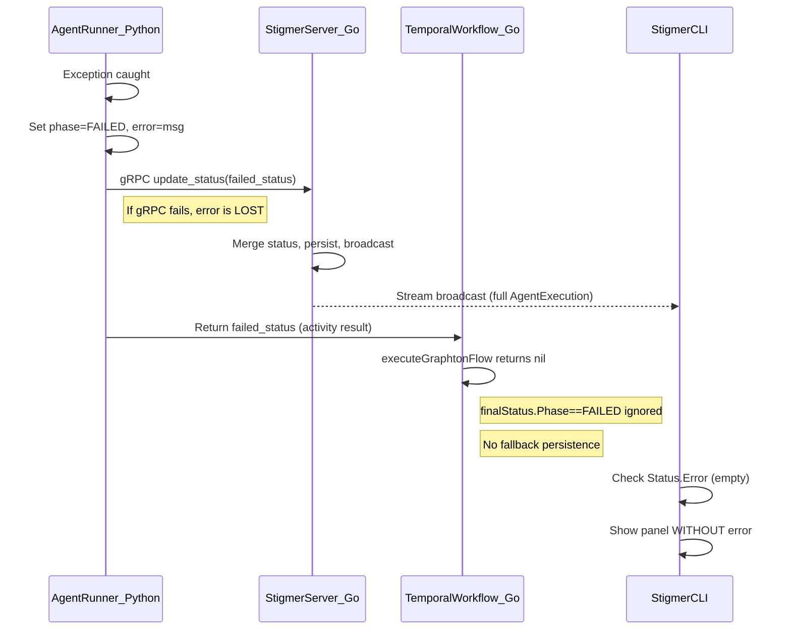

# Fix Agent Execution Error Propagation

## Problem

From the [logs](_cursor/logs.md), execution `aex-01khebew38t20ndxva6nef0zkx` failed but the CLI showed no error reason:

```
✗ ❌ Execution failed

╭─ EXECUTION FAILED ────────────────────────╮
│  Messages:    2                            │
│  Tool calls:  6                            │
│               ls x1, read x5              │
╰────────────────────────────────────────────╯
```

The `Error:` line that should appear at the top of the panel is absent because `execution.Status.Error` was empty.

## Root Cause Analysis

The error propagation chain has **4 backend gaps** (missing `Status.Error`), **1 architectural gap** (workflow discards error), and **1 CLI gap** (no fallback display).

### Error Flow Diagram




### Gap 1 -- Go Workflow `updateStatusOnFailure` missing `Error` field

[invoke_workflow_impl.go](backend/services/stigmer-server/pkg/domain/agentexecution/temporal/workflows/invoke_workflow_impl.go) lines 419-431: Creates `failedStatus` with `Phase=EXECUTION_FAILED` and 2 system messages, but never sets the `Error` field. This path handles system errors (activity timeout, worker unavailable).

```419:431:backend/services/stigmer-server/pkg/domain/agentexecution/temporal/workflows/invoke_workflow_impl.go
	failedStatus := &agentexecutionv1.AgentExecutionStatus{
		Phase: agentexecutionv1.ExecutionPhase_EXECUTION_FAILED,
		Messages: []*agentexecutionv1.AgentMessage{
			{
				Type:    agentexecutionv1.MessageType_MESSAGE_SYSTEM,
				Content: "Internal system error occurred during execution. Please contact support if this issue persists.",
			},
			{
				Type:    agentexecutionv1.MessageType_MESSAGE_SYSTEM,
				Content: fmt.Sprintf("Error details: %s", originalErr.Error()),
			},
		},
	}
```

**Fix**: Add `Error: originalErr.Error()` to the struct literal.

### Gap 2 -- Python REJECT approval path missing `current_status.error`

[status_builder.py](backend/services/agent-runner/worker/activities/graphton/status_builder.py) lines 989-998: On REJECT, sets `tool_call.error` and `current_status.phase=EXECUTION_FAILED` but never sets `current_status.error`.

```989:998:backend/services/agent-runner/worker/activities/graphton/status_builder.py
        elif action == ApprovalAction.APPROVAL_ACTION_REJECT:
            # Tool is rejected - fail the execution
            tool_call.status = ToolCallStatus.TOOL_CALL_FAILED
            tool_call.error = f"Tool execution rejected by {approved_by}"
            tool_call.completed_at = timestamp
            
            # Clear pending state but set phase to FAILED (not restore)
            self._pending_tool_approval = None
            self.current_status.pending_approval.Clear()
            self.current_status.phase = ExecutionPhase.EXECUTION_FAILED
```

**Fix**: Add `self.current_status.error = f"Tool '{tool_call.name}' execution rejected by {approved_by}"` after setting the phase.

### Gap 3 -- Go `reconcileStaleExecution` missing `Error` field

[submit_approval.go](backend/services/stigmer-server/pkg/domain/agentexecution/controller/submit_approval.go) lines 340-347: Builds reconciled execution with `Phase=EXECUTION_FAILED` and a system message, but no `Error` field.

**Fix**: Add `Error: "Workflow backing this execution is no longer running. Execution marked as failed."` to the `AgentExecutionStatus` struct.

### Gap 4 -- Java `reconcileStaleExecution` missing `setError`

[AgentExecutionSubmitApprovalHandler.java](../stigmer-cloud/backend/services/stigmer-service/src/main/java/ai/stigmer/domain/agentic/agentexecution/request/handler/AgentExecutionSubmitApprovalHandler.java) lines 420-432: Same pattern in Java -- sets phase to FAILED, adds system message, but never calls `.setError()`.

**Fix**: Add `.setError("Workflow backing this execution is no longer running. Execution marked as failed.")` to the builder.

### Gap 5 (Architectural) -- Workflow silently discards failed activity result

[invoke_workflow_impl.go](backend/services/stigmer-server/pkg/domain/agentexecution/temporal/workflows/invoke_workflow_impl.go) lines 157-221: When the Python activity returns `finalStatus` with `phase=EXECUTION_FAILED` (activity succeeds from Temporal's perspective but returns a failed domain status), `executeGraphtonFlow` logs "completed" and returns `nil`. The workflow never persists the returned failed status as a fallback. If the Python gRPC call also failed, the error is completely lost.

This is the **most likely cause** of the specific failure in the logs: the Python error handler set the error, but the gRPC call to persist it failed, and the workflow had no fallback to persist it from its side.

**Fix**: After the event stream / approval loop ends, check `finalStatus.Phase`. If it is `EXECUTION_FAILED`, call `updateStatusOnFailure` to ensure the failed state is persisted and broadcast, using `finalStatus.Error` if available. This provides defense-in-depth: the Python gRPC path is the primary, the workflow persistence is the safety net.

### Gap 6 (CLI) -- No fallback error extraction

[run_display_summary.go](client-apps/cli/cmd/stigmer/root/run_display_summary.go) lines 67-72: When `Status.Error` is empty, nothing is shown. But there may be useful error information in other fields (system messages, failed tool calls).

```67:72:client-apps/cli/cmd/stigmer/root/run_display_summary.go
	// Error message (failures only)
	if execution.Status.Phase == agentexecutionv1.ExecutionPhase_EXECUTION_FAILED &&
		execution.Status.Error != "" {
		sections = append(sections, fmt.Sprintf("Error: %s", execution.Status.Error))
		sections = append(sections, "")
	}
```

**Fix**: When `Status.Error` is empty for a FAILED execution, extract a fallback error from:

1. The last system message content (these typically contain error details)
2. Any failed tool call's `.Error` field

Show this with appropriate framing, e.g. `"Error: (details unavailable -- check execution logs)"` as a final fallback so the user always knows to look further.

## Implementation Order

The fixes are independent and can be done in any order. I recommend starting from the backend (source of truth) and finishing with the CLI (display layer), so each layer adds defense-in-depth.