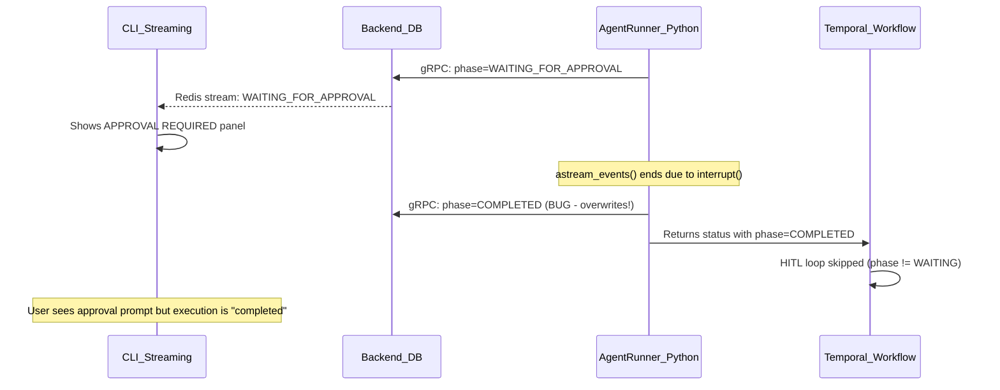

# Fix Execution Status and Approval Panel UX

## Three Issues Discovered

### Issue 1 -- Critical: Execution shows "completed" during approval wait

**Root Cause (agent-runner, Python)**

When a tool requires HITL approval, the flow is:

1. Tool node calls LangGraph `interrupt()`, which pauses the graph at a checkpoint
2. During event streaming, `status_builder` correctly sets `EXECUTION_WAITING_FOR_APPROVAL` and sends it via gRPC to the backend
3. The `astream_events()` generator **naturally ends** (the graph paused, no more events)
4. **Line 1425** of `execute_graphton.py` **unconditionally** sets `EXECUTION_COMPLETED`
5. This COMPLETED status is sent via gRPC to the backend, **overwriting** the WAITING_FOR_APPROVAL
6. The activity returns COMPLETED to the Temporal workflow
7. The Java workflow's HITL loop checks `finalStatus.getPhase() == EXECUTION_WAITING_FOR_APPROVAL` -- it sees COMPLETED, so the loop **never enters**
8. Workflow completes prematurely

The CLI received the earlier WAITING_FOR_APPROVAL update via its streaming subscription and shows the approval prompt, but the backend has already moved to COMPLETED. When the user runs `stigmer get execution`, it reads from the DB and shows "completed".




**Fix**: Guard the phase transition at line 1425 in [execute_graphton.py](backend/services/agent-runner/worker/activities/execute_graphton.py). Do not set COMPLETED if the current phase is `EXECUTION_WAITING_FOR_APPROVAL` (or `EXECUTION_PAUSED`, for consistency).

```python
# Before (line 1425):
status_builder.current_status.phase = ExecutionPhase.EXECUTION_COMPLETED

# After:
if status_builder.current_status.phase == ExecutionPhase.EXECUTION_WAITING_FOR_APPROVAL:
    activity_logger.info(
        f"Stream ended with WAITING_FOR_APPROVAL phase for execution {execution_id}. "
        f"Not setting COMPLETED - execution is paused at interrupt checkpoint."
    )
elif status_builder.current_status.phase == ExecutionPhase.EXECUTION_PAUSED:
    activity_logger.info(
        f"Stream ended with PAUSED phase for execution {execution_id}. "
        f"Not setting COMPLETED - execution is paused at checkpoint."
    )
else:
    status_builder.current_status.phase = ExecutionPhase.EXECUTION_COMPLETED
```

The COMPLETED gRPC update (lines 1427-1453) should also be guarded to only send when the phase actually changed to COMPLETED. When in WAITING_FOR_APPROVAL, we still want the final status update sent (to ensure the latest messages/tool_calls are persisted), but the phase should remain WAITING_FOR_APPROVAL.

---

### Issue 2 -- UX: Long text overflows approval panel border

**Root Cause (CLI, Go)**

In [panel.go](client-apps/cli/pkg/panel/panel.go) line 142-151, `renderContentRow()` does not wrap long lines. When content exceeds `contentWidth` (panel width minus borders and padding), `rightPad` is set to 0 and the content extends beyond the right border:

```
| command: cd /workspace && python /bin/skills/a34ed6ddb7e2...init_skill.py agent-drafter --path /workspace    |
```

The right `|` border appears at the correct position but the text visually overflows it, breaking the panel visual.

**Fix**: Add word wrapping to the panel renderer. This is the architecturally correct location because:

- The panel is a generic reusable component (`pkg/panel/`)
- The caller should not need to know about terminal width constraints
- All panels (approval, summary, future panels) benefit from this

The approach:

- Add a `wrapText(text string, maxWidth int) []string` function to `panel.go` that wraps long lines at word boundaries
- Modify `Render()` to wrap each content line before rendering
- For lines without natural word break points (e.g., long file paths, URLs), break at `maxWidth` with no hyphen -- these are technical strings where mid-word breaks are acceptable

Additionally, the approval formatter in [formatter.go](client-apps/cli/pkg/approval/formatter.go) should remain unaware of panel width. The panel handles wrapping; the formatter handles semantics.

---

### Issue 3 -- Minor: "Waiting for: unknown" timestamp

**Root Cause (agent-runner, Python)**

The `_populate_pending_approval()` in [status_builder.py](backend/services/agent-runner/worker/activities/graphton/status_builder.py) uses `datetime.utcnow().isoformat()` which produces `2026-02-14T15:28:48.123456` (no timezone suffix). Go's `time.Parse(time.RFC3339, ...)` in [run_display_approval.go](client-apps/cli/cmd/stigmer/root/run_display_approval.go) line 80 requires either `Z` or `+00:00` suffix. The parse fails, and `formatWaitingDuration()` returns "unknown".

Notably, line 1513 of `status_builder.py` already does `datetime.utcnow().isoformat() + "Z"` for summarization events, proving this is an inconsistency.

**Fix (two-sided, defense-in-depth)**:

1. **Python side**: Add a `_utc_timestamp()` helper in `status_builder.py` that consistently produces RFC3339 timestamps (`datetime.utcnow().isoformat() + "Z"`). Replace all bare `datetime.utcnow().isoformat()` calls.
2. **Go side**: Make `formatWaitingDuration()` in `run_display_approval.go` try both `time.RFC3339` and `time.RFC3339Nano`, and also fall back to parsing without timezone (`2006-01-02T15:04:05`). This ensures the CLI is resilient to various timestamp formats from the backend.

---

## Files Changed

**Backend (agent-runner)**:

- [execute_graphton.py](backend/services/agent-runner/worker/activities/execute_graphton.py) -- Guard phase transition at line 1425
- [status_builder.py](backend/services/agent-runner/worker/activities/graphton/status_builder.py) -- Add `_utc_timestamp()` helper, fix all bare `.isoformat()` calls

**CLI**:

- [panel.go](client-apps/cli/pkg/panel/panel.go) -- Add text wrapping in `Render()`
- [run_display_approval.go](client-apps/cli/cmd/stigmer/root/run_display_approval.go) -- Lenient timestamp parsing in `formatWaitingDuration()`

