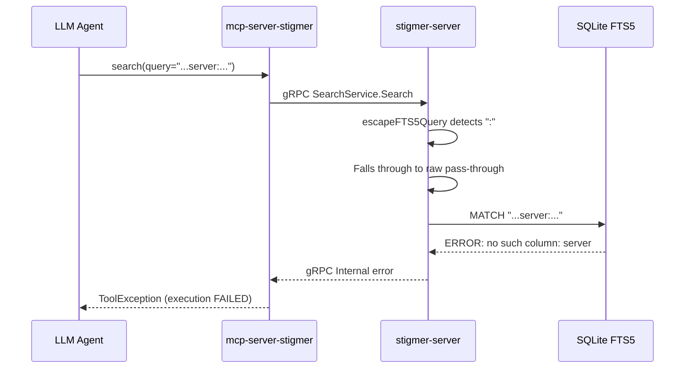

# Fix FTS5 Query Escaping in Search Tool

## Root Cause Analysis

The error `SQL logic error: no such column: server (1)` originates from the FTS5 MATCH expression, not from a regular SQL column reference.

The `search_index` FTS5 virtual table has these columns:

```286:297:backend/libs/go/store/sqlite/store.go
		CREATE VIRTUAL TABLE IF NOT EXISTS search_index USING fts5(
			kind,
			resource_id UNINDEXED,
			name,
			description,
			tags,
			org UNINDEXED,
			visibility UNINDEXED,
			created_at UNINDEXED,
			tokenize='porter unicode61'
		);
```

There is no `server` column. The error occurs because in FTS5 query syntax, `column:term` means "search for term in column". When an LLM agent passes a query containing a colon (e.g., `server:skill-creator` or similar), FTS5 interprets `server` as a column name filter.

## The Bug

In `[sqlite_search_query_store.go](backend/services/stigmer-server/pkg/query/search/store/sqlite_search_query_store.go)`, the `escapeFTS5Query` function has a flawed escaping strategy:

```429:456:backend/services/stigmer-server/pkg/query/search/store/sqlite_search_query_store.go
func escapeFTS5Query(query string) string {
	query = strings.TrimSpace(query)
	if query == "" {
		return query
	}

	if !strings.ContainsAny(query, `"*-^:(){}[]`) &&
		!strings.Contains(query, " AND ") &&
		!strings.Contains(query, " OR ") &&
		!strings.Contains(query, " NOT ") &&
		!strings.Contains(query, " NEAR ") {
		words := strings.Fields(query)
		if len(words) == 1 {
			return query + "*"
		}
		return strings.Join(words, " ")
	}

	// Complex query - let FTS5 parse it directly
	return query
}
```

The logic is **inverted from a safety perspective**: when it detects special characters (`:`, `-`, `*`, etc.), it passes the query **raw** to FTS5. This is the opposite of what it should do -- special characters are exactly when more escaping is needed. The "complex query" comment suggests this was designed to support advanced query syntax, but in this system the queries come from LLM agents, not power users with FTS5 knowledge.

## Error Flow




## Fix

Rewrite `escapeFTS5Query` to **always sanitize** the query by quoting individual terms. In FTS5, double-quoted strings are treated as literal text -- the tokenizer still applies inside quotes, but operator syntax (column filters, NOT, NEAR, etc.) is disabled.

The approach:

1. Split the query into whitespace-separated words
2. For each word, strip embedded double-quotes (which would break FTS5 quoting) and wrap in double quotes
3. Join with spaces (FTS5 implicit AND)
4. For single words, add `*` suffix for prefix matching (still works on quoted terms in FTS5)

This is the correct approach because:

- Queries come from LLM agents, not power users with FTS5 knowledge -- there is no legitimate use of raw FTS5 syntax
- Quoting prevents all FTS5 operator interpretation while the tokenizer (`porter unicode61`) still does its job inside quotes
- It completely eliminates the class of injection-like errors (column references, NOT operators, NEAR, etc.)
- It preserves the existing behavior for simple queries (single word prefix matching, multi-word AND)

## Files to Change

1. `**[sqlite_search_query_store.go](backend/services/stigmer-server/pkg/query/search/store/sqlite_search_query_store.go)`** -- Rewrite `escapeFTS5Query` to always quote individual terms
2. `**[sqlite_search_query_store_test.go](backend/services/stigmer-server/pkg/query/search/store/sqlite_search_query_store_test.go)`** -- Update `TestEscapeFTS5Query` with new expected outputs and add test cases for the failing scenarios (queries with colons, dashes, mixed special characters)

