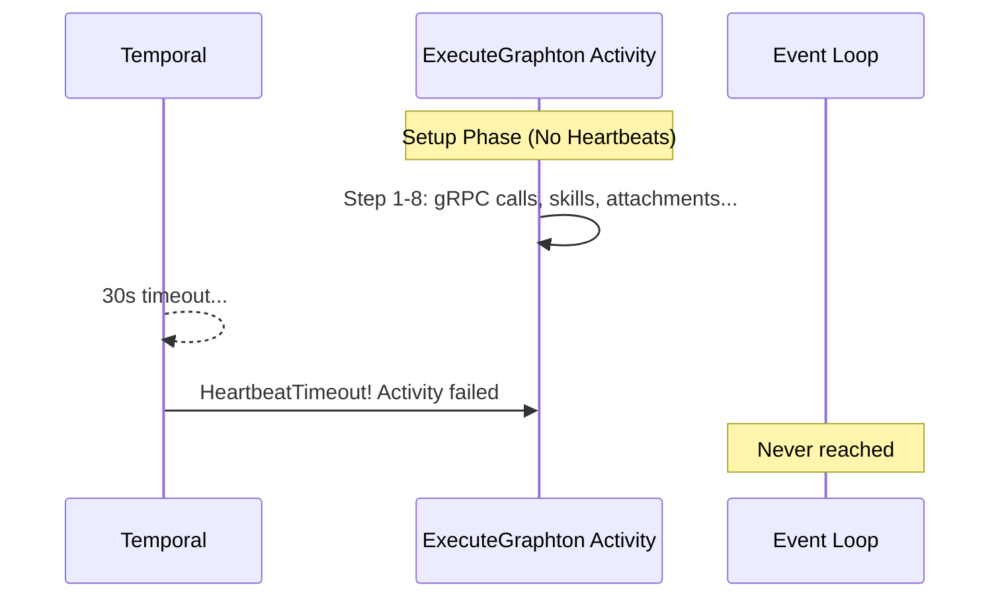

# Fix ExecuteGraphton Heartbeat Timeout

## Problem

The `stigmer draft skill` command fails with:

```
activity 'ExecuteGraphton' failed: Activity stopped sending heartbeat (worker may have crashed)
```

**Root Cause**: Heartbeats are only sent inside the `astream_events` loop (line ~1197), but the setup phase (lines 300-1195) runs **without any heartbeats**. If setup exceeds 30 seconds (the `HeartbeatTimeout`), Temporal marks the activity as failed.




## Setup Phase Operations (No Heartbeats)

In [execute_graphton.py](backend/services/agent-runner/worker/activities/execute_graphton.py):

- **Step 1** (lines 320-346): Resolve execution chain via gRPC
- **Step 3** (lines 500-570): Fetch and write skills
- **Step 3.5** (lines 572-608): Download and inject attachments (5 files in this case)
- **Step 4** (lines 610-695): Merge environment variables
- **Step 5** (lines 697-753): Fetch and transform MCP servers
- **Step 6** (lines 838-1054): Create Graphton agent

Each step involves gRPC calls, file I/O, or network operations that can take seconds.

## Solution

Add periodic heartbeats throughout the setup phase using a helper function:

```python
async def heartbeat_during_setup(phase_name: str, details: dict | None = None):
    """Send heartbeat with setup phase info to prevent timeout during initialization."""
    activity.heartbeat({
        "setup_phase": phase_name,
        "details": details or {},
    })
```

Insert heartbeat calls at key points:

1. After Step 1 (chain resolution)
2. After Step 3 (skill writing)
3. After Step 3.5 (attachment injection)
4. After Step 4 (environment merge)
5. After Step 5 (MCP server transform)
6. After Step 6 (agent creation)

## Files to Modify


| File                                                                                       | Change                                 |
| ------------------------------------------------------------------------------------------ | -------------------------------------- |
| [execute_graphton.py](backend/services/agent-runner/worker/activities/execute_graphton.py) | Add heartbeat calls during setup phase |


## Alternative: Background Heartbeat Task

For more robust handling, consider a background task that sends heartbeats every 5-10 seconds regardless of what the main code is doing:

```python
async def _heartbeat_loop(interval_seconds: float = 5.0):
    """Background task that sends heartbeats at regular intervals."""
    while True:
        await asyncio.sleep(interval_seconds)
        activity.heartbeat({"phase": "setup", "keepalive": True})
```

This would be started before setup and cancelled when the event loop begins. This is more robust but adds complexity.

## Recommendation

Start with the simpler approach (explicit heartbeat calls after each major step). It's transparent, easy to debug, and the heartbeat payloads provide visibility into which step is slow.