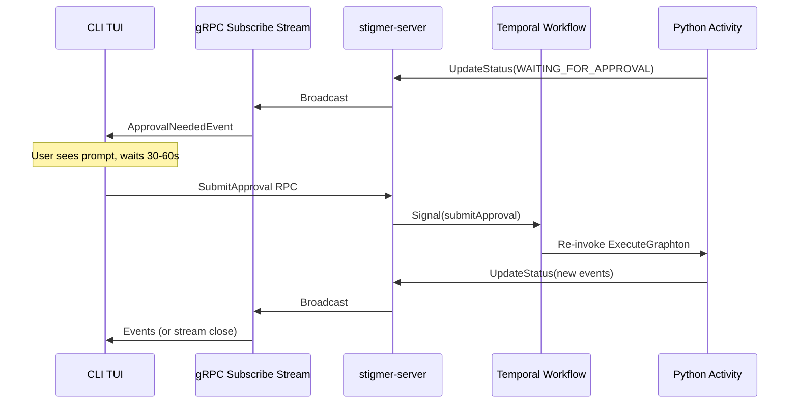

# Fix HITL Approval Stream Closure and Error Handling

## Problem Analysis

After the recent alias-resolution fix (which correctly fixed approval detection), a new issue surfaces when the user **waits 30-60 seconds before approving**: the CLI shows "Stream closed unexpectedly" followed by "Execution failed: size_bytes".

The error output from `_cursor/error.md`:

```
APPROVAL REQUIRED
  Write file: /bin/skills/agent-drafter/SKILL.md
  [a] Approve   [s] Skip   [r] Reject

Approved: write
Stream closed unexpectedly
Execution failed: size_bytes
Execution failed
```

I traced through every layer of the system (CLI TUI, gRPC stream, Go subscribe handler, StreamBroker, Temporal workflow, Python activity). The architecture is:




## Bug 1 (Confirmed): Double `listenForEvents` Race Condition

**Root cause**: Two Bubbletea goroutines compete for events from the same Go channel, causing non-deterministic behavior.

**Trace**:

1. `ApprovalNeededEvent` is received by `handleExecutionEvent` (`[handle_events.go](client-apps/cli/pkg/executiontui/handle_events.go)`)
2. `handleExecutionEvent` returns `listenForEvents(m.cfg.Events)` -- **Listener A starts** (line 152)
3. Listener A blocks on `<-ch`, waiting for the next event
4. User presses `a` -- `handleApprovalKey` runs (`[approval.go](client-apps/cli/pkg/executiontui/approval.go)`)
5. Line 59 returns `tea.Batch(sendCmd, listenForEvents(m.cfg.Events))` -- **Listener B starts**

Now **two goroutines** are reading from the same channel:

```
Listener A: <-events  (from step 2)
Listener B: <-events  (from step 5)
```

When the stream goroutine sends a `DoneEvent` (or `StreamErrorEvent`) and closes the channel:

- One listener gets the event, the other gets the channel close
- Go's scheduler decides which gets what -- non-deterministic
- If Listener B gets the close signal first, `streamClosedMsg` is processed before the actual event
- Result: "Stream closed unexpectedly" instead of the proper terminal event

**Fix**: Remove `listenForEvents` from `handleApprovalKey`. Listener A from step 2 is already active and will receive the next event when it arrives. Only `sendCmd` needs to be issued.

In `[approval.go](client-apps/cli/pkg/executiontui/approval.go)` line 59, change:

```go
return m, tea.Batch(sendCmd, listenForEvents(m.cfg.Events))
```

to:

```go
return m, sendCmd
```

This is safe because:

- Listener A is still alive in a Bubbletea goroutine, blocking on `<-ch`
- After `sendCmd` sends the approval response, the stream goroutine unblocks and continues
- When the next event arrives in the channel, Listener A receives it
- Normal event processing resumes

## Bug 2 (Confirmed): Approval Submission Errors Silently Discarded

In `[run_stream_events.go](client-apps/cli/cmd/stigmer/root/run_stream_events.go)` line 373:

```go
_, _ = submitAgentApproval(ctx, cfg.conn, cfg.executionID, toolCallID, decision)
```

Both return values are discarded. If the approval submission fails (network error, timeout, etc.), the CLI silently continues calling `stream.Recv()` -- but the backend never received the approval. The execution stays stuck in `WAITING_FOR_APPROVAL` indefinitely, and the CLI eventually gets a stream closure.

**Fix**: Log the error and emit a `StreamErrorEvent` so the user gets actionable feedback.

## Bug 3 (Needs Investigation): "Execution failed: size_bytes"

This error comes from the Python activity's exception handler at `[execute_graphton.py](backend/services/agent-runner/worker/activities/execute_graphton.py)` line 2566-2567:

```python
error_str = str(e)
error_message = f"Execution failed: {error_str}"
```

The exception's string representation is literally `"size_bytes"`. This is cryptic -- it could be:

- A proto field validation error during Temporal payload serialization
- An `AttributeError` accessing `size_bytes` on a malformed artifact object
- A Temporal codec issue with the `ExecutionArtifact.size_bytes` field

The current error handler only captures `str(e)`, losing the exception type and traceback. This makes diagnosis of such issues extremely difficult.

**Fix**: Enhance the error handler to capture the full exception context:

- Log the exception type (`type(e).__name__`)
- Log the full traceback (`traceback.format_exc()`)
- Include the exception type in the error message for better diagnostics
- This will make future occurrences of this class of error diagnosable without needing to reproduce

**Next step for definitive diagnosis**: After deploying the enhanced logging, reproduce the issue and check the agent-runner logs for the full traceback. The bare string `"size_bytes"` is insufficient to pinpoint the root cause with certainty.

## Files to Change

1. `**[client-apps/cli/pkg/executiontui/approval.go](client-apps/cli/pkg/executiontui/approval.go)**` -- Remove duplicate `listenForEvents` from `handleApprovalKey`
2. `**[client-apps/cli/cmd/stigmer/root/run_stream_events.go](client-apps/cli/cmd/stigmer/root/run_stream_events.go)**` -- Handle approval submission errors in `emitAndWaitApproval`
3. `**[backend/services/agent-runner/worker/activities/execute_graphton.py](backend/services/agent-runner/worker/activities/execute_graphton.py)**` -- Enhance error handler with full traceback and exception type

