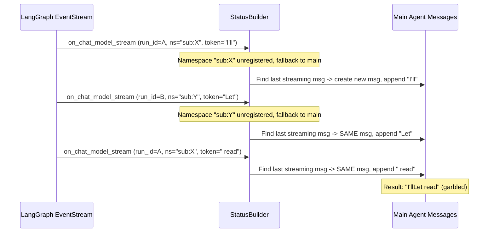
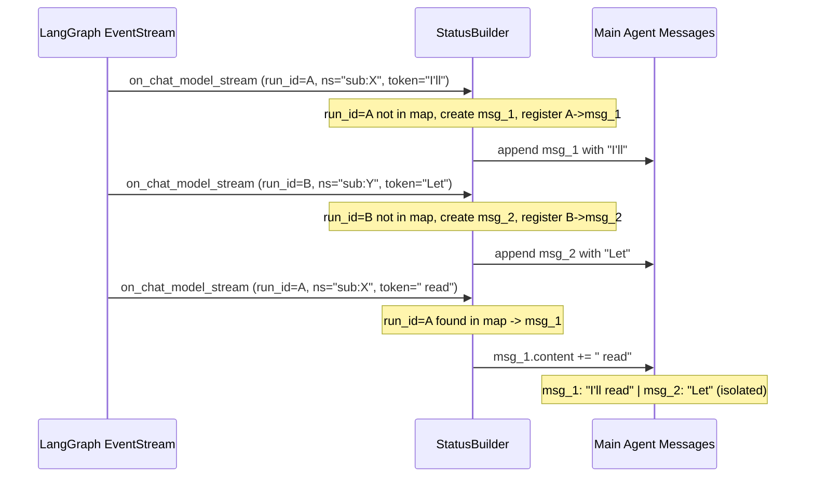

# Fix LLM Stream Token Interleaving in StatusBuilder

## Problem

When running `stigmer draft skill` with multiple `--attach` directories, the agent creates parallel sub-agents (via `task` tool calls) to read files from each directory. The output shows garbled, mixed text like:

> "I'll read Let me start by reading all them all at once.7 files."

This is two separate LLM responses being interleaved token-by-token into the same `AgentMessage`.

## Root Cause Analysis

The bug is in `[status_builder.py](backend/services/agent-runner/worker/activities/graphton/status_builder.py)`, with two contributing factors:

### Factor 1: No `run_id` tracking for LLM streams (primary bug)

`_handle_chat_model_stream_event()` (lines 593-686) identifies the target message by scanning backwards for "the last streaming AI message":

```653:663:backend/services/agent-runner/worker/activities/graphton/status_builder.py
        ai_message = None
        for idx in range(len(messages_list) - 1, -1, -1):
            message = messages_list[idx]
            if message.type == MessageType.MESSAGE_AI and message.is_streaming:
                ai_message = message
                break
```

When two concurrent LLM streams both resolve to the same `messages_list`, they find and append tokens to the **same** message, producing garbled output. Tool calls already use `run_id` for precise routing (line 282, 458), but the chat model handler does not.

### Factor 2: Namespace fallback silently leaks sub-agent events to main agent

`_get_execution_context()` (lines 1652-1677) falls back to the main agent when a namespace isn't registered:

```1676:1677:backend/services/agent-runner/worker/activities/graphton/status_builder.py
        # Namespace not yet registered - fall back to main agent
        return self.current_status, None
```

If the `deepagents` library's sub-agent namespaces don't contain the `task` tool's `run_id` as a substring (the matching logic at line 1698), the fallback triggers and both sub-agents' LLM tokens drain into `self.current_status.messages` -- where they share the same "last streaming" message.

### Data Flow (broken path)




## Fix: `run_id`-Based LLM Message Tracking

Add a `run_id` -> message mapping (same pattern already proven for tool calls), so each LLM invocation always writes to its own dedicated `AgentMessage`, regardless of namespace routing.

### Changes in `[status_builder.py](backend/services/agent-runner/worker/activities/graphton/status_builder.py)`

**1. New instance state** (in `__init__`, around line 120):

- Add `_llm_run_id_to_message_key: dict[str, tuple[str, int]]` -- maps LLM `run_id` to `(namespace_key, message_index)` where `namespace_key` is the resolved context identifier and `message_index` is the position in the messages list.

**2. Modify `_handle_chat_model_stream_event`** (lines 593-686):

- Extract `run_id` from `event.get("run_id", "")`.
- If `run_id` is already in the map, retrieve and append to the tracked message directly.
- If not, create a new `AgentMessage`, append it to the appropriate messages list, and register the `(run_id -> message)` mapping.
- Remove the backwards scan for "last streaming AI message" entirely.

**3. Modify `_handle_chat_model_end_event`** (lines 688+):

- Extract `run_id` from the event.
- Use the `run_id` map to find the exact message to finalize (set `is_streaming=False`, capture usage metrics).
- Clean up the map entry after finalization.
- Keep the existing backwards-scan as a fallback for events that arrive without a `run_id` (defensive).

**4. Add warning log for namespace fallback** (in `_get_execution_context`, line 1676):

- When falling back from a non-empty namespace to the main agent, emit a WARNING log so we can detect misrouted events in production. This is diagnostic-only and doesn't change behavior, but makes future namespace routing issues immediately visible.

### Corrected Data Flow




### Files Modified

- `[backend/services/agent-runner/worker/activities/graphton/status_builder.py](backend/services/agent-runner/worker/activities/graphton/status_builder.py)` -- all changes are in this one file
- `[backend/libs/python/graphton/tests/core/test_prompt_enhancement.py](backend/libs/python/graphton/tests/core/test_prompt_enhancement.py)` -- update/add tests for the new behavior (if status_builder tests exist)

### What This Does NOT Change

- **CLI rendering**: The CLI correctly renders whatever the backend provides. The bug is purely in status building.
- **Tool call handling**: Already uses `run_id` correctly -- no changes needed.
- **Thinking buffer handling**: Already keyed by raw namespace -- no mixing risk.
- **Namespace routing logic**: The fallback remains as-is (changing it could break other things); the `run_id` mapping makes the fallback safe by ensuring message isolation even when routing falls back.

### Risk Assessment

- **Low risk**: The `run_id` field is already present on all `on_chat_model_stream` events (LangGraph v2 event contract). We're adding a lookup, not changing event processing order.
- **Backwards compatible**: The backwards-scan fallback in `_handle_chat_model_end_event` handles any edge case where `run_id` is missing.
- **Testable**: Can be verified by running `stigmer draft skill` with the same `--attach` directories.

